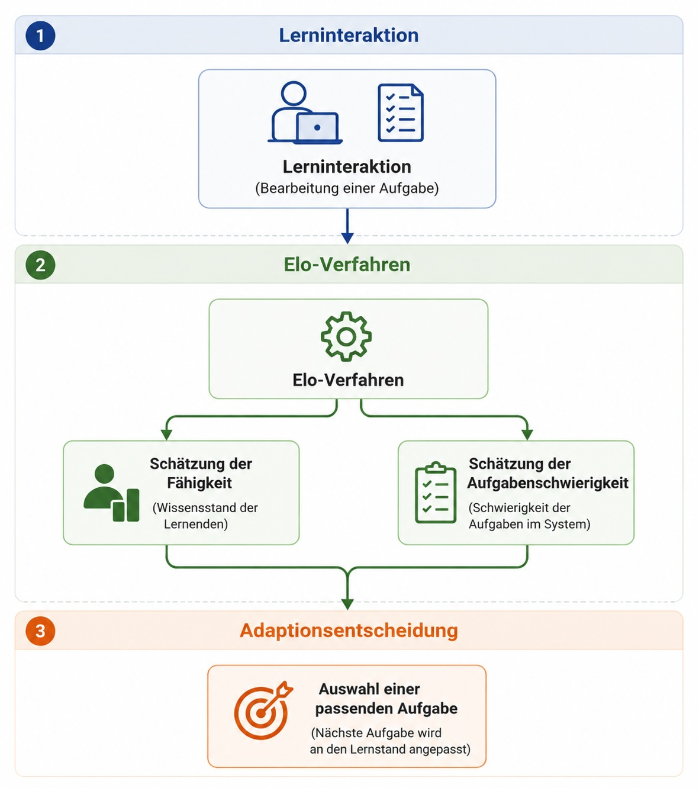

# Umsetzung einer Lernressource 

## Einleitung

Adaptive Lernsysteme verfolgen das Ziel, Lerninhalte an die individuellen Voraussetzungen und den aktuellen Wissensstand von Lernenden anzupassen. Dazu müssen sie zunächst möglichst zuverlässig einschätzen, wie gut eine Person ein bestimmtes Themengebiet bereits beherrscht. Auf Grundlage dieser Einschätzung können anschließend geeignete Aufgaben oder Lernressourcen ausgewählt werden.

Aus funktionaler Sicht lassen sich adaptive Lernverfahren daher in zwei grundlegende Bereiche einteilen:

- **Lernzustandsmodellierung**: Verfahren zur Schätzung des aktuellen Wissensstands eines Lernenden auf Grundlage seiner bisherigen Interaktionen.

- **Adaptionsentscheidung**: Verfahren, die auf Basis dieses geschätzten Lernzustands geeignete Aufgaben, Lernpfade oder Lernressourcen auswählen.

Die vorliegende Lernressource behandelt exemplarisch das **Elo-Verfahren**. Innerhalb der entwickelten Klassifikation gehört es zum Bereich der **Lernzustandsmodellierung** und dort zur Unterklasse der **logistischen und online aktualisierten Performanzmodelle**. Diese Verfahren aktualisieren die Schätzung des Wissensstands fortlaufend auf Grundlage beobachtbarer Lerninteraktionen. Das Elo-Verfahren wurde ausgewählt, da es einen weit verbreiteten Vertreter dieser Unterklasse darstellt und sich aufgrund seiner vergleichsweise übersichtlichen Modellstruktur besonders gut für eine didaktische Aufbereitung eignet. 

Neben den theoretischen Grundlagen werden das Verfahren anhand eines Zahlenbeispiels erläutert, in Python implementiert und durch interaktive Simulationen veranschaulicht.
Ziel ist es, ein konzeptionelles Verständnis des Elo-Verfahrens zu vermitteln und zugleich einen Einblick in dessen praktische Umsetzung zu geben.

**Quellcode der interaktiven Elemente**

Die vollständigen Quelltexte aller in dieser Lernressource verwendeten interaktiven Komponenten stehen aus Gründen der Transparenz, Nachvollziehbarkeit und Nachnutzbarkeit im öffentlichen GitHub-Repository zur Verfügung. Dort sind die einzelnen Simulationen als dokumentierte Quarto-Dateien mit erläuternden Kommentaren abgelegt:

[GitHub-Repository (Ordner `code`)](https://github.com/DankertJo/adaptive-lernverfahren-code/tree/main/code)


**Lernziele**

Nach der Bearbeitung dieser Lernressource können Sie

- die Grundidee des Elo-Verfahrens erläutern,
- den Zusammenhang zwischen Fähigkeit, Aufgabenschwierigkeit und Erfolgswahrscheinlichkeit erklären,
- den Aktualisierungsschritt mathematisch nachvollziehen,
- das Verfahren anhand einer Python-Implementierung umsetzen,
- typische Einsatzgebiete sowie Grenzen und Erweiterungen des Elo-Verfahrens beschreiben.

**Wie möchten Sie beginnen?**

Die Inhalte dieser Lernressource können aus unterschiedlichen Perspektiven erschlossen werden. Je nach Vorwissen und Interesse können Sie einen der folgenden Zugänge wählen. Zwischen den einzelnen Zugängen kann jederzeit gewechselt werden.

|  | **Konzeptueller Zugang** | **Formaler Zugang** | **Implementierungszugang** |
|:---|:---|:---|:---|
| **Zielgruppe** | Für Lernende, die zunächst verstehen möchten, welches Problem das Elo-Verfahren löst und wie es grundsätzlich funktioniert. | Für Lernende, die die mathematischen Grundlagen und den Aktualisierungsmechanismus nachvollziehen möchten. | Für Lernende, die das Verfahren praktisch in Python umsetzen möchten. |
| **Inhalte** | Motivation, Grundidee des Elo-Verfahrens, interaktives Experiment, Ablauf des Algorithmus, Einsatzgebiete | Erfolgswahrscheinlichkeit, Aktualisierungsregeln, Zahlenbeispiel, interaktive Simulation | Python-Implementierung, Funktionen, Codebeispiele, interaktive Programmieraufgaben, Optionale Vertiefung: Grenzen und Erweiterungen |
| **Einstieg** | [Zum konzeptuellen Zugang](#konzeptueller-zugang) | [Zum formalen Zugang](#formaler-zugang) | [Zum Implementierungszugang](#implementierungszugang) |

\

## Das Elo-Verfahren in adaptiven Lernsystemen {#konzeptueller-zugang}

**Lernziele dieses Abschnitts**

Nach diesem Abschnitt können Sie

- erläutern, weshalb das Elo-Verfahren zur Lernstandsschätzung eingesetzt werden kann,
- die Grundidee und den grundlegenden Ablauf des Elo-Verfahrens beschreiben,
- typische Einsatzgebiete des Elo-Verfahrens in adaptiven Lernsystemen erläutern,
- die Rolle des Elo-Verfahrens bei adaptiven Entscheidungen erläutern.

Adaptive Lernsysteme verfolgen das Ziel, Lerninhalte an die individuellen Voraussetzungen und den aktuellen Wissensstand von Lernenden anzupassen. Um geeignete Aufgaben oder Lernressourcen auswählen zu können, müssen sie daher zunächst möglichst zuverlässig abschätzen, wie gut ein Lernender ein bestimmtes Themengebiet bereits beherrscht. Die Modellierung dieses aktuellen Leistungs- oder Wissensstands stellt eine zentrale Aufgabe adaptiver Lernsysteme dar [@Pelanek2017; @Abdi2019].

Für diese Schätzung wurden unterschiedliche Verfahren entwickelt. Während einige Ansätze auf psychometrischen oder probabilistischen Modellen beruhen, existieren auch Verfahren, die ihre Schätzungen nach jeder neuen Interaktion kontinuierlich aktualisieren. Ein vergleichsweise einfaches und weit verbreitetes Verfahren dieser Art ist das Elo-Verfahren. Es wurde ursprünglich zur Bewertung von Schachspielern entwickelt [@Elo1978] und später für verschiedene Anwendungsgebiete, darunter auch adaptive Lernsysteme, weiterentwickelt und eingesetzt [@Abdi2019].

Im Vergleich zu vielen komplexeren Modellierungsansätzen zeichnet sich das Elo-Verfahren durch eine vergleichsweise einfache Struktur sowie die Möglichkeit einer kontinuierlichen Aktualisierung aus. Diese Eigenschaften machen es für den Einsatz in digitalen Lernumgebungen interessant und haben dazu geführt, dass Elo-basierte Verfahren in der Literatur als geeignete Ansätze zur Lernendenmodellierung diskutiert werden [@Pelanek2016; @Abdi2019].

### Experiment: Wie reagiert ein adaptives Lernsystem?

Bevor die Funktionsweise des Elo-Verfahrens erläutert wird, können Sie dessen Grundidee zunächst selbst erkunden. Im folgenden Experiment beobachten Sie, wie ein adaptives Lernsystem seine Einschätzung eines Lernenden sowie der Schwierigkeit einzelner Aufgaben nach jeder bearbeiteten Aufgabe aktualisiert.

Beobachten Sie während der Simulation insbesondere folgende Aspekte:

* Wann verändert das System seine Einschätzung von Lisa nur geringfügig und wann deutlich?
* Verändert das System nur seine Einschätzung von Lisa oder auch die der Aufgabe?
* Wie reagiert das System auf unerwartete Ergebnisse?

::: {.content-visible when-format="pdf"}
**// CSS-Definitionen:** Die folgenden CSS-Regeln definieren das Layout und das Erscheinungsbild der interaktiven Simulation.
:::

```{ojs}
//| echo: false

html`<style>
.elo-experiment {
  --elo-bg: #f6f8fb;
  --elo-card: #ffffff;
  --elo-ink: #172033;
  --elo-muted: #64748b;
  --elo-line: #d8e0ea;
  --elo-blue: #2563eb;
  --elo-blue-soft: #dbeafe;
  --elo-green: #15803d;
  --elo-green-soft: #dcfce7;
  --elo-orange: #c2410c;
  --elo-orange-soft: #ffedd5;
  --elo-violet: #6d28d9;
  --elo-shadow: 0 18px 45px rgba(15, 23, 42, 0.09);
  background: var(--elo-bg);
  border: 1px solid var(--elo-line);
  border-radius: 10px;
  color: var(--elo-ink);
  margin: 1.1rem 0 1.4rem;
  overflow: hidden;
  box-shadow: var(--elo-shadow);
}
.elo-experiment * {
  box-sizing: border-box;
}
.elo-exp-head {
  display: grid;
  grid-template-columns: minmax(0, 1.4fr) minmax(230px, 0.6fr);
  gap: 0.85rem;
  align-items: center;
  padding: 1.05rem 1.15rem;
  background: linear-gradient(135deg, #ffffff 0%, #eef5ff 55%, #f5f3ff 100%);
  border-bottom: 1px solid var(--elo-line);
}
.elo-exp-kicker {
  color: var(--elo-blue);
  font-size: 0.76rem;
  font-weight: 800;
  letter-spacing: 0.05em;
  margin-bottom: 0.35rem;
  text-transform: uppercase;
}
.elo-exp-head h3 {
  font-size: clamp(1.35rem, 2.4vw, 2rem);
  line-height: 1.15;
  margin: 0;
}
.elo-exp-head p {
  color: var(--elo-muted);
  margin: 0.55rem 0 0;
  max-width: 68ch;
}
.elo-lisa-badge {
  align-items: center;
  background: rgba(255, 255, 255, 0.82);
  border: 1px solid var(--elo-line);
  border-radius: 10px;
  display: flex;
  gap: 0.85rem;
  padding: 1rem;
}
.elo-lisa-avatar {
  align-items: center;
  background: var(--elo-blue-soft);
  border-radius: 999px;
  color: #1d4ed8;
  display: flex;
  flex: 0 0 58px;
  font-size: 1.35rem;
  font-weight: 900;
  height: 58px;
  justify-content: center;
  width: 58px;
}
.elo-lisa-badge strong {
  display: block;
  font-size: 1.02rem;
}
.elo-lisa-badge span {
  color: var(--elo-muted);
  display: block;
  font-size: 0.9rem;
  margin-top: 0.2rem;
}
.elo-exp-body {
  display: grid;
  gap: 0.8rem;
  grid-template-columns: 1fr;
  padding: 1rem;
}
.elo-guide {
  background: #ffffff;
  border: 1px solid var(--elo-line);
  border-radius: 10px;
  margin: 1rem 1rem 0;
  padding: 0.95rem;
}
.elo-guide h4 {
  font-size: 1rem;
  margin: 0 0 0.7rem;
}
.elo-guide ol {
  display: grid;
  gap: 0.55rem;
  grid-template-columns: repeat(4, minmax(0, 1fr));
  list-style: none;
  margin: 0;
  padding: 0;
}
.elo-guide li {
  background: #f8fafc;
  border: 1px solid var(--elo-line);
  border-radius: 8px;
  color: #334155;
  font-size: 0.86rem;
  padding: 0.7rem;
}
.elo-guide strong {
  color: var(--elo-blue);
  display: block;
  font-size: 0.78rem;
  margin-bottom: 0.25rem;
  text-transform: uppercase;
}
.elo-exp-card {
  background: var(--elo-card);
  border: 1px solid var(--elo-line);
  border-radius: 10px;
  padding: 0.85rem;
}
.elo-exp-card h4 {
  font-size: 1.02rem;
  margin: 0 0 0.85rem;
}
.elo-exp-card p {
  color: var(--elo-muted);
}
.elo-start-control {
  margin-bottom: 1rem;
}
.elo-start-control .observablehq {
  margin: 0;
}
.elo-experiment .observablehq input[type="range"] {
  accent-color: var(--elo-blue);
  width: 100%;
}
.elo-radio-group .observablehq {
  margin: 0;
}
.elo-radio-group form{
  display:grid;
  gap:0.55rem;
  grid-template-columns: repeat(3, minmax(0, 1fr));
}
.elo-radio-group label {
  align-items: center;
  background: #f8fafc;
  border: 1px solid var(--elo-line);
  border-radius: 8px;
  cursor: pointer;
  display: flex;
  font-size: 0.82rem;
  gap: 0.45rem;
  margin: 0;
  padding:0.55rem 0.65rem;
}
.elo-radio-group label:has(input:checked) {
  background: #eff6ff;
  border-color: #93c5fd;
}
.elo-radio-group input {
  accent-color: var(--elo-blue);
}
.elo-task-card {
  background: #fff7ed;
  border: 1px solid #fed7aa;
  border-radius: 10px;
  color: #7c2d12;
  display: grid;
  gap: 0.42rem;
  margin-top: 0.75rem;
  padding: 0.75rem;
}
.elo-task-card h4 {
  color: #9a3412;
  margin: 0;
}
.elo-task-card p {
  color: #7c2d12;
  margin: 0;
}
.elo-mini-label{
    display:grid;
    grid-template-columns:1fr 1fr;
    font-size:0.72rem;
}

.elo-mini-label span:last-child{
    text-align:right;
}
.elo-scale {
  background: #e2e8f0;
  border-radius: 999px;
  height: 15px;
  overflow: hidden;
}
.elo-scale-fill {
  background: linear-gradient(90deg, #38bdf8, #2563eb, #16a34a);
  border-radius: 999px;
  height: 100%;
  transition: width 220ms ease;
}
.elo-scale-fill.task {
  background: linear-gradient(90deg, #fbbf24, #f97316, #b91c1c);
}
.elo-status-grid {
  display: grid;
  gap: 0.75rem;
  grid-template-columns: minmax(0, 1fr) minmax(0, 1fr);
}
.elo-status {
  background: #f8fafc;
  border: 1px solid var(--elo-line);
  border-radius: 10px;
  min-width: 0;
  padding: 0.85rem;
}
.elo-status-title {
  color: var(--elo-muted);
  font-size: 0.82rem;
  font-weight: 800;
  margin-bottom: 0.35rem;
  text-transform: uppercase;
}
.elo-status-main {
  font-size: clamp(1rem, 1.8vw, 1.35rem);
  font-weight: 900;
  line-height: 1.1;
  margin-bottom: 0.85rem;
  overflow-wrap: anywhere;
}
.elo-change-list {
  display: grid;
  gap: 0.45rem;
}
.elo-change-item {
  align-items: center;
  background: #ffffff;
  border: 1px solid var(--elo-line);
  border-radius: 8px;
  display: flex;
  justify-content: space-between;
  min-width: 0;
  padding: 0.5rem 0.6rem;
}
.elo-change-item span {
  color: var(--elo-muted);
  font-size: 0.78rem;
  font-weight: 800;
}
.elo-change-item strong {
  color: var(--elo-ink);
  font-size: 0.9rem;
  overflow-wrap: anywhere;
}
.elo-actions {
  display:grid;
  gap:0.65rem;
  grid-template-columns: minmax(0, 1fr) minmax(0, 1fr);
  margin-top:1rem;
}
.elo-actions > div {
  min-width: 0;
}
.elo-actions .observablehq,
.elo-reset .observablehq {
  margin: 0;
}
.elo-experiment .observablehq button {
  border: 0 !important;
  border-radius: 8px !important;
  color: #ffffff !important;
  cursor: pointer;
  font-size: 0.82rem !important;
  font-weight: 800 !important;
  line-height: 1.15 !important;
  min-height: 46px;
  min-width: 0 !important;
  padding: 0.65rem 0.7rem !important;
  white-space: normal !important;
  width: 100%;
}
.elo-good button {
  background: var(--elo-green) !important;
}
.elo-bad button {
  background: var(--elo-orange) !important;
}
.elo-reset button {
  background: #475569 !important;
}
.elo-message {
  background: #eff6ff;
  border: 1px solid #bfdbfe;
  border-left: 5px solid var(--elo-blue);
  border-radius: 8px;
  color: #1e3a8a;
  margin: 1rem 0 0;
  padding: 0.8rem 0.9rem;
}
.elo-trend {
  background: #f8fafc;
  border: 1px solid var(--elo-line);
  border-radius: 10px;
  margin-top: 1rem;
  padding: 0.75rem;
}
.elo-trend-head {
  align-items: center;
  display: flex;
  flex-wrap: wrap;
  gap: 0.6rem;
  justify-content: space-between;
  margin-bottom: 0.4rem;
}
.elo-trend-head strong {
  font-size: 0.95rem;
}
.elo-legend {
  display: flex;
  flex-wrap: wrap;
  gap: 0.65rem;
}
.elo-legend span {
  align-items: center;
  color: var(--elo-muted);
  display: inline-flex;
  font-size: 0.78rem;
  gap: 0.25rem;
}
.elo-dot {
  border-radius: 999px;
  display: inline-block;
  height: 9px;
  width: 9px;
}
.elo-dot.learner {
  background: var(--elo-blue);
}
.elo-dot.task {
  background: var(--elo-orange);
}
.elo-dot.multiplication {
  background: #16a34a;
}
.elo-dot.fractions {
  background: #f59e0b;
}
.elo-dot.integrals {
  background: #dc2626;
}
.elo-trend svg {
  background: #ffffff;
  border: 1px solid var(--elo-line);
  border-radius: 8px;
  display: block;
  min-height: 300px;
  margin-top: 0.45rem;
  width: 100%;
}
.elo-pill {
  border-radius: 999px;
  display: inline-block;
  font-size: 0.82rem;
  font-weight: 800;
  padding: 0.22rem 0.58rem;
}
.elo-pill.good {
  background: var(--elo-green-soft);
  color: #166534;
}
.elo-pill.bad {
  background: var(--elo-orange-soft);
  color: #9a3412;
}
.elo-empty {
  color: var(--elo-muted);
  margin: 0;
}
@media (max-width: 820px) {
  .elo-exp-head,
  .elo-exp-body,
  .elo-status-grid,
  .elo-guide ol,
  .elo-radio-group form {
    grid-template-columns: 1fr;
  }
}
@media (max-width: 480px) {
  .elo-actions {
    grid-template-columns: 1fr;
  }
}
</style>`
```

::: {.content-visible when-format="pdf"}
**// Definition der Beispielaufgaben:** Dieser Block definiert die Beispielaufgaben, ihre Startschwierigkeiten und die Beschreibungstexte.
:::

```{ojs}
//| echo: false

conceptTasksInitial = [
  {
    id: "multiplication",
    title: "Einmaleins",
    stars: "⭐",
    level: "leicht",
    description: "Lisa berechnet 7 × 8.",
    startDifficulty: -2
  },
  {
    id: "fractions",
    title: "Bruchrechnung",
    stars: "⭐⭐",
    level: "mittel",
    description: "Lisa kürzt und addiert einfache Brüche.",
    startDifficulty: 0
  },
  {
    id: "integrals",
    title: "Integralrechnung",
    stars: "⭐⭐⭐⭐⭐",
    level: "sehr schwierig",
    description: "Lisa bestimmt den Flächeninhalt unter einer Kurve.",
    startDifficulty: 2
  }
]
```

::: {.content-visible when-format="pdf"}
**// Startwert:** Dieser Block legt den Startwert für Lisas Fähigkeitsschätzung fest.
:::

```{ojs}
//| echo: false

conceptStart = 0
```

::: {.content-visible when-format="pdf"}
**// Initialisierung des Modells:** Dieser Block initialisiert den internen Zustand der Simulation mit Lernendenwerten, Aufgabenschwierigkeiten, Meldung und Verlauf.
:::

```{ojs}
//| echo: false

mutable conceptModel = ({
  learnerSkill: conceptStart,
  learnerBefore: conceptStart,
  learnerAfter: conceptStart,
  tasks: conceptTasksInitial.map(task => ({...task, difficulty: task.startDifficulty})),
  lastTaskId: "fractions",
  lastTaskBefore: conceptTasksInitial.find(task => task.id === "fractions").startDifficulty,
  lastTaskAfter: conceptTasksInitial.find(task => task.id === "fractions").startDifficulty,
  message: "Wählen Sie eine Aufgabe und tragen Sie ein, ob Lisa sie lösen konnte. Danach passt das System seine Einschätzung zu Lisa und zur Aufgabe an.",
  history: []
})
```

::: {.content-visible when-format="pdf"}
**// Hilfsfunktionen und Verlaufsgrafik:** Dieser Block enthält Skalen, Textfunktionen, Erklärlogik und die SVG-Grafik für den Verlauf.
:::

```{ojs}
//| echo: false

conceptStepSize = 0.65
conceptClamp = (value, min, max) => Math.max(min, Math.min(max, value))
conceptScale = value => conceptClamp(Math.round(((value + 2.5) / 5) * 100), 4, 96)
conceptTaskById = id => conceptModel.tasks.find(task => task.id === id)
conceptStars = value => {
  const count =
    value < -1.5 ? 1
    : value < -0.5 ? 2
    : value < 0.5 ? 3
    : value < 1.5 ? 4
    : 5
  return "⭐".repeat(count)
}
conceptTaskLabel = task => `${task.title} ${conceptStars(task.difficulty)}`
conceptLearnerText = value =>
  value < -1.5 ? "Anfängerin"
  : value < -0.5 ? "Grundkenntnisse"
  : value < 0.5 ? "Solide Kenntnisse"
  : value < 1.5 ? "Fortgeschritten"
  : "Sehr sicher"
conceptDifficultyText = value =>
  value < -1.1 ? "leicht"
  : value < 0.35 ? "mittel"
  : value < 1.35 ? "schwierig"
  : "sehr schwierig"
conceptTaskColor = id => ({
  multiplication: "#16a34a",
  fractions: "#f59e0b",
  integrals: "#dc2626"
})[id]
conceptDirectionText = (before, after, kind) => {
  const delta = after - before
  if (Math.abs(delta) < 0.08) return `${kind} bleibt fast gleich`
  return delta > 0 ? `${kind} wird höher eingeschätzt` : `${kind} wird niedriger eingeschätzt`
}
conceptShortChange = (before, after, upText, downText) => {
  const delta = after - before
  if (Math.abs(delta) < 0.08) return "kaum verändert"
  return delta > 0 ? upText : downText
}
conceptStrengthText = change => {
  const amount = Math.abs(change)
  return amount > 0.45 ? "deutlich" : amount > 0.22 ? "merklich" : "leicht"
}
conceptExplanation = (beforeSkill, afterSkill, beforeDifficulty, afterDifficulty, solved) => {
  const skillChange = conceptStrengthText(afterSkill - beforeSkill)
  const gap = beforeDifficulty - beforeSkill
  if (solved && gap > 1.1) {
    return `Das war aus Sicht des Systems eine starke Überraschung: Lisa löst eine Aufgabe, die das System derzeit als sehr anspruchsvoll einschätzt. Deshalb schätzt es Lisa nun ${skillChange} höher ein und die Aufgabe ${skillChange} leichter.`
  }
  if (solved && gap > 0.25) {
    return `Lisa löst eine Aufgabe, die das System derzeit eher anspruchsvoll einschätzt. Deshalb steigt die Einschätzung zu Lisa ${skillChange}, und die Aufgabe wird etwas weniger schwierig eingeschätzt.`
  }
  if (solved && Math.abs(gap) <= 0.25) {
    return `Lisa löst eine Aufgabe im Grenzbereich ihrer bisherigen Einschätzung. Beides wäre plausibel gewesen; durch die richtige Antwort schätzt das System Lisa nun ${skillChange} höher ein und die Aufgabe ${skillChange} leichter.`
  }
  if (solved) {
    return `Lisa löst eine Aufgabe, die das System derzeit eher leicht für sie einschätzt. Das bestätigt die bisherige Einschätzung, deshalb verschiebt das System die Werte nur ${skillChange}.`
  }
  if (!solved && gap < -1.1) {
    return `Das war aus Sicht des Systems unerwartet: Lisa scheitert an einer Aufgabe, die das System derzeit eher leicht einschätzt. Deshalb schätzt es Lisa nun ${skillChange} niedriger ein und die Aufgabe ${skillChange} schwieriger.`
  }
  if (!solved && gap < -0.25) {
    return `Lisa löst eine Aufgabe nicht, die das System derzeit eher erreichbar einschätzt. Deshalb sinkt die Einschätzung zu Lisa ${skillChange}, und die Aufgabe wird etwas schwieriger eingeschätzt.`
  }
  if (!solved && Math.abs(gap) <= 0.25) {
    return `Lisa löst eine Aufgabe im Grenzbereich ihrer bisherigen Einschätzung nicht. Beides wäre plausibel gewesen; durch die falsche Antwort schätzt das System Lisa nun ${skillChange} niedriger ein und die Aufgabe ${skillChange} schwieriger.`
  }
  return `Lisa löst eine Aufgabe nicht, die das System derzeit ohnehin als anspruchsvoll einschätzt. Das passt eher zur bisherigen Einschätzung, daher verändert das System die Werte nur ${skillChange}.`
}
conceptTrendCoordinates = values => {
  const steps = Math.max(values.length - 1, 1)
  return values.map((value, index) => {
    const x = 46 + index * (438 / steps)
    const y = 220 - ((conceptClamp(value, -2.5, 2.5) + 2.5) / 5) * 170
    return {x, y}
  })
}
conceptPointsFromValues = values =>
  conceptTrendCoordinates(values).map(point => `${point.x},${point.y}`).join(" ")
conceptLearnerValues = rows =>
  rows.length === 0 ? [conceptStart] : [rows[0].learnerBefore, ...rows.map(row => row.learnerAfter)]
conceptTaskValues = (rows, taskId) => {
  const initialTask = conceptTasksInitial.find(task => task.id === taskId)
  const initialDifficulty = initialTask.startDifficulty
  return [
    initialDifficulty,
    ...rows.map(row => {
      const snapshot = row.taskSnapshot.find(task => task.id === taskId)
      return snapshot ? snapshot.difficulty : initialDifficulty
    })
  ]
}
conceptXAxisTicks = rows => {
  const count = rows.length
  const steps = Math.max(count, 1)
  return Array.from({length: count + 1}, (_, index) => ({
    label: index === 0 ? "Start" : String(index),
    x: 46 + index * (438 / steps)
  }))
}
conceptTrendChart = model => html`
  <div class="elo-trend">
    <div class="elo-trend-head">
      <strong>Verlauf als Grafik</strong>
      <div class="elo-legend">
        <span><i class="elo-dot learner"></i>Lisa</span>
        ${model.tasks.map(task => html`
          <span><i class="elo-dot" style=${`background:${conceptTaskColor(task.id)}`}></i>${task.title}</span>
        `)}
      </div>
    </div>
    ${svg`<svg viewBox="0 0 530 270" role="img" aria-label="Gemeinsamer Verlauf der Einschätzungen">
      <text x="20" y="135" transform="rotate(-90 20 135)" text-anchor="middle" fill="#475569" font-size="12" font-weight="700">ELO-Wert</text>
      <line x1="46" y1="50" x2="46" y2="220" stroke="#cbd5e1" stroke-width="1.5"></line>
      <line x1="46" y1="220" x2="484" y2="220" stroke="#cbd5e1" stroke-width="1.5"></line>
      <line x1="46" y1="135" x2="484" y2="135" stroke="#e2e8f0" stroke-width="1.5" stroke-dasharray="5 6"></line>
      <text x="12" y="55" fill="#64748b" font-size="12">hoch</text>
      <text x="8" y="222" fill="#64748b" font-size="12">niedrig</text>
      ${conceptXAxisTicks(model.history).map(tick => svg`
        <line x1="${tick.x}" y1="220" x2="${tick.x}" y2="226" stroke="#94a3b8" stroke-width="1.2"></line>
        <text x="${tick.x}" y="244" text-anchor="middle" fill="#64748b" font-size="12">${tick.label}</text>
      `)}
      <text x="265" y="263" text-anchor="middle" fill="#64748b" font-size="12">Update</text>
      ${model.tasks.map(task => svg`
        <polyline points="${conceptPointsFromValues(conceptTaskValues(model.history, task.id))}" fill="none" stroke="${conceptTaskColor(task.id)}" stroke-width="4" stroke-linecap="round" stroke-linejoin="round" opacity="0.95"></polyline>
      `)}
      <polyline points="${conceptPointsFromValues(conceptLearnerValues(model.history))}" fill="none" stroke="#2563eb" stroke-width="5" stroke-linecap="round" stroke-linejoin="round"></polyline>
    </svg>`}
  </div>
`
```

::: {.content-visible when-format="pdf"}
**// Aufgabenauswahl:** Dieser Block erzeugt die Radio-Buttons zur Auswahl der Aufgabe.
:::

```{ojs}
//| echo: false

viewof conceptTaskId = Inputs.radio(conceptModel.tasks.map(task => task.id), {
  value: conceptModel.lastTaskId,
  label: "Aufgabe auswählen",
  format: id => {
    const task = conceptModel.tasks.find(task => task.id === id)
    return `${task.title} ${conceptStars(task.difficulty)} (derzeit: ${conceptDifficultyText(task.difficulty)})`
  }
})
```

::: {.content-visible when-format="pdf"}
**// Aktualisierung des Elo-Modells:** Dieser Block berechnet nach jeder Antwort das interne Elo-Update für Lisa und die gewählte Aufgabe.
:::

```{ojs}
//| echo: false

conceptUpdate = (solved) => {
  const task = conceptTaskById(conceptTaskId)
  const beforeSkill = conceptModel.learnerSkill
  const beforeDifficulty = task.difficulty
  const expected = 1 / (1 + Math.exp(-(beforeSkill - beforeDifficulty)))
  const observed = solved ? 1 : 0
  const difference = observed - expected
  const afterSkill = conceptClamp(beforeSkill + conceptStepSize * difference, -2.5, 2.5)
  const afterDifficulty = conceptClamp(beforeDifficulty - conceptStepSize * difference, -2.5, 2.5)
  const explanation = conceptExplanation(beforeSkill, afterSkill, beforeDifficulty, afterDifficulty, solved)
  const updatedTasks = conceptModel.tasks.map(item =>
    item.id === task.id ? ({...item, difficulty: afterDifficulty}) : item
  )
  return {
    learnerSkill: afterSkill,
    learnerBefore: beforeSkill,
    learnerAfter: afterSkill,
    tasks: updatedTasks,
    lastTaskId: task.id,
    lastTaskBefore: beforeDifficulty,
    lastTaskAfter: afterDifficulty,
    message: explanation,
    history: [
      ...conceptModel.history,
      {
        step: conceptModel.history.length + 1,
        task: conceptTaskLabel(task),
        result: solved ? "richtig gelöst" : "falsch gelöst",
        learnerBefore: beforeSkill,
        learnerAfter: afterSkill,
        difficultyBefore: beforeDifficulty,
        difficultyAfter: afterDifficulty,
        taskSnapshot: updatedTasks.map(item => ({id: item.id, difficulty: item.difficulty})),
        explanation
      }
    ]
  }
}
```

::: {.content-visible when-format="pdf"}
**// Button für richtige Antworten:** Dieser Block erzeugt den Button, mit dem eine richtig gelöste Aufgabe eingetragen wird.
:::

```{ojs}
//| echo: false

viewof conceptSolved = Inputs.button("Aufgabe richtig gelöst", {
  reduce: () => {
    mutable conceptModel = conceptUpdate(true)
  }
})
```

::: {.content-visible when-format="pdf"}
**// Button für falsche Antworten:** Dieser Block erzeugt den Button, mit dem eine falsch gelöste Aufgabe eingetragen wird.
:::

```{ojs}
//| echo: false

viewof conceptFailed = Inputs.button("Aufgabe falsch gelöst", {
  reduce: () => {
    mutable conceptModel = conceptUpdate(false)
  }
})
```

::: {.content-visible when-format="pdf"}
**// Reset-Button:** Dieser Block setzt die Simulation auf die Anfangswerte zurück.
:::

```{ojs}
//| echo: false

viewof conceptReset = Inputs.button("Reset", {
  reduce: () => {
    const selected = conceptTasksInitial.find(task => task.id === conceptTaskId)
    mutable conceptModel = ({
      learnerSkill: conceptStart,
      learnerBefore: conceptStart,
      learnerAfter: conceptStart,
      tasks: conceptTasksInitial.map(task => ({...task, difficulty: task.startDifficulty})),
      lastTaskId: conceptTaskId,
      lastTaskBefore: selected.startDifficulty,
      lastTaskAfter: selected.startDifficulty,
      message: "Die Werte wurden zurückgesetzt. Das System beginnt wieder mit der anfänglichen Einschätzung.",
      history: []
    })
  }
})
```

::: {.content-visible when-format="pdf"}
**// Aktuelle Aufgabe:** Dieser Block bestimmt die aktuell ausgewählte Aufgabe für die Anzeige.
:::

```{ojs}
//| echo: false

selectedConceptTask = conceptTaskById(conceptTaskId)
```

::: {.content-visible when-format="pdf"}
**// Benutzeroberfläche:** Dieser Block setzt alle Bestandteile zur sichtbaren interaktiven Simulation zusammen.
:::

```{ojs}
//| echo: false

html`
<div class="elo-experiment">
  <section class="elo-exp-head">
    <div>
      <div class="elo-exp-kicker">Interaktives Experiment</div>
      <h3>Wie reagiert ein adaptives Lernsystem?</h3>
      <p>
        Bearbeiten Sie verschiedene Aufgaben mit Lisa und beobachten Sie, wie sich die Einschätzung des Systems nach jeder Antwort verändert.
      </p>
    </div>
    <div class="elo-lisa-badge">
      <div class="elo-lisa-avatar">L</div>
      <div>
        <strong>Lisa</strong>
        <span>${conceptLearnerText(conceptModel.learnerSkill)}</span>
      </div>
    </div>
	  </section>

  <section class="elo-guide">
    <h4>So nutzen Sie das Experiment</h4>
    <ol>
      <li><strong>1. Aufgabe wählen</strong> Wählen Sie eine Aufgabe aus, die Lisa bearbeiten soll.</li>
      <li><strong>2. Ergebnis einschätzen</strong> Überlegen Sie zunächst, wie das System auf eine richtige oder falsche Antwort reagieren könnte.</li>
      <li><strong>3. Ergebnis auswählen</strong> Geben Sie an, ob Lisa die Aufgabe richtig oder falsch gelöst hat.</li>
      <li><strong>4. Veränderungen beobachten</strong> Vergleichen Sie anschließend die aktualisierte Einschätzung von Lisa und der ausgewählten Aufgabe. Wiederholen Sie das Experiment mit verschiedenen Aufgaben und Ergebnissen.</li>
    </ol>
  </section>

  <section class="elo-exp-body">
    <div class="elo-exp-card">
      <h4>1. Aufgabe auswählen</h4>
      <div class="elo-radio-group">${viewof conceptTaskId}</div>

      <div class="elo-task-card">
        <h4>${conceptTaskLabel(selectedConceptTask)}</h4>
        <p><strong>Vom System derzeit eingeschätzt als:</strong> ${conceptDifficultyText(selectedConceptTask.difficulty)}</p>
        <p>${selectedConceptTask.description}</p>
        <div>
          <div class="elo-mini-label">
            <span>Derzeitige Systemeinschätzung</span>
            <span>${conceptDifficultyText(selectedConceptTask.difficulty)}</span>
          </div>
          <div class="elo-scale">
            <div class="elo-scale-fill task" style="width: ${conceptScale(selectedConceptTask.difficulty)}%"></div>
          </div>
        </div>
      </div>

      <div class="elo-reset">${viewof conceptReset}</div>
    </div>

    <div class="elo-exp-card">
      <h4>2. Ergebnis auswählen</h4>
      <div class="elo-status-grid">
        <div class="elo-status">
          <div class="elo-status-title">Aktuelle Einschätzung des Systems zu Lisa</div>
          <div class="elo-status-main">${conceptLearnerText(conceptModel.learnerSkill)}</div>
          <div class="elo-mini-label">
            <span>Anfängerin</span>
            <span>Sehr sicher</span>
          </div>
          <div class="elo-scale">
            <div class="elo-scale-fill" style="width: ${conceptScale(conceptModel.learnerSkill)}%"></div>
          </div>
        </div>

        <div class="elo-status">
          <div class="elo-status-title">Letzte Veränderung</div>
          <div class="elo-change-list">
            <div class="elo-change-item">
              <span>Lisa</span>
              <strong>${conceptShortChange(conceptModel.learnerBefore, conceptModel.learnerAfter, "höher", "niedriger")}</strong>
            </div>
            <div class="elo-change-item">
              <span>Aufgabe</span>
              <strong>${conceptShortChange(conceptModel.lastTaskBefore, conceptModel.lastTaskAfter, "schwieriger", "leichter")}</strong>
            </div>
          </div>
          <div class="elo-mini-label" style="margin-top:0.75rem;">
            <span>leichter</span>
            <span>schwieriger</span>
          </div>
          <div class="elo-scale">
            <div class="elo-scale-fill task" style="width: ${conceptScale(conceptModel.lastTaskAfter)}%"></div>
          </div>
        </div>
      </div>

      <div class="elo-actions">
        <div class="elo-good">${viewof conceptSolved}</div>
        <div class="elo-bad">${viewof conceptFailed}</div>
      </div>

      <p class="elo-message">${conceptModel.message}</p>
      ${conceptTrendChart(conceptModel)}
    </div>
  </section>
</div>
`
```

### Vom Schachspiel zum adaptiven Lernen

Im vorherigen Experiment konnten Sie beobachten, dass ein adaptives Lernsystem seine Einschätzung eines Lernenden und der Aufgabenschwierigkeit nach jeder bearbeiteten Aufgabe aktualisiert. Dabei wurde bereits deutlich, dass manche Ergebnisse nur zu kleinen Veränderungen führen, während andere die Einschätzungen deutlich stärker beeinflussen.

Doch warum reagiert das System auf diese Weise? Um diese Frage zu beantworten, lohnt sich ein Blick auf den Ursprung des Elo-Verfahrens. Die Grundidee entstand ursprünglich im Schachsport und bildet bis heute die Grundlage vieler Elo-basierter Verfahren in adaptiven Lernsystemen.
Ziel war es, die relative Spielstärke verschiedener Spieler möglichst objektiv abzuschätzen. Hierzu wird jedem Spieler eine numerische Bewertung, das sogenannte Rating, zugeordnet. Treffen zwei Spieler aufeinander, kann aus ihren Ratings abgeschätzt werden, welcher Spieler mit höherer Wahrscheinlichkeit gewinnen sollte [@Elo1978].
Betrachtet man beispielsweise zwei Schachspieler mit einem Rating von 1600 beziehungsweise 1400 Punkten, so würde das Elo-Verfahren erwarten, dass der Spieler mit dem höheren Rating häufiger gewinnt. Das tatsächliche Ergebnis einer einzelnen Partie ist jedoch nicht sicher vorhersagbar. Auch ein schwächer eingeschätzter Spieler kann gewinnen und für eine Überraschung sorgen.

Genau diese Kombination aus Erwartung und tatsächlichem Ergebnis bildet den Kern des Elo-Verfahrens. Vor jeder Begegnung wird zunächst abgeschätzt, wie wahrscheinlich ein bestimmter Ausgang ist. Nach dem Spiel wird das tatsächliche Ergebnis mit dieser Erwartung verglichen. Entspricht das Ergebnis der Erwartung, verändern sich die Bewertungen nur geringfügig. Tritt dagegen ein unerwartetes Ergebnis ein, werden die Bewertungen stärker angepasst [@Elo1978].  

Dieses Prinzip lässt sich auch auf adaptive Lernsysteme übertragen. Anstelle zweier Schachspieler treten hier ein Lernender und eine Aufgabe gegeneinander an. Dem Lernenden wird eine geschätzte Fähigkeit zugeordnet, während die Aufgabe durch einen Schwierigkeitswert beschrieben wird. Aus beiden Werten lässt sich ableiten, wie wahrscheinlich eine erfolgreiche Bearbeitung der Aufgabe ist. Nach jeder Interaktion werden die Schätzwerte anhand des tatsächlichen Ergebnisses aktualisiert, sodass sich die Einschätzung des Lernenden kontinuierlich an neue Informationen anpasst [@Abdi2019].  

Die grundlegende Idee des Elo-Verfahrens lässt sich somit auf drei einfache Schritte zurückführen:

1. Aus den vorhandenen Bewertungen wird eine Erwartung gebildet.
2. Das tatsächliche Ergebnis wird beobachtet.
3. Die Bewertungen werden entsprechend angepasst.

Diese drei Schritte bilden den Kern des Elo-Verfahrens und werden im weiteren Verlauf der Lernressource zunächst algorithmisch und anschließend wahlweise auch mathematisch genauer betrachtet.

### Algorithmische Funktionsweise des Elo-Verfahrens

Im Experiment konnten Sie beobachten, wie ein adaptives Lernsystem seine Einschätzungen nach jeder bearbeiteten Aufgabe aktualisiert. Im vorherigen Abschnitt wurde anschließend die Grundidee dieses Vorgehens anhand des Elo-Verfahrens aus dem Schachsport erläutert. Im Folgenden wird dieser Aktualisierungsprozess Schritt für Schritt beschrieben.

Zu Beginn einer Interaktion liegen für den Lernenden und die Aufgabe jeweils aktuelle Schätzwerte vor. Der Lernende wird durch eine geschätzte Fähigkeit beschrieben, während für die Aufgabe ein Schwierigkeitswert angenommen wird. Beide Werte repräsentieren den aktuellen Kenntnisstand des Systems über den Lernenden beziehungsweise die Aufgabe [@Pelanek2016; @Abdi2019].

Im ersten Schritt wird aus diesen Schätzwerten eine Erwartung gebildet. Das System bestimmt, mit welcher Wahrscheinlichkeit ein Lernender die betrachtete Aufgabe erfolgreich bearbeiten sollte. Besitzt der Lernende im Vergleich zur Schwierigkeit der Aufgabe eine hohe geschätzte Fähigkeit, wird eine erfolgreiche Bearbeitung wahrscheinlicher eingeschätzt. Ist die Aufgabe schwieriger als die geschätzte Fähigkeit des Lernenden, fällt die erwartete Erfolgswahrscheinlichkeit entsprechend geringer aus [@Elo1978; @Pelanek2016].

Im zweiten Schritt wird das tatsächliche Ergebnis der Bearbeitung beobachtet. Das System stellt fest, ob die Aufgabe erfolgreich gelöst wurde oder nicht. Dieses Ergebnis liefert neue Informationen über die Fähigkeit des Lernenden und gegebenenfalls auch über die Schwierigkeit der Aufgabe.

Anschließend wird das beobachtete Ergebnis mit der zuvor berechneten Erwartung verglichen. Genau dieser Vergleich entscheidet darüber, ob die Einschätzungen – wie bereits im Experiment beobachtet – nur geringfügig oder deutlich angepasst werden. Stimmen Erwartung und Ergebnis weitgehend überein, werden die Schätzwerte nur geringfügig angepasst. Treten dagegen unerwartete Ergebnisse auf, beispielsweise wenn ein Lernender eine schwierige Aufgabe erfolgreich bearbeitet oder an einer einfachen Aufgabe scheitert, erfolgt eine stärkere Aktualisierung der Bewertungen [@Elo1978; @Pelanek2016].

Im letzten Schritt werden die Schätzwerte aktualisiert. Die neu berechnete Fähigkeit des Lernenden sowie gegebenenfalls die angepasste Schwierigkeit der Aufgabe bilden die Ausgangsbasis für die nächste Interaktion. Durch die wiederholte Anwendung dieses Ablaufs passt sich das Modell kontinuierlich an neue Beobachtungen an und verbessert fortlaufend seine Schätzung des aktuellen Leistungsstands [@Pelanek2016; @Abdi2019].

Der algorithmische Ablauf des Elo-Verfahrens lässt sich somit in fünf Schritte zusammenfassen:

1. Aktuelle Schätzwerte bestimmen.
2. Erwartete Erfolgswahrscheinlichkeit berechnen.
3. Tatsächliches Ergebnis beobachten.
4. Erwartung und Ergebnis vergleichen.
5. Schätzwerte aktualisieren.

Diese fünf Schritte werden nach jeder bearbeiteten Aufgabe erneut durchlaufen und bilden den grundlegenden Arbeitsablauf des Elo-Verfahrens. Im nächsten Abschnitt werden die verschiedenen Anwendungsbereiche des Verfahrens in adaptiven Lernsystemen näher betrachtet.

### Anwendungen des Elo-Verfahrens in adaptiven Lernsystemen

Das Elo-Verfahren wird in adaptiven Lernsystemen vor allem zur Schätzung von Fähigkeits- und Schwierigkeitswerten eingesetzt. Dabei wird jede Interaktion zwischen einem Lernenden und einer Aufgabe als Beobachtung genutzt, um die zugrunde liegenden Parameter fortlaufend zu aktualisieren. Durch diese kontinuierliche Aktualisierung eignet sich das Verfahren insbesondere für Systeme, die den Wissensstand von Lernenden während des Lernprozesses modellieren möchten [@Pelanek2016].

#### Lernendenmodellierung

Eine zentrale Anwendung des Elo-Verfahrens besteht in der Schätzung der Fähigkeiten von Lernenden. Nach jeder bearbeiteten Aufgabe wird die Fähigkeitsbewertung anhand des beobachteten Ergebnisses aktualisiert. Dadurch entsteht ein dynamisches Modell des aktuellen Wissensstands, das sich kontinuierlich an neue Beobachtungen anpasst [@Pelanek2016].

#### Schätzung von Aufgabenschwierigkeiten

Neben der Modellierung von Lernenden können auch Schwierigkeitswerte für Aufgaben geschätzt werden. Neue Aufgaben erhalten zunächst einen Startwert, der im Laufe der Nutzung anhand der Antworten vieler Lernender angepasst wird. Auf diese Weise kann ein System automatisch Informationen über die Schwierigkeit einzelner Aufgaben gewinnen [@Pelanek2016].

#### Grundlage adaptiver Entscheidungen

Wie in @fig-elo-einordnung dargestellt, können die geschätzten Fähigkeits- und Schwierigkeitswerte anschließend als Grundlage adaptiver Entscheidungen dienen. Beispielsweise können Lernsysteme Aufgaben auswählen, deren Schwierigkeit zum aktuellen Leistungsstand eines Lernenden passt. Die eigentliche Aufgabenwahl ist dabei nicht Bestandteil des Elo-Verfahrens selbst, sondern nutzt die durch das Verfahren bereitgestellten Schätzwerte [@Pelanek2016].
Ein Beispiel hierfür beschreiben Vesin et al., die ein modifiziertes Elo-Verfahren in Online-Programmierkursen einsetzen, um sowohl den Wissensstand der Lernenden als auch die Schwierigkeit von Programmieraufgaben zu schätzen und darauf aufbauend geeignete Lerninhalte zu empfehlen [@Vesin2022].

{#fig-elo-einordnung width=70% fig-pos="H"}

#### Open Learner Models

Eine weitere Anwendung besteht in sogenannten Open Learner Models. Dabei werden die durch das System geschätzten Fähigkeitswerte nicht ausschließlich intern verwendet, sondern den Lernenden direkt zugänglich gemacht. Die Lernenden erhalten dadurch Einblick in die Einschätzung ihres aktuellen Wissensstands und können ihre Stärken und Schwächen besser nachvollziehen.
Abdi et al. beschreiben einen solchen Ansatz auf Basis eines mehrdimensionalen Elo-Modells (M-Elo), bei dem Fähigkeitswerte für verschiedene Themengebiete visualisiert werden. Die Autoren argumentieren, dass transparente Darstellungen des Lernendenmodells die Reflexion des eigenen Lernfortschritts unterstützen und das Vertrauen in die Empfehlungen eines adaptiven Systems fördern können [@Abdi2019].

Die dargestellten Anwendungsbereiche verdeutlichen, dass das Elo-Verfahren nicht nur zur Schätzung von Fähigkeiten eingesetzt werden kann, sondern auch die Grundlage verschiedener adaptiver Funktionen in modernen Lernsystemen bildet.

### Wissensüberprüfung

Beantworten Sie die folgenden Fragen, bevor Sie zur mathematischen Herleitung übergehen. Die Auswertung erscheint, sobald alle Fragen beantwortet wurden.

::: {.content-visible when-format="pdf"}
**// CSS-Definitionen:** Die folgenden CSS-Regeln gestalten die Quizkarten, Antwortoptionen und Rückmeldungen.
:::

```{ojs}
//| echo: false

html`<style>
.elo-quiz {
  background: #f8fafc;
  border: 1px solid #d8e0ea;
  border-radius: 10px;
  margin: 1rem 0 1.25rem;
  padding: 1rem;
}
.elo-quiz h4 {
  margin: 0 0 0.8rem;
}
.elo-quiz-grid {
  display: grid;
  gap: 0.9rem;
}
.elo-quiz-card {
  background: #ffffff;
  border: 1px solid #d8e0ea;
  border-radius: 8px;
  padding: 0.85rem;
}
.elo-quiz-card .observablehq {
  margin: 0;
}
.elo-quiz-card form {
  display: grid;
  gap: 0.45rem;
}
.elo-quiz-question {
  color: #111827;
  font-weight: 700;
  margin-bottom: 0.35rem;
}
.elo-quiz-card label {
  align-items: flex-start;
  background: #f8fafc;
  border: 1px solid #e2e8f0;
  border-radius: 7px;
  display: flex;
  gap: 0.45rem;
  margin: 0;
  padding: 0.5rem 0.6rem;
}
.elo-quiz-card input {
  margin-top: 0.2rem;
}
.elo-quiz-result {
  border-radius: 8px;
  margin-top: 1rem;
  padding: 0.85rem;
}
.elo-quiz-result.pending {
  background: #eff6ff;
  border: 1px solid #bfdbfe;
  color: #1e3a8a;
}
.elo-quiz-summary {
  display: grid;
  gap: 0.75rem;
  margin-top: 1rem;
}
.elo-quiz-score {
  background: #ffffff;
  border: 1px solid #cbd5e1;
  border-radius: 8px;
  color: #111827;
  padding: 0.85rem;
}
.elo-quiz-score strong {
  display: block;
  font-size: 1.05rem;
}
.elo-quiz-message {
  border-radius: 8px;
  padding: 0.85rem;
}
.elo-quiz-message.reached {
  background: #dcfce7;
  border: 1px solid #86efac;
  color: #166534;
}
.elo-quiz-message.partial {
  background: #ffedd5;
  border: 1px solid #fdba74;
  color: #9a3412;
}
.elo-quiz-message.open {
  background: #fee2e2;
  border: 1px solid #fca5a5;
  color: #991b1b;
}
.elo-quiz-feedback {
  border-top: 1px solid #d8e0ea;
  display: grid;
  gap: 0.45rem;
  margin: 0.25rem 0 0;
  padding-top: 0.75rem;
}
.elo-quiz-feedback div {
  background: #ffffff;
  border: 1px solid #e2e8f0;
  border-radius: 6px;
  padding: 0.55rem 0.65rem;
}
</style>`
```

::: {.content-visible when-format="pdf"}
**// Fragen und Antwortoptionen:** Dieser Block definiert die Fragen, Antwortoptionen, korrekten Lösungen und individuellen Rückmeldungen.
:::

```{ojs}
//| echo: false

eloQuizQuestions = [
  {
    id: "q1",
    title: "Frage 1 – Ziel des Elo-Verfahrens",
    prompt: "Welches Ziel verfolgt das Elo-Verfahren in adaptiven Lernsystemen?",
    correct: "q1-b",
    options: [
      {id: "q1-a", text: "Es erstellt automatisch neue Aufgaben."},
      {id: "q1-b", text: "Es schätzt kontinuierlich den Wissensstand von Lernenden und die Schwierigkeit von Aufgaben."},
      {id: "q1-c", text: "Es ordnet Lernende dauerhaft festen Leistungsgruppen zu."},
      {id: "q1-d", text: "Es bewertet ausschließlich Aufgaben."}
    ]
  },
  {
    id: "q2",
    title: "Frage 2 – Grundidee",
    prompt: "Welche Aussage beschreibt die Grundidee des Elo-Verfahrens am besten?",
    correct: "q2-b",
    options: [
      {id: "q2-a", text: "Der Wissensstand wird nur einmal zu Beginn bestimmt."},
      {id: "q2-b", text: "Das System passt seine bisherigen Schätzungen nach jeder Interaktion anhand neuer Beobachtungen an."},
      {id: "q2-c", text: "Nach jeder Aufgabe werden alle bisherigen Werte verworfen."},
      {id: "q2-d", text: "Die Schwierigkeit einer Aufgabe bleibt immer konstant."}
    ]
  },
  {
    id: "q3",
    title: "Frage 3 – Verständnis des Experiments",
    prompt: "Lisa löst eine Aufgabe, die das System als sehr schwierig eingeschätzt hat. Wie reagiert das System typischerweise?",
    correct: "q3-a",
    options: [
      {id: "q3-a", text: "Es schätzt Lisa stärker ein und die Aufgabe etwas leichter."},
      {id: "q3-b", text: "Es schätzt Lisa schwächer ein und die Aufgabe schwieriger."},
      {id: "q3-c", text: "Nur die Schwierigkeit der Aufgabe wird verändert."},
      {id: "q3-d", text: "Es erfolgt keine Anpassung."}
    ]
  },
  {
    id: "q4",
    title: "Frage 4 – Verständnis des Algorithmus",
    prompt: "Welche Reihenfolge beschreibt den grundlegenden Ablauf des Elo-Verfahrens?",
    correct: "q4-b",
    options: [
      {id: "q4-a", text: "Tatsächliches Ergebnis beobachten → Schätzwerte aktualisieren → Erwartung bilden"},
      {id: "q4-b", text: "Erwartung bilden → tatsächliches Ergebnis beobachten → Schätzwerte aktualisieren"},
      {id: "q4-c", text: "Schätzwerte aktualisieren → Erwartung bilden → tatsächliches Ergebnis beobachten"},
      {id: "q4-d", text: "Tatsächliches Ergebnis beobachten → Erwartung bilden → Schätzwerte aktualisieren"}
    ]
  },
  {
    id: "q5",
    title: "Frage 5 – Anwendungsszenario",
    prompt: "Für welches Szenario eignet sich das Elo-Verfahren besonders gut?",
    correct: "q5-a",
    options: [
      {id: "q5-a", text: "Ein Mathematik-Lernsystem soll nach jeder bearbeiteten Aufgabe die Fähigkeit der Lernenden neu einschätzen und anschließend passende Aufgaben auswählen."},
      {id: "q5-b", text: "Ein Lernsystem soll allen Lernenden dieselben Aufgaben in einer festen Reihenfolge anzeigen."},
      {id: "q5-c", text: "Ein Prüfungssystem soll ausschließlich die Gesamtpunktzahl einer Abschlussklausur berechnen."},
      {id: "q5-d", text: "Ein Lernsystem soll Aufgaben zufällig auswählen, ohne den bisherigen Lernfortschritt zu berücksichtigen."}
    ]
  }
]
```

::: {.content-visible when-format="pdf"}
**// Eingabeelemente:** Dieser Block erzeugt die Radio-Button-Eingaben für einzelne Multiple-Choice-Fragen.
:::

```{ojs}
//| echo: false

eloQuizInput = question => {
  const form = document.createElement("form")
  form.value = null

  const questionText = document.createElement("div")
  questionText.className = "elo-quiz-question"
  questionText.textContent = `${question.title}: ${question.prompt}`
  form.append(questionText)

  question.options.forEach(option => {
    const label = document.createElement("label")
    const input = document.createElement("input")
    const text = document.createElement("span")

    input.type = "radio"
    input.name = `elo-${question.id}`
    input.value = option.id
    text.textContent = option.text

    input.addEventListener("change", () => {
      form.value = input.value
      form.dispatchEvent(new Event("input", {bubbles: true}))
    })

    label.append(input, text)
    form.append(label)
  })

  return form
}

viewof eloQuizQ1 = eloQuizInput(eloQuizQuestions[0])

viewof eloQuizQ2 = eloQuizInput(eloQuizQuestions[1])

viewof eloQuizQ3 = eloQuizInput(eloQuizQuestions[2])

viewof eloQuizQ4 = eloQuizInput(eloQuizQuestions[3])

viewof eloQuizQ5 = eloQuizInput(eloQuizQuestions[4])
```

::: {.content-visible when-format="pdf"}
**// Auswertung:** Dieser Block sammelt die Antworten, berechnet den Punktestand und erzeugt Gesamt- und Detailfeedback.
:::

```{ojs}
//| echo: false

eloQuizAnswers = [eloQuizQ1, eloQuizQ2, eloQuizQ3, eloQuizQ4, eloQuizQ5]
eloQuizComplete = eloQuizAnswers.every(answer => answer !== null && answer !== undefined)
eloQuizScore = eloQuizComplete
  ? eloQuizAnswers.filter((answer, index) => answer === eloQuizQuestions[index].correct).length
  : 0
eloQuizEvaluations = [
  {
    level: "open",
    title: "↺ Lernziel noch nicht erreicht.",
    text: "Bearbeiten Sie das Kapitel einschließlich des Experiments erneut und wiederholen Sie anschließend den Abschlusstest."
  },
  {
    level: "partial",
    title: "↺ Lernziel noch nicht vollständig erreicht.",
    text: "Es empfiehlt sich, das Kapitel einschließlich des Experiments noch einmal zu bearbeiten und anschließend den Test zu wiederholen."
  },
  {
    level: "partial",
    title: "↺ Lernziel noch nicht vollständig erreicht.",
    text: "Einige grundlegende Konzepte sind noch nicht vollständig verstanden. Wiederholen Sie insbesondere die Grundidee des Elo-Verfahrens sowie den grundlegenden Ablauf und bearbeiten Sie den Test anschließend erneut."
  },
  {
    level: "partial",
    title: "↺ Lernziel noch nicht vollständig erreicht.",
    text: "Die Grundidee ist teilweise verstanden. Wiederholen Sie bei Bedarf die Abschnitte zur Anwendung des Elo-Verfahrens in adaptiven Lernsystemen und zum grundlegenden Ablauf."
  },
  {
    level: "reached",
    title: "✅ Lernziel erreicht.",
    text: "Sie haben die wichtigsten Konzepte des Elo-Verfahrens verstanden. Lesen Sie bei Bedarf die Rückmeldung zur falsch beantworteten Frage und fahren Sie anschließend mit dem nächsten Kapitel fort."
  },
  {
    level: "reached",
    title: "✅ Lernziel erreicht.",
    text: "Sie haben die grundlegenden Konzepte des Elo-Verfahrens verstanden und können mit dem nächsten Kapitel zur mathematischen Beschreibung fortfahren."
  }
]
eloQuizEvaluation = eloQuizEvaluations[eloQuizScore]
eloQuizFeedback = eloQuizQuestions.map((question, index) => {
  const answer = eloQuizAnswers[index]
  const correct = question.options.find(option => option.id === question.correct)
  return {
    title: question.title,
    ok: answer === question.correct,
    correct: correct.text
  }
})
```

::: {.content-visible when-format="pdf"}
**// Benutzeroberfläche:** Dieser Block setzt die Fragen und Rückmeldungen zur sichtbaren Quizoberfläche zusammen.
:::

```{ojs}
//| echo: false

html`
<div class="elo-quiz">
  <h4>Kurzer Selbsttest</h4>
  <div class="elo-quiz-grid">
    <div class="elo-quiz-card">${viewof eloQuizQ1}</div>
    <div class="elo-quiz-card">${viewof eloQuizQ2}</div>
    <div class="elo-quiz-card">${viewof eloQuizQ3}</div>
    <div class="elo-quiz-card">${viewof eloQuizQ4}</div>
    <div class="elo-quiz-card">${viewof eloQuizQ5}</div>
  </div>
  ${!eloQuizComplete
    ? html`<div class="elo-quiz-result pending">Beantworten Sie alle fünf Fragen, um eine Rückmeldung zu erhalten.</div>`
    : html`
      <div class="elo-quiz-summary">
        <div class="elo-quiz-score">
          <strong>Ergebnis: ${eloQuizScore} von 5 Fragen richtig</strong>
        </div>
        <div class=${`elo-quiz-message ${eloQuizEvaluation.level}`}>
          <strong>${eloQuizEvaluation.title}</strong><br>
          ${eloQuizEvaluation.text}
        </div>
        <div class="elo-quiz-feedback">
          ${eloQuizFeedback.map(item => html`
            <div>
              <strong>${item.ok ? "✅ Richtig" : "❌ Noch einmal ansehen"}: ${item.title}</strong>
              ${item.ok
                ? html`<br>Diese Antwort passt zum jeweiligen Lernziel.`
                : html`<br>Richtige Antwort: ${item.correct}`}
            </div>
          `)}
        </div>
      </div>
    `}
</div>
`
```


::: {.callout-note title="Weiterer Zugang"}
Möchten Sie tiefer in das Elo-Verfahren einsteigen?

* Die mathematischen Grundlagen erläutern, wie die Erfolgswahrscheinlichkeit und die Aktualisierung der Schätzwerte berechnet werden. → [Zum formalen Zugang](#formaler-zugang)
* Die Implementierung zeigt, wie sich das Elo-Verfahren Schritt für Schritt in Python umsetzen lässt. → [Zum Implementierungszugang](#implementierungszugang)
:::

## Mathematische Modellierung im Elo-Verfahren {#formaler-zugang}

**Lernziele**

Nach Abschluss dieses Kapitels können Sie …

* erläutern, wie aus der Fähigkeit eines Lernenden und der Schwierigkeit einer Aufgabe die erwartete Erfolgswahrscheinlichkeit berechnet wird.
* die Bedeutung der Größen $\theta_s$, $d_i$, $P_{si}$, $correct_{si}$ und $K$ erklären.
* nachvollziehen, wie das Elo-Verfahren seine Schätzwerte nach jeder Bearbeitung aktualisiert.
* die Auswirkungen verschiedener Parameter in der interaktiven Simulation interpretieren.
* die Berechnung einer Aktualisierung anhand eines Zahlenbeispiels Schritt für Schritt nachvollziehen.

Damit ein adaptives Lernsystem den Wissensstand eines Lernenden abschätzen kann, muss es dessen Beobachtungen mathematisch beschreiben. Das Elo-Verfahren modelliert dazu zwei zentrale Größen: die geschätzte Fähigkeit eines Lernenden und die geschätzte Schwierigkeit einer Aufgabe. Beide Werte werden nach jeder bearbeiteten Aufgabe anhand des beobachteten Ergebnisses aktualisiert und bilden die Grundlage für alle weiteren Berechnungen [@Pelanek2016; @Elo1978].

Die zentrale Idee besteht darin, aus der Beziehung zwischen Fähigkeit und Aufgabenschwierigkeit die Wahrscheinlichkeit einer erfolgreichen Bearbeitung abzuleiten. Besitzt ein Lernender eine höhere geschätzte Fähigkeit als die Schwierigkeit der Aufgabe, sollte die Erfolgswahrscheinlichkeit entsprechend größer ausfallen. Umgekehrt sinkt diese Wahrscheinlichkeit, wenn die Aufgabe schwieriger eingeschätzt wird als die Fähigkeit des Lernenden [@Pelanek2016].

Im Folgenden wird zunächst gezeigt, wie das Elo-Verfahren diese Erfolgswahrscheinlichkeit mathematisch berechnet. Anschließend wird erläutert, wie die Schätzwerte nach einer bearbeiteten Aufgabe aktualisiert werden.

### Wovon hängt die Erfolgswahrscheinlichkeit ab?

Bevor die Formel eingeführt wird, können Sie den Zusammenhang zwischen Fähigkeit und Aufgabenschwierigkeit zunächst selbst erkunden.

::: {.content-visible when-format="pdf"}
**// CSS-Definitionen:** Die folgenden CSS-Regeln definieren das Layout, die Karten und die Balkendarstellung der Simulation.
:::

```{ojs}
//| echo: false

html`<style>
.elo-expect-sim {
  --expect-bg: #f6f8fb;
  --expect-card: #ffffff;
  --expect-ink: #172033;
  --expect-muted: #64748b;
  --expect-line: #d8e0ea;
  --expect-blue: #2563eb;
  --expect-blue-soft: #dbeafe;
  --expect-green: #15803d;
  background: var(--expect-bg);
  border: 1px solid var(--expect-line);
  border-radius: 10px;
  color: var(--expect-ink);
  margin: 1rem 0 1.25rem;
  overflow: hidden;
}
.elo-expect-sim * {
  box-sizing: border-box;
}
.elo-expect-head {
  background: linear-gradient(135deg, #ffffff 0%, #eef5ff 58%, #f5f3ff 100%);
  border-bottom: 1px solid var(--expect-line);
  padding: 1rem 1.1rem;
}
.elo-expect-kicker {
  color: var(--expect-blue);
  font-size: 0.76rem;
  font-weight: 800;
  letter-spacing: 0.05em;
  margin-bottom: 0.3rem;
  text-transform: uppercase;
}
.elo-expect-head h4 {
  font-size: clamp(1.2rem, 2vw, 1.55rem);
  margin: 0;
}
.elo-expect-head p {
  color: var(--expect-muted);
  margin: 0.55rem 0 0;
}
.elo-expect-body {
  display: grid;
  gap: 0.85rem;
  grid-template-columns: minmax(260px, 0.9fr) minmax(260px, 1.1fr);
  padding: 1rem;
}
.elo-expect-card {
  background: var(--expect-card);
  border: 1px solid var(--expect-line);
  border-radius: 10px;
  min-width: 0;
  padding: 0.9rem;
}
.elo-expect-card h5 {
  font-size: 1rem;
  margin: 0 0 0.75rem;
}
.elo-expect-controls {
  display: grid;
  gap: 0.8rem;
}
.elo-expect-slider {
  background: #f8fafc;
  border: 1px solid var(--expect-line);
  border-radius: 8px;
  padding: 0.65rem 0.75rem;
}
.elo-expect-slider strong {
  display: block;
  margin-bottom: 0.45rem;
}
.elo-expect-slider input {
  accent-color: var(--expect-blue);
  display: block;
  width: 100%;
}
.elo-expect-slider-scale {
  color: var(--expect-muted);
  display: flex;
  font-size: 0.78rem;
  justify-content: space-between;
  margin-top: 0.25rem;
}
.elo-expect-bar-wrap {
  display: grid;
  gap: 0.65rem;
}
.elo-expect-bar-title {
  color: var(--expect-muted);
  font-size: 0.82rem;
  font-weight: 800;
  text-transform: uppercase;
}
.elo-expect-scale {
  align-items: center;
  display: grid;
  gap: 0.65rem;
  grid-template-columns: auto minmax(0, 1fr) auto;
}
.elo-expect-track {
  background: #e2e8f0;
  border-radius: 999px;
  height: 22px;
  overflow: hidden;
}
.elo-expect-fill {
  background: linear-gradient(90deg, #38bdf8, #2563eb, #15803d);
  border-radius: 999px;
  height: 100%;
  transition: width 180ms ease;
}
.elo-expect-scale span {
  color: var(--expect-muted);
  font-weight: 800;
}
.elo-expect-prompt {
  background: #eff6ff;
  border: 1px solid #bfdbfe;
  border-left: 5px solid var(--expect-blue);
  border-radius: 8px;
  color: #1e3a8a;
  margin: 0.8rem 0 0;
  padding: 0.75rem 0.85rem;
}
.elo-expect-prompt p {
  margin: 0 0 0.5rem;
}
.elo-expect-prompt ul {
  margin: 0;
  padding-left: 1.2rem;
}
@media (max-width: 780px) {
  .elo-expect-body {
    grid-template-columns: 1fr;
  }
}
</style>`
```

::: {.content-visible when-format="pdf"}
**// Benutzeroberfläche und Update-Logik:** Dieser Block erzeugt die Slider, berechnet die angezeigte Einschätzung und aktualisiert Text und Balken.
:::

```{ojs}
//| echo: false

{
const expectationRoot = html`
<div class="elo-expect-sim">
  <section class="elo-expect-head">
    <div class="elo-expect-kicker">Vor der Formel</div>
    <h4>Wovon hängt die Erfolgswahrscheinlichkeit ab?</h4>
    <p>Wann schätzt das System eine richtige Lösung als eher wahrscheinlich ein?</p>
  </section>

  <section class="elo-expect-body">
    <div class="elo-expect-card">
      <h5>Werte verschieben</h5>
      <div class="elo-expect-controls">
        <div class="elo-expect-slider">
          <strong>θ: Einschätzung von Lisa</strong>
          <input data-expectation-theta type="range" min="-2" max="2" step="0.1" value="0">
          <div class="elo-expect-slider-scale">
            <span>-2</span>
            <span>+2</span>
          </div>
        </div>
        <div class="elo-expect-slider">
          <strong>d: Einschätzung der Aufgabe</strong>
          <input data-expectation-difficulty type="range" min="-2" max="2" step="0.1" value="0">
          <div class="elo-expect-slider-scale">
            <span>-2</span>
            <span>+2</span>
          </div>
        </div>
      </div>
    </div>

    <div class="elo-expect-card">
      <h5>Wie wahrscheinlich hält das System eine richtige Lösung?</h5>
      <div class="elo-expect-bar-wrap">
        <div class="elo-expect-bar-title">Erwartung des Systems: Wahrscheinlichkeit, dass Lisa die Aufgabe löst</div>
        <div class="elo-expect-scale">
          <span>0&nbsp;%</span>
          <div class="elo-expect-track">
            <div class="elo-expect-fill" style="width: 50%"></div>
          </div>
          <span>100&nbsp;%</span>
        </div>
      </div>
      <div class="elo-expect-prompt">
        <p>Verschieben Sie die beiden Werte. Welche Beziehung erkennen Sie?</p>
        <p>Probieren Sie insbesondere folgende Situationen aus:</p>
        <ul>
          <li>θ größer als d</li>
          <li>θ kleiner als d</li>
          <li>θ = d</li>
        </ul>
      </div>
    </div>
  </section>
</div>
`

const thetaSlider = expectationRoot.querySelector("[data-expectation-theta]")
const difficultySlider = expectationRoot.querySelector("[data-expectation-difficulty]")
const expectationFill = expectationRoot.querySelector(".elo-expect-fill")

const updateExpectationBar = () => {
  const thetaValue = Number(thetaSlider.value)
  const difficultyValue = Number(difficultySlider.value)
  const expectation = 1 / (1 + Math.exp(difficultyValue - thetaValue))
  expectationFill.style.width = `${Math.round(expectation * 100)}%`
}

thetaSlider.addEventListener("input", updateExpectationBar)
difficultySlider.addEventListener("input", updateExpectationBar)
updateExpectationBar()

return expectationRoot
}
```

### Erwartete Erfolgswahrscheinlichkeit

Im vorherigen Experiment konnten Sie beobachten, dass sich die Einschätzung des Systems verändert, wenn die Fähigkeit eines Lernenden oder die Schwierigkeit einer Aufgabe angepasst wird. Dabei wurde deutlich, dass eine höhere Fähigkeit zu einer höheren erwarteten Erfolgswahrscheinlichkeit führt, während eine höhere Aufgabenschwierigkeit diese verringert.

Die entscheidende Frage lautet nun: Wie berechnet das System diese Einschätzung?

Dazu beschreibt das Elo-Verfahren sowohl die Fähigkeit eines Lernenden als auch die Schwierigkeit einer Aufgabe durch numerische Werte. Aus der Beziehung zwischen beiden Größen wird anschließend die Wahrscheinlichkeit berechnet, mit der ein Lernender eine Aufgabe voraussichtlich erfolgreich bearbeiten wird. Diese Wahrscheinlichkeit wird als erwartete Erfolgswahrscheinlichkeit bezeichnet [@Pelanek2016; @Abdi2019].

Im Bildungsbereich hängt die erwartete Erfolgswahrscheinlichkeit von der Differenz zwischen der geschätzten Fähigkeit eines Lernenden und der Schwierigkeit einer Aufgabe ab. Besitzt ein Lernender eine höhere Fähigkeit als die Schwierigkeit der Aufgabe, wird eine erfolgreiche Bearbeitung wahrscheinlicher eingeschätzt. Ist die Aufgabe schwieriger als die geschätzte Fähigkeit des Lernenden, fällt die erwartete Erfolgswahrscheinlichkeit entsprechend geringer aus [@Pelanek2016; @Abdi2019].

Die Beziehung wird mithilfe einer logistischen Funktion beschrieben. In dieser Lernressource wird die gegenüber Pelánek äquivalent umgestellte und an die verwendete Notation angepasste Darstellung verwendet[@Pelanek2016]. Die Formel führt damit keinen neuen Zusammenhang ein. Stattdessen beschreibt sie mathematisch genau die Beziehung zwischen Fähigkeit, Aufgabenschwierigkeit und erwarteter Erfolgswahrscheinlichkeit, die Sie im vorherigen Experiment bereits beobachten konnten.

$$
P_{si}
=
\frac{1}{1+e^{d_i-\theta_s}}
\tag{1}
$$

Dabei bezeichnet

| Symbol | Bedeutung |
|----------|----------|
| $P_{si}$ | Wahrscheinlichkeit einer korrekten Antwort |
| $\theta_s$ | Fähigkeit des Lernenden |
| $d_i$ | Schwierigkeit der Aufgabe |
\
Entscheidend für die berechnete Erfolgswahrscheinlichkeit ist die Differenz $d_i-\theta_s$. Ist die
Aufgabe im Vergleich zur Fähigkeit schwieriger, wird der Ausdruck
$e^{d_i-\theta_s}$ größer. Dadurch vergrößert sich der Nenner der Funktion und die berechnete Erfolgswahrscheinlichkeit sinkt. Ist die Fähigkeit dagegen größer als die Aufgabenschwierigkeit, wird $d_i-\theta_s$ kleiner oder sogar negativ. Dadurch wird auch $e^{d_i-\theta_s}$ kleiner, sodass die Erfolgswahrscheinlichkeit steigt.
Besitzen Lernender und Aufgabe denselben Bewertungswert, also $\theta_s=d_i$, ergibt sich eine erwartete Erfolgswahrscheinlichkeit von 0,5. Das System geht in diesem Fall davon aus, dass eine korrekte und eine falsche Antwort gleichermaßen wahrscheinlich sind.
Der Wert von $P_{si}$ liegt stets zwischen 0 und 1. Werte nahe 1 deuten auf eine hohe Erfolgswahrscheinlichkeit hin, während Werte nahe 0 auf eine geringe Erfolgswahrscheinlichkeit hinweisen. [@Pelanek2016; @Abdi2019].

Die ursprüngliche Elo-Formulierung im Schach verwendet statt der natürlichen Exponentialfunktion $e$ eine Potenz zur Basis 10 sowie den Skalierungsfaktor 400. Beide Darstellungen beschreiben jedoch denselben grundlegenden Zusammenhang zwischen Fähigkeitsdifferenz und Erfolgswahrscheinlichkeit. Für Anwendungen im Bildungsbereich wird häufig die mathematisch einfachere Form mit der Standard-Logistikfunktion verwendet [@Pelanek2016; @Elo1978].

### Aktualisierung der Bewertungen

Nachdem die erwartete Erfolgswahrscheinlichkeit berechnet wurde, stellt sich die nächste Frage: Wie passt das Elo-Verfahren seine Schätzungen an, nachdem das tatsächliche Ergebnis bekannt ist?

Die Grundidee ist einfach: Das System vergleicht zunächst seine Erwartung mit dem tatsächlich beobachteten Ergebnis. Weichen beide voneinander ab, werden die Schätzwerte entsprechend angepasst. Fällt das Ergebnis besser aus als erwartet, wird die Fähigkeit des Lernenden höher und die Schwierigkeit der Aufgabe geringer eingeschätzt. Fällt das Ergebnis dagegen schlechter aus als erwartet, erfolgt die Anpassung in die entgegengesetzte Richtung. Auf diese Weise berücksichtigt das Modell neue Informationen unmittelbar und verbessert seine Schätzungen fortlaufend [@Elo1978; @Pelanek2016].

Entscheidend für die Aktualisierung ist dabei die Differenz zwischen dem beobachteten Ergebnis und der zuvor berechneten Erfolgswahrscheinlichkeit. Dieser Ausdruck
$$
correct_{si}-P_{si}
\tag{2}
$$

wird häufig als Vorhersagefehler bezeichnet [@Pelanek2016]. Er beschreibt, wie stark das tatsächliche Ergebnis von der ursprünglichen Erwartung des Systems abweicht.

Dabei wird eine korrekte Antwort mit $correct_{si}=1$ und eine falsche Antwort mit $correct_{si}=0$ codiert. Ist die Antwort korrekt, obwohl zuvor nur eine geringe Erfolgswahrscheinlichkeit erwartet wurde, ergibt sich ein großer positiver Vorhersagefehler. Wird eine Aufgabe dagegen falsch beantwortet, obwohl eine hohe Erfolgswahrscheinlichkeit vorhergesagt wurde, fällt der Vorhersagefehler negativ aus. Stimmen Erwartung und Ergebnis weitgehend überein, liegt der Vorhersagefehler nahe bei null [@Pelanek2016].

Neben dem Vorhersagefehler beeinflusst auch die Lernrate $K$ die Aktualisierung. Sie bestimmt, wie stark neue Beobachtungen die bisherigen Schätzwerte beeinflussen. Große Werte führen zu schnelleren Anpassungen, während kleine Werte stabilere, aber langsamere Veränderungen bewirken [@Pelanek2016; @Vesin2022].

Der Vorhersagefehler bildet die Grundlage der Aktualisierung. Er wird nun verwendet, um sowohl die Fähigkeit des Lernenden als auch die Schwierigkeit der Aufgabe anzupassen. Mathematisch ergibt sich hierfür [@Pelanek2016]

$$
\theta_s' = \theta_s + K \left( correct_{si} - P_{si} \right)
\tag{3}
$$

Analog wird auch die Schwierigkeit einer Aufgabe aktualisiert [@Pelanek2016]:

$$
d_i' = d_i + K \left( P_{si} - correct_{si} \right)
\tag{4}
$$

Dabei bezeichnet

| Symbol | Bedeutung |
|----------|----------|
| $\theta_s'$ | aktualisierte Fähigkeit des Lernenden |
| $d_i'$ | aktualisierte Schwierigkeit der Aufgabe |
| $correct_{si}$ | tatsächliches Ergebnis (0 = falsch, 1 = richtig) |
| $P_{si}$ | erwartete Erfolgswahrscheinlichkeit |
| $K$ | Anpassungs- bzw. Lernrate |

Zu Beginn werden die Fähigkeit des Lernenden ($\theta_s$) und die Schwierigkeit der Aufgabe ($d_i$) häufig mit dem Startwert 0 initialisiert. Von diesem Ausgangspunkt aus werden beide Werte nach jeder Interaktion schrittweise angepasst [@Pelanek2016].

Beide Aktualisierungsformeln beruhen auf demselben Prinzip. Der Vorhersagefehler bestimmt die Richtung und Größe der Anpassung, während die Lernrate K deren Stärke festlegt. Fällt das tatsächliche Ergebnis besser aus als erwartet, wird die Fähigkeit des Lernenden höher und die Schwierigkeit der Aufgabe geringer eingeschätzt. Bei einem schlechter als erwarteten Ergebnis erfolgt die Anpassung entsprechend in die entgegengesetzte Richtung.

Im nächsten Abschnitt wird dieser Aktualisierungsschritt anhand eines konkreten Zahlenbeispiels nachvollzogen.

### Beispiel einer Aktualisierung

Die Aktualisierung der Schätzwerte lässt sich anhand eines konkreten Zahlenbeispiels Schritt für Schritt nachvollziehen.

Angenommen, die geschätzte Fähigkeit eines Lernenden beträgt:

$$
\theta_s = 0.5
$$

während die Schwierigkeit einer Aufgabe mit:

$$
d_i = 1.5
$$

eingeschätzt wird. Die Aufgabe gilt damit als deutlich schwieriger als das aktuelle Fähigkeitsniveau des Lernenden.

Die erwartete Erfolgswahrscheinlichkeit ergibt sich gemäß Gleichung (1) zu

$$
\begin{aligned}
P_{si}
&=
\frac{1}{1+e^{1.5-0.5}} \\
&=
\frac{1}{1+e^1} \\
&\approx 0.27
\end{aligned}
$$

Das System geht somit davon aus, dass der Lernende die Aufgabe nur mit einer Wahrscheinlichkeit von etwa 27 % korrekt beantworten wird. Eine korrekte Lösung wäre aus Sicht des Systems daher eher überraschend.

Nun sei angenommen, dass der Lernende die Aufgabe dennoch richtig löst. Das beobachtete Ergebnis beträgt daher

$$
correct_{si}=1
$$

Für dieses Beispiel werde eine Lernrate von

$$
K=0.1
$$

verwendet.

Zunächst wird der Vorhersagefehler mithilfe von Gleichung (2) berechnet:

$$
\begin{aligned}
correct_{si}-P_{si}
&=
1-0.27 \\
&=
0.73
\end{aligned}
$$

Der Vorhersagefehler beträgt somit 0,73. Da dieser Wert deutlich größer als 0 ist, hat der Lernende wesentlich besser abgeschnitten als vom System erwartet. Entsprechend fällt auch die anschließende Aktualisierung vergleichsweise groß aus.

Die Fähigkeit des Lernenden wird anschließend gemäß Gleichung (3) zu

$$
\begin{aligned}
\theta_s'
&=
\theta_s + K(correct_{si}-P_{si}) \\
&=
0.5 + 0.1(1-0.27) \\
&=
0.5 + 0.073 \\
&=
0.573
\end{aligned}
$$

aktualisiert.

Für die Schwierigkeit der Aufgabe ergibt sich analog gemäß Gleichung (4)

$$
\begin{aligned}
d_i'
&=
d_i + K(P_{si}-correct_{si}) \\
&=
1.5 + 0.1(0.27-1) \\
&=
1.5 - 0.073 \\
&=
1.427
\end{aligned}
$$

Nach der Aktualisierung wird der Lernende somit etwas stärker und die Aufgabe etwas leichter eingeschätzt als zuvor. Das Elo-Verfahren berücksichtigt dadurch die neue Information, dass ein unerwartet gutes Ergebnis erzielt wurde.

Je stärker ein tatsächliches Ergebnis von der zuvor berechneten Erwartung abweicht, desto größer fällt die Anpassung der Schätzwerte aus. Überraschende Ergebnisse führen daher zu stärkeren Aktualisierungen als Ergebnisse, die bereits erwartet wurden.

### Interaktive Simulation des Elo-Verfahrens

Nachdem die mathematischen Grundlagen und die Aktualisierung der Schätzwerte anhand eines Zahlenbeispiels erläutert wurden, können Sie die Auswirkungen verschiedener Parameter nun selbst untersuchen. Die Simulation ermöglicht es, die zuvor vorgestellten Formeln interaktiv anzuwenden und den Einfluss einzelner Größen auf das Verhalten des Elo-Verfahrens zu beobachten.

Verändern Sie die Fähigkeit des Lernenden ($\theta_s$), die Schwierigkeit der Aufgabe ($d_i$), die Lernrate ($K$) sowie das Ergebnis der Bearbeitung ($correct_{si}$). Beobachten Sie anschließend, wie sich die erwartete Erfolgswahrscheinlichkeit sowie die aktualisierten Schätzwerte verändern.

Führen Sie mehrere Aktualisierungsschritte nacheinander durch und vergleichen Sie insbesondere,

* wie sich unterschiedliche Startwerte auf den Verlauf auswirken,
* wie stark erwartete und unerwartete Ergebnisse die Schätzwerte verändern,
* welchen Einfluss die Lernrate $K$ auf die Größe der Aktualisierung besitzt.

::: {.content-visible when-format="pdf"}
**// CSS-Definitionen:** Die folgenden CSS-Regeln gestalten die formale Elo-Simulation, die Eingabekarten und die Verlaufsgrafik.
:::

```{ojs}
//| echo: false

html`<style>
.elo-math-sim {
  --elo-bg: #f6f8fb;
  --elo-card: #ffffff;
  --elo-ink: #172033;
  --elo-muted: #64748b;
  --elo-line: #d8e0ea;
  --elo-blue: #2563eb;
  --elo-blue-soft: #dbeafe;
  --elo-orange: #c2410c;
  --elo-orange-soft: #ffedd5;
  --elo-green: #15803d;
  --elo-shadow: 0 18px 45px rgba(15, 23, 42, 0.09);
  background: var(--elo-bg);
  border: 1px solid var(--elo-line);
  border-radius: 10px;
  box-shadow: var(--elo-shadow);
  color: var(--elo-ink);
  margin: 1.1rem 0 1.4rem;
  overflow: hidden;
}
.elo-math-sim * {
  box-sizing: border-box;
}
.elo-math-head {
  align-items: center;
  background: linear-gradient(135deg, #ffffff 0%, #eef5ff 55%, #f5f3ff 100%);
  border-bottom: 1px solid var(--elo-line);
  display: grid;
  gap: 0.85rem;
  grid-template-columns: minmax(0, 1.4fr) minmax(220px, 0.6fr);
  padding: 1.05rem 1.15rem;
}
.elo-math-kicker {
  color: var(--elo-blue);
  font-size: 0.76rem;
  font-weight: 800;
  letter-spacing: 0.05em;
  margin-bottom: 0.35rem;
  text-transform: uppercase;
}
.elo-math-head h3 {
  font-size: clamp(1.35rem, 2.4vw, 2rem);
  line-height: 1.15;
  margin: 0;
}
.elo-math-head p {
  color: var(--elo-muted);
  margin: 0.55rem 0 0;
}
.elo-math-badge {
  background: rgba(255, 255, 255, 0.82);
  border: 1px solid var(--elo-line);
  border-radius: 10px;
  display: grid;
  gap: 0.45rem;
  padding: 1rem;
}
.elo-math-badge span {
  color: var(--elo-muted);
  font-size: 0.82rem;
  font-weight: 800;
  text-transform: uppercase;
}
.elo-math-badge strong {
  font-size: 1.35rem;
  line-height: 1;
}
.elo-math-body {
  display: grid;
  gap: 1rem;
  grid-template-columns: 1fr;
  padding: 1rem;
}
.elo-math-card {
  background: var(--elo-card);
  border: 1px solid var(--elo-line);
  border-radius: 10px;
  min-width: 0;
  padding: 0.9rem;
}
.elo-math-card h4 {
  font-size: 1.02rem;
  margin: 0 0 0.85rem;
}
.elo-math-controls {
  display: grid;
  gap: 0.85rem;
  grid-template-columns: 1fr;
}
.elo-math-controls .observablehq {
  margin: 0;
}
.elo-math-slider,
.elo-math-result {
  min-width: 0;
}
.elo-math-slider-control {
  background: #f8fafc;
  border: 1px solid var(--elo-line);
  border-radius: 8px;
  padding: 0.65rem 0.75rem;
}
.elo-math-slider-label {
  color: var(--elo-ink);
  display: block;
  font-weight: 700;
  margin-bottom: 0.45rem;
}
.elo-math-slider-row {
  align-items: center;
  display: grid;
  gap: 0.7rem;
  grid-template-columns: minmax(180px, 0.72fr) 4.2rem;
  max-width: 34rem;
}
.elo-math-controls input[type="range"] {
  accent-color: var(--elo-blue);
  min-width: 0;
  width: 100%;
}
.elo-math-slider-number {
  border: 1px solid #cbd5e1;
  border-radius: 6px;
  font: inherit;
  max-width: 4.2rem;
  min-width: 0;
  padding: 0.25rem 0.35rem;
  text-align: right;
  width: 4.2rem;
}
.elo-math-result form {
  background: #f8fafc;
  border: 1px solid var(--elo-line);
  border-radius: 8px;
  display: grid;
  gap: 0.65rem;
  grid-template-columns: repeat(2, minmax(0, 1fr));
  padding: 0.65rem 0.75rem;
}
.elo-math-result-title {
  color: var(--elo-ink);
  font-weight: 700;
  grid-column: 1 / -1;
}
.elo-math-result-option {
  align-items: center;
  background: #f1f5f9;
  border: 1px solid #cbd5e1;
  border-radius: 8px;
  color: #334155;
  cursor: pointer;
  display: flex;
  font-weight: 800;
  gap: 0.45rem;
  justify-content: center;
  margin: 0;
  min-height: 44px;
  min-width: 0;
  padding: 0.55rem 0.65rem;
  white-space: normal;
}
.elo-math-result-option.correct {
  background: #f1f5f9;
  border-color: #cbd5e1;
  color: #334155;
}
.elo-math-result-option.incorrect {
  background: #f1f5f9;
  border-color: #cbd5e1;
  color: #334155;
}
.elo-math-result-option.correct:has(input:checked) {
  background: #15803d;
  border-color: #166534;
  box-shadow: 0 0 0 3px rgba(21, 128, 61, 0.22);
  color: #ffffff;
}
.elo-math-result-option.incorrect:has(input:checked) {
  background: #dc2626;
  border-color: #b91c1c;
  box-shadow: 0 0 0 3px rgba(220, 38, 38, 0.22);
  color: #ffffff;
}
.elo-math-result input {
  accent-color: #475569;
  height: 1.05rem;
  width: 1.05rem;
}
.elo-math-result-option.correct input {
  accent-color: #15803d;
}
.elo-math-result-option.incorrect input {
  accent-color: #dc2626;
}
.elo-math-result-option:has(input:checked) input {
  accent-color: #ffffff;
}
.elo-math-note {
  background: #eff6ff;
  border: 1px solid #bfdbfe;
  border-left: 5px solid var(--elo-blue);
  border-radius: 8px;
  color: #1e3a8a;
  margin: 0.9rem 0 0;
  padding: 0.75rem 0.85rem;
}
.elo-math-state {
  display: grid;
  gap: 0.75rem;
  grid-template-columns: repeat(3, minmax(0, 1fr));
}
.elo-math-stat {
  background: #f8fafc;
  border: 1px solid var(--elo-line);
  border-radius: 10px;
  min-width: 0;
  padding: 0.8rem;
}
.elo-math-stat span {
  color: var(--elo-muted);
  display: block;
  font-size: 0.78rem;
  font-weight: 800;
  margin-bottom: 0.3rem;
}
.elo-math-stat strong {
  color: var(--elo-ink);
  display: block;
  font-size: clamp(1rem, 1.8vw, 1.3rem);
  line-height: 1.15;
  overflow-wrap: anywhere;
}
.elo-math-actions {
  display: grid;
  gap: 0.65rem;
  grid-template-columns: minmax(0, 1fr) minmax(0, 1fr);
  margin-top: 0.9rem;
}
.elo-math-actions .observablehq {
  margin: 0;
}
.elo-math-sim .observablehq button {
  border: 0 !important;
  border-radius: 8px !important;
  color: #ffffff !important;
  cursor: pointer;
  font-size: 0.84rem !important;
  font-weight: 800 !important;
  line-height: 1.15 !important;
  min-height: 46px;
  min-width: 0 !important;
  padding: 0.65rem 0.7rem !important;
  white-space: normal !important;
  width: 100%;
}
.elo-math-update button {
  background: var(--elo-green) !important;
}
.elo-math-reset button {
  background: #475569 !important;
}
.elo-math-trend {
  background: #f8fafc;
  border: 1px solid var(--elo-line);
  border-radius: 10px;
  margin-top: 0.9rem;
  padding: 0.75rem;
}
.elo-math-trend-head {
  align-items: center;
  display: flex;
  flex-wrap: wrap;
  gap: 0.6rem;
  justify-content: space-between;
  margin-bottom: 0.45rem;
}
.elo-math-legend {
  display: flex;
  flex-wrap: wrap;
  gap: 0.65rem;
}
.elo-math-legend span {
  align-items: center;
  color: var(--elo-muted);
  display: inline-flex;
  font-size: 0.78rem;
  gap: 0.25rem;
}
.elo-math-dot {
  border-radius: 999px;
  display: inline-block;
  height: 9px;
  width: 9px;
}
.elo-math-dot.theta {
  background: var(--elo-blue);
}
.elo-math-dot.difficulty {
  background: var(--elo-orange);
}
.elo-math-trend svg {
  background: #ffffff;
  border: 1px solid var(--elo-line);
  border-radius: 8px;
  display: block;
  min-height: 460px;
  width: 100%;
}
@media (max-width: 860px) {
  .elo-math-head,
  .elo-math-state {
    grid-template-columns: 1fr;
  }
  .elo-math-slider-row {
    grid-template-columns: 1fr;
  }
  .elo-math-slider-number {
    justify-self: start;
  }
}
@media (max-width: 480px) {
  .elo-math-actions,
  .elo-math-result form {
    grid-template-columns: 1fr;
  }
}
</style>`
```

::: {.content-visible when-format="pdf"}
**// Eingabeelemente:** Dieser Block definiert eigene Slider- und Auswahlkomponenten für die Parameter der Simulation.
:::

```{ojs}
//| echo: false

mathSliderInput = ({label, min, max, step, value}) => {
  const form = document.createElement("form")
  const wrapper = document.createElement("div")
  const labelElement = document.createElement("label")
  const row = document.createElement("div")
  const range = document.createElement("input")
  const number = document.createElement("input")

  form.value = value
  wrapper.className = "elo-math-slider-control"
  labelElement.className = "elo-math-slider-label"
  labelElement.textContent = label
  row.className = "elo-math-slider-row"

  range.type = "range"
  range.min = min
  range.max = max
  range.step = step
  range.value = value

  number.className = "elo-math-slider-number"
  number.type = "number"
  number.min = min
  number.max = max
  number.step = step
  number.value = value

  const syncValue = newValue => {
    const numericValue = Math.max(min, Math.min(max, Number(newValue)))
    const roundedValue = Number(numericValue.toFixed(step < 0.1 ? 2 : 1))
    range.value = roundedValue
    number.value = roundedValue
    form.value = roundedValue
  }

  range.addEventListener("input", () => {
    number.value = range.value
    form.value = Number(range.value)
  })

  range.addEventListener("change", () => {
    syncValue(range.value)
    form.dispatchEvent(new Event("input", {bubbles: true}))
  })

  number.addEventListener("change", () => {
    syncValue(number.value)
    form.dispatchEvent(new Event("input", {bubbles: true}))
  })

  row.append(range, number)
  wrapper.append(labelElement, row)
  form.append(wrapper)
  return form
}

viewof mathThetaStart = mathSliderInput({
  min: -3,
  max: 3,
  step: 0.1,
  value: 0.5,
  label: "θₛ: Startfähigkeit des Lernenden"
})

viewof mathDifficultyStart = mathSliderInput({
  min: -3,
  max: 3,
  step: 0.1,
  value: 1.5,
  label: "dᵢ: Startschwierigkeit der Aufgabe"
})

viewof mathK = mathSliderInput({
  min: 0.01,
  max: 1,
  step: 0.01,
  value: 0.1,
  label: "K: Lernrate"
})

mathResultInput = () => {
  const form = document.createElement("form")
  const title = document.createElement("div")
  const options = [
    {value: "Korrekt = 1", className: "correct"},
    {value: "Falsch = 0", className: "incorrect"}
  ]

  form.value = "Korrekt = 1"
  title.className = "elo-math-result-title"
  title.textContent = "correctₛᵢ: Ergebnis der Bearbeitung"
  form.append(title)

  options.forEach(option => {
    const label = document.createElement("label")
    const input = document.createElement("input")
    const text = document.createElement("span")

    label.className = `elo-math-result-option ${option.className}`
    input.type = "radio"
    input.name = "math-result"
    input.value = option.value
    input.checked = option.value === form.value
    text.textContent = option.value

    input.addEventListener("change", () => {
      form.value = input.value
      form.dispatchEvent(new Event("input", {bubbles: true}))
    })

    label.append(input, text)
    form.append(label)
  })

  return form
}

viewof mathResultText = mathResultInput()
```

::: {.content-visible when-format="pdf"}
**// Modellzustand:** Dieser Block initialisiert den veränderlichen Zustand der Simulation mit aktuellen Werten und Verlauf.
:::

```{ojs}
//| echo: false

mutable mathEloModel = ({
  thetaCurrent: mathThetaStart,
  difficultyCurrent: mathDifficultyStart,
  stepCount: 0,
  history: []
})
```

::: {.content-visible when-format="pdf"}
**// Vorschau der Aktualisierung:** Dieser Block berechnet aus den aktuellen Eingaben die Erfolgswahrscheinlichkeit, den Vorhersagefehler und die nächsten Werte.
:::

```{ojs}
//| echo: false

mathResult = mathResultText === "Korrekt = 1" ? 1 : 0
mathProbability = 1 / (1 + Math.exp(mathEloModel.difficultyCurrent - mathEloModel.thetaCurrent))
mathPredictionError = mathResult - mathProbability
mathThetaPreview = mathEloModel.thetaCurrent + mathK * mathPredictionError
mathDifficultyPreview = mathEloModel.difficultyCurrent - mathK * mathPredictionError
```

::: {.content-visible when-format="pdf"}
**// Hilfsfunktionen und Grafikdaten:** Dieser Block enthält Formatierungsfunktionen, Skalen und Hilfsfunktionen für die Verlaufsgrafik.
:::

```{ojs}
//| echo: false

mathFormat = value => Number(value).toFixed(3)
mathPercent = value => `${(value * 100).toFixed(1)} %`
mathResultLabel = value => value === 1 ? "korrekt" : "falsch"
mathClampDisplay = value => Math.max(-3, Math.min(3, value))
mathChartBounds = ({
  left: 86,
  right: 590,
  top: 42,
  bottom: 330
})
mathYPosition = value =>
  mathChartBounds.bottom - ((mathClampDisplay(value) + 3) / 6) * (mathChartBounds.bottom - mathChartBounds.top)
mathThetaValues = model =>
  model.history.length === 0
    ? [model.thetaCurrent]
    : [model.history[0].thetaBefore, ...model.history.map(row => row.thetaAfter)]
mathDifficultyValues = model =>
  model.history.length === 0
    ? [model.difficultyCurrent]
    : [model.history[0].difficultyBefore, ...model.history.map(row => row.difficultyAfter)]
mathChartPoints = values => {
  const left = mathChartBounds.left
  const right = mathChartBounds.right
  const bottom = mathChartBounds.bottom
  const steps = Math.max(values.length - 1, 1)
  return values.map((value, index) => {
    const x = left + index * ((right - left) / steps)
    const y = mathYPosition(value)
    return {x, y, value}
  })
}
mathPolyline = points => points.map(point => `${point.x},${point.y}`).join(" ")
mathYAxisTicks = [-3, -2, -1, 0, 1, 2, 3].map(value => ({
  value,
  y: mathYPosition(value)
}))
mathXAxisTicks = count => {
  const left = mathChartBounds.left
  const right = mathChartBounds.right
  const steps = Math.max(count, 1)
  const labelStep = count <= 12 ? 1 : Math.ceil(count / 12)
  return Array.from({length: count + 1}, (_, index) => ({
    index,
    label: index === 0 ? "Start" : String(index),
    x: left + index * ((right - left) / steps)
  })).filter(tick => tick.index === 0 || tick.index === count || tick.index % labelStep === 0)
}
mathTrendChart = model => {
  const thetaValues = mathThetaValues(model)
  const difficultyValues = mathDifficultyValues(model)
  const thetaPoints = mathChartPoints(thetaValues)
  const difficultyPoints = mathChartPoints(difficultyValues)
  return html`
    <div class="elo-math-trend">
      <div class="elo-math-trend-head">
        <strong>Verlauf als Grafik</strong>
        <div class="elo-math-legend">
          <span><i class="elo-math-dot theta"></i>θₛ Fähigkeit</span>
          <span><i class="elo-math-dot difficulty"></i>dᵢ Schwierigkeit</span>
        </div>
      </div>
      ${svg`<svg viewBox="0 0 660 405" role="img" aria-label="Verlauf von Fähigkeit und Schwierigkeit">
        <text x="18" y="186" transform="rotate(-90 18 186)" text-anchor="middle" fill="#475569" font-size="13" font-weight="700">ELO-Wert</text>
        ${mathYAxisTicks.map(tick => svg`
          <line x1="86" y1="${tick.y}" x2="590" y2="${tick.y}" stroke="${tick.value === 0 ? "#e2e8f0" : "#f1f5f9"}" stroke-width="${tick.value === 0 ? "1.5" : "1"}" stroke-dasharray="${tick.value === 0 ? "5 6" : "0"}"></line>
          <line x1="80" y1="${tick.y}" x2="86" y2="${tick.y}" stroke="#94a3b8" stroke-width="1.2"></line>
          <text x="70" y="${tick.y + 4}" text-anchor="end" fill="#64748b" font-size="12">${tick.value}</text>
        `)}
        <line x1="86" y1="42" x2="86" y2="330" stroke="#cbd5e1" stroke-width="1.5"></line>
        <line x1="86" y1="330" x2="590" y2="330" stroke="#cbd5e1" stroke-width="1.5"></line>
        ${mathXAxisTicks(model.stepCount).map(tick => svg`
          <line x1="${tick.x}" y1="330" x2="${tick.x}" y2="337" stroke="#94a3b8" stroke-width="1.2"></line>
          <text x="${tick.x}" y="360" text-anchor="middle" fill="#64748b" font-size="12">${tick.label}</text>
        `)}
        <text x="338" y="390" text-anchor="middle" fill="#64748b" font-size="12">Update</text>
        <polyline points="${mathPolyline(difficultyPoints)}" fill="none" stroke="#c2410c" stroke-width="4" stroke-linecap="round" stroke-linejoin="round"></polyline>
        <polyline points="${mathPolyline(thetaPoints)}" fill="none" stroke="#2563eb" stroke-width="5" stroke-linecap="round" stroke-linejoin="round"></polyline>
        ${difficultyPoints.map((point, index) => svg`
          <circle cx="${point.x}" cy="${point.y}" r="5.5" fill="#ffffff" stroke="#c2410c" stroke-width="3">
            <title>dᵢ: ${mathFormat(difficultyValues[index])}</title>
          </circle>
        `)}
        ${thetaPoints.map((point, index) => svg`
          <circle cx="${point.x}" cy="${point.y}" r="5.5" fill="#ffffff" stroke="#2563eb" stroke-width="3">
            <title>θₛ: ${mathFormat(thetaValues[index])}</title>
          </circle>
        `)}
      </svg>`}
    </div>
  `
}
```

::: {.content-visible when-format="pdf"}
**// Aktualisierungsbutton:** Dieser Block übernimmt die berechneten Vorschauwerte in den Modellzustand und erweitert den Verlauf.
:::

```{ojs}
//| echo: false

viewof mathApplyUpdate = Inputs.button("Aktualisierung durchführen", {
  reduce: () => {
    const nextStep = mathEloModel.stepCount + 1
    mutable mathEloModel = ({
      thetaCurrent: mathThetaPreview,
      difficultyCurrent: mathDifficultyPreview,
      stepCount: nextStep,
      history: [
        ...mathEloModel.history,
        {
          step: nextStep,
          result: mathResult,
          probability: mathProbability,
          predictionError: mathPredictionError,
          thetaBefore: mathEloModel.thetaCurrent,
          thetaAfter: mathThetaPreview,
          difficultyBefore: mathEloModel.difficultyCurrent,
          difficultyAfter: mathDifficultyPreview
        }
      ]
    })
  }
})
```

::: {.content-visible when-format="pdf"}
**// Reset-Button:** Dieser Block setzt die Simulation auf die gewählten Startwerte zurück.
:::

```{ojs}
//| echo: false

viewof mathResetSimulation = Inputs.button("Simulation zurücksetzen", {
  reduce: () => {
    mutable mathEloModel = ({
      thetaCurrent: mathThetaStart,
      difficultyCurrent: mathDifficultyStart,
      stepCount: 0,
      history: []
    })
  }
})
```

::: {.content-visible when-format="pdf"}
**// Benutzeroberfläche:** Dieser Block setzt Eingaben, Ergebnisanzeige, Buttons und Verlaufsgrafik zur sichtbaren Simulation zusammen.
:::

```{ojs}
//| echo: false

html`
<div class="elo-math-sim">
  <section class="elo-math-head">
    <div>
      <div class="elo-math-kicker">Interaktive Elo-Simulation</div>
      <h3>Experimentieren Sie mit den Parametern des Elo-Verfahrens</h3>
      <p>
        Verändern Sie die Startwerte, die Lernrate und das Bearbeitungsergebnis. Nach jeder Aktualisierung zeigt die Simulation, wie sich die Fähigkeit des Lernenden und die Schwierigkeit der Aufgabe gemäß den zuvor vorgestellten Formeln verändern.
      </p>
    </div>
    <div class="elo-math-badge">
      <span>Aktueller Schritt</span>
      <strong>${mathEloModel.stepCount}</strong>
    </div>
  </section>

  <section class="elo-math-body">
    <div class="elo-math-card">
      <h4>1. Werte einstellen</h4>
      <div class="elo-math-controls">
        <div class="elo-math-slider">${viewof mathThetaStart}</div>
        <div class="elo-math-slider">${viewof mathDifficultyStart}</div>
        <div class="elo-math-slider">${viewof mathK}</div>
        <div class="elo-math-result">${viewof mathResultText}</div>
      </div>
      <p class="elo-math-note">
        Die Startwerte werden beim Zurücksetzen übernommen. Danach können Sie mehrere Aktualisierungen nacheinander durchführen.
      </p>
    </div>

    <div class="elo-math-card">
      <h4>2. Aktualisierung beobachten</h4>
      <div class="elo-math-state">
        <div class="elo-math-stat">
          <span>Pₛᵢ</span>
          <strong>${mathPercent(mathProbability)}</strong>
        </div>
        <div class="elo-math-stat">
          <span>θₛ aktuell</span>
          <strong>${mathFormat(mathEloModel.thetaCurrent)}</strong>
        </div>
        <div class="elo-math-stat">
          <span>dᵢ aktuell</span>
          <strong>${mathFormat(mathEloModel.difficultyCurrent)}</strong>
        </div>
        <div class="elo-math-stat">
          <span>Ergebnis</span>
          <strong>${mathResultLabel(mathResult)}</strong>
        </div>
        <div class="elo-math-stat">
          <span>Vorhersagefehler</span>
          <strong>${mathFormat(mathPredictionError)}</strong>
        </div>
        <div class="elo-math-stat">
          <span>Nach Update</span>
          <strong>θₛ′ = ${mathFormat(mathThetaPreview)}<br>dᵢ′ = ${mathFormat(mathDifficultyPreview)}</strong>
        </div>
      </div>

      <div class="elo-math-actions">
        <div class="elo-math-update">${viewof mathApplyUpdate}</div>
        <div class="elo-math-reset">${viewof mathResetSimulation}</div>
      </div>

      ${mathTrendChart(mathEloModel)}
    </div>
  </section>
</div>
`
```

### Wissensüberprüfung

Beantworten Sie die folgenden Fragen, bevor Sie zur Implementierung des Elo-Verfahrens übergehen. Die Auswertung erscheint, sobald alle Fragen beantwortet wurden.

::: {.content-visible when-format="pdf"}
**// Fragen und Antwortoptionen:** Dieser Block definiert die Fragen, Antwortoptionen, korrekten Lösungen und Rückmeldungen.
:::

```{ojs}
//| echo: false

eloMathQuizQuestions = [
  {
    id: "mq1",
    title: "Frage 1 – Erfolgswahrscheinlichkeit",
    prompt: "Wovon hängt die erwartete Erfolgswahrscheinlichkeit im Elo-Verfahren hauptsächlich ab?",
    correct: "mq1-c",
    options: [
      {id: "mq1-a", text: "Nur von der Fähigkeit des Lernenden."},
      {id: "mq1-b", text: "Nur von der Schwierigkeit der Aufgabe."},
      {id: "mq1-c", text: "Von der Differenz zwischen Fähigkeit und Aufgabenschwierigkeit."},
      {id: "mq1-d", text: "Von der Anzahl bereits bearbeiteter Aufgaben."}
    ]
  },
  {
    id: "mq2",
    title: "Frage 2 – Vorhersagefehler",
    prompt: "Wann ist der Vorhersagefehler besonders groß?",
    correct: "mq2-b",
    options: [
      {id: "mq2-a", text: "Wenn Erwartung und Ergebnis nahezu übereinstimmen."},
      {id: "mq2-b", text: "Wenn das tatsächliche Ergebnis deutlich von der erwarteten Erfolgswahrscheinlichkeit abweicht."},
      {id: "mq2-c", text: "Immer bei einer falschen Antwort."},
      {id: "mq2-d", text: "Immer bei einer richtigen Antwort."}
    ]
  },
  {
    id: "mq3",
    title: "Frage 3 – Lernrate K",
    prompt: "Welche Aussage beschreibt den Einfluss der Lernrate K richtig?",
    correct: "mq3-a",
    options: [
      {id: "mq3-a", text: "Ein größeres K führt zu stärkeren Aktualisierungen der Schätzwerte."},
      {id: "mq3-b", text: "Ein größeres K verändert nur die Erfolgswahrscheinlichkeit."},
      {id: "mq3-c", text: "K beeinflusst nur die Schwierigkeit einer Aufgabe."},
      {id: "mq3-d", text: "K bestimmt die Startwerte von Fähigkeit und Schwierigkeit."}
    ]
  },
  {
    id: "mq4",
    title: "Frage 4 – Aktualisierung",
    prompt: "Ein Lernender löst eine Aufgabe korrekt, obwohl die erwartete Erfolgswahrscheinlichkeit sehr gering war. Welche Aussage trifft typischerweise zu?",
    correct: "mq4-a",
    options: [
      {id: "mq4-a", text: "Die Fähigkeit steigt deutlich und die Schwierigkeit sinkt."},
      {id: "mq4-b", text: "Die Fähigkeit sinkt und die Schwierigkeit steigt."},
      {id: "mq4-c", text: "Nur die Schwierigkeit wird angepasst."},
      {id: "mq4-d", text: "Es erfolgt keine Aktualisierung."}
    ]
  }
]
```

::: {.content-visible when-format="pdf"}
**// Eingabeelemente:** Dieser Block erzeugt die Radio-Button-Eingaben für die einzelnen Fragen.
:::

```{ojs}
//| echo: false

eloMathQuizInput = question => {
  const form = document.createElement("form")
  form.value = null

  const questionText = document.createElement("div")
  questionText.className = "elo-quiz-question"
  questionText.textContent = `${question.title}: ${question.prompt}`
  form.append(questionText)

  question.options.forEach(option => {
    const label = document.createElement("label")
    const input = document.createElement("input")
    const text = document.createElement("span")

    input.type = "radio"
    input.name = `elo-${question.id}`
    input.value = option.id
    text.textContent = option.text

    input.addEventListener("change", () => {
      form.value = input.value
      form.dispatchEvent(new Event("input", {bubbles: true}))
    })

    label.append(input, text)
    form.append(label)
  })

  return form
}

viewof eloMathQuizQ1 = eloMathQuizInput(eloMathQuizQuestions[0])

viewof eloMathQuizQ2 = eloMathQuizInput(eloMathQuizQuestions[1])

viewof eloMathQuizQ3 = eloMathQuizInput(eloMathQuizQuestions[2])

viewof eloMathQuizQ4 = eloMathQuizInput(eloMathQuizQuestions[3])
```

::: {.content-visible when-format="pdf"}
**// Auswertung:** Dieser Block sammelt die Antworten, berechnet das Ergebnis und erzeugt Gesamt- und Detailfeedback.
:::

```{ojs}
//| echo: false

eloMathQuizAnswers = [eloMathQuizQ1, eloMathQuizQ2, eloMathQuizQ3, eloMathQuizQ4]
eloMathQuizComplete = eloMathQuizAnswers.every(answer => answer !== null && answer !== undefined)
eloMathQuizScore = eloMathQuizComplete
  ? eloMathQuizAnswers.filter((answer, index) => answer === eloMathQuizQuestions[index].correct).length
  : 0
eloMathQuizFeedback = eloMathQuizQuestions.map((question, index) => {
  const answer = eloMathQuizAnswers[index]
  const correct = question.options.find(option => option.id === question.correct)
  const topic = question.title.split("–").slice(1).join("–").trim()
  return {
    title: question.title,
    topic: topic || question.title,
    ok: answer === question.correct,
    correct: correct.text
  }
})
eloMathQuizWrongTopics = eloMathQuizFeedback
  .filter(item => !item.ok)
  .map(item => item.topic)
eloMathQuizTopicHint = eloMathQuizWrongTopics.length === 0
  ? ""
  : `Schauen Sie sich insbesondere ${eloMathQuizWrongTopics.length === 1 ? "diesen Bereich" : "diese Bereiche"} noch einmal an: ${eloMathQuizWrongTopics.join(", ")}.`
eloMathQuizEvaluations = [
  {
    level: "open",
    title: "↺ Lernziel noch nicht erreicht.",
    text: "Bearbeiten Sie den Abschnitt zur mathematischen Modellierung einschließlich der interaktiven Simulation erneut und wiederholen Sie anschließend den Test."
  },
  {
    level: "partial",
    title: "↺ Lernziel noch nicht vollständig erreicht.",
    text: "Mehrere zentrale Zusammenhänge sind noch nicht vollständig gefestigt."
  },
  {
    level: "partial",
    title: "↺ Lernziel noch nicht vollständig erreicht.",
    text: "Einige zentrale Zusammenhänge sind noch nicht vollständig gefestigt."
  },
  {
    level: "reached",
    title: "✅ Lernziel erreicht.",
    text: "Sie haben die wichtigsten Zusammenhänge der mathematischen Modellierung verstanden. Lesen Sie bei Bedarf die Rückmeldung zur falsch beantworteten Frage und fahren Sie anschließend fort."
  },
  {
    level: "reached",
    title: "✅ Lernziel erreicht.",
    text: "Sie haben die zentralen Konzepte der mathematischen Modellierung des Elo-Verfahrens verstanden und können mit der Implementierung fortfahren."
  }
]
eloMathQuizEvaluationBase = eloMathQuizEvaluations[eloMathQuizScore]
eloMathQuizEvaluation = ({
  ...eloMathQuizEvaluationBase,
  text: eloMathQuizScore === 4
    ? eloMathQuizEvaluationBase.text
    : `${eloMathQuizEvaluationBase.text} ${eloMathQuizTopicHint}`
})
```

::: {.content-visible when-format="pdf"}
**// Benutzeroberfläche:** Dieser Block setzt Fragen und Rückmeldungen zur sichtbaren Quizoberfläche zusammen.
:::

```{ojs}
//| echo: false

html`
<div class="elo-quiz">
  <h4>Kurzer Selbsttest</h4>
  <div class="elo-quiz-grid">
    <div class="elo-quiz-card">${viewof eloMathQuizQ1}</div>
    <div class="elo-quiz-card">${viewof eloMathQuizQ2}</div>
    <div class="elo-quiz-card">${viewof eloMathQuizQ3}</div>
    <div class="elo-quiz-card">${viewof eloMathQuizQ4}</div>
  </div>
  ${!eloMathQuizComplete
    ? html`<div class="elo-quiz-result pending">Beantworten Sie alle vier Fragen, um eine Rückmeldung zu erhalten.</div>`
    : html`
      <div class="elo-quiz-summary">
        <div class="elo-quiz-score">
          <strong>Ergebnis: ${eloMathQuizScore} von 4 Fragen richtig</strong>
        </div>
        <div class=${`elo-quiz-message ${eloMathQuizEvaluation.level}`}>
          <strong>${eloMathQuizEvaluation.title}</strong><br>
          ${eloMathQuizEvaluation.text}
        </div>
        <div class="elo-quiz-feedback">
          ${eloMathQuizFeedback.map(item => html`
            <div>
              <strong>${item.ok ? "✅ Richtig" : "❌ Noch einmal ansehen"}: ${item.title}</strong>
              ${item.ok
                ? html`<br>Diese Antwort passt zum jeweiligen Lernziel.`
                : html`<br>Richtige Antwort: ${item.correct}`}
            </div>
          `)}
        </div>
      </div>
    `}
</div>
`
```

::: {.callout-note title="Weiterer Zugang"}
Je nach Interesse können Sie das Gelernte nun aus einer anderen Perspektive vertiefen:

* Der konzeptuelle Zugang fasst die Grundidee und typische Einsatzgebiete des Elo-Verfahrens ohne mathematische Herleitungen zusammen. → [Zum konzeptuellen Zugang](#konzeptueller-zugang)
* Der Implementierungszugang zeigt, wie sich die vorgestellten Gleichungen in Python umsetzen lassen. → [Zum Implementierungszugang](#implementierungszugang)
:::

## Implementierung des Elo-Verfahrens {#implementierungszugang}

**Lernziele** 

Nach Abschluss dieses Kapitels können Sie …

* erläutern, wie die zentralen Berechnungsschritte des Elo-Verfahrens in Programmcode umgesetzt werden.
* die Bedeutung der wichtigsten Bestandteile der Implementierung (Variablen, Funktionen und Parameter) erklären.
* nachvollziehen, wie die erwartete Erfolgswahrscheinlichkeit und die Aktualisierung der Schätzwerte in Python implementiert werden.
* den Ablauf des Elo-Algorithmus von der Berechnung der Erfolgswahrscheinlichkeit bis zur Aktualisierung der Schätzwerte beschreiben.
* einfache Python-Codeausschnitte zum Elo-Verfahren lesen, verstehen und vervollständigen.

Das Elo-Verfahren basiert auf wenigen mathematischen Berechnungsschritten, mit denen die Fähigkeit eines Lernenden und die Schwierigkeit einer Aufgabe kontinuierlich geschätzt werden. Damit diese Berechnungen in einem adaptiven Lernsystem automatisch nach jeder Bearbeitung durchgeführt werden können, müssen sie in einen Algorithmus übertragen werden.

In diesem Kapitel wird das Elo-Verfahren exemplarisch in der Programmiersprache Python umgesetzt. Ziel ist nicht die Entwicklung eines vollständigen adaptiven Lernsystems, sondern das Verständnis, wie sich die zentralen Berechnungsschritte des Elo-Verfahrens in Programmcode übersetzen lassen. Dabei wird schrittweise gezeigt, wie aus einzelnen Variablen, Funktionen und Berechnungen eine vollständige Implementierung entsteht.

Grundlegende Programmierkenntnisse in Python sind hilfreich, aber nicht zwingend erforderlich. Alle benötigten Codebeispiele werden erläutert und bauen systematisch aufeinander auf.

### Repräsentation von Lernenden und Aufgaben

Bevor das Elo-Verfahren implementiert werden kann, muss zunächst festgelegt werden, wie die benötigten Informationen im Programm gespeichert werden. Für die grundlegende Implementierung reichen zwei numerische Werte aus: die geschätzte Fähigkeit eines Lernenden und die Schwierigkeit einer Aufgabe. Beide Werte verändern sich im Verlauf der Bearbeitung und bilden die Grundlage aller weiteren Berechnungen.

In Python können diese Informationen zunächst als einfache Variablen gespeichert werden:

```python
theta = 0.5      # Fähigkeit des Lernenden
difficulty = 1.5 # Schwierigkeit der Aufgabe
```

Die Variable theta speichert also die aktuelle Fähigkeit des Lernenden, während difficulty die Schwierigkeit der betrachteten Aufgabe repräsentiert. Diese Werte entsprechen den mathematischen Größen $\theta_s$ und $d_i$, die im Elo-Verfahren verwendet werden.

### Berechnung der erwarteten Erfolgswahrscheinlichkeit

Nachdem die Fähigkeit eines Lernenden und die Schwierigkeit einer Aufgabe als Variablen gespeichert wurden, kann daraus die erwartete Erfolgswahrscheinlichkeit berechnet werden. Sie beschreibt, mit welcher Wahrscheinlichkeit das System erwartet, dass ein Lernender eine Aufgabe korrekt bearbeitet.

Die Berechnung erfolgt mithilfe der logistischen Funktion

$$
P_{si}
=
\frac{1}{1+e^{d_i-\theta_s}}
$$

Diese Formel lässt sich in Python nahezu direkt umsetzen. Übertragen Sie die Formel in Python. Ergänzen Sie dazu den Ausdruck hinter `return`. Falls Sie Unterstützung benötigen, können Sie die Hinweise nacheinander aufdecken. Erst nach dem letzten Hinweis wird die Lösung angeboten.

::: {.content-visible when-format="pdf"}
**// Codeergänzung mit Hinweisen:** Dieser Block erzeugt das Eingabefeld, prüft die ergänzte Return-Zeile, gibt spezifisches Feedback und verwaltet Hinweise sowie Lösung.
:::

```{ojs}
//| echo: false

{
const probabilityReturnHints = [
  {
    title: "Hinweis 1",
    text: "Die Funktion soll die erwartete Erfolgswahrscheinlichkeit zurückgeben. Überlegen Sie zunächst, welche mathematische Beziehung zwischen theta und difficulty modelliert werden soll."
  },
  {
    title: "Hinweis 2",
    text: "Die Rückgabe ist ein Bruch. Der Zähler ist 1. Im Nenner steht 1 + ...."
  },
  {
    title: "Hinweis 3",
    text: "Die mathematische Schreibweise <em>e<sup>x</sup></em> wird in Python mit <code>math.exp(x)</code> umgesetzt. Der Exponent enthält die Differenz zwischen <code>difficulty</code> und <code>theta</code>."
  }
]

const probabilityExercise = html`
<style>
.python-return-exercise {
  background: #f8fafc;
  border: 1px solid #d8e0ea;
  border-radius: 10px;
  margin: 1rem 0 1.25rem;
  padding: 1rem;
}
.python-return-exercise h4 {
  margin: 0 0 0.7rem;
}
.python-return-code {
  background: #0f172a;
  border-radius: 8px;
  color: #e2e8f0;
  font-family: ui-monospace, SFMono-Regular, Menlo, Monaco, Consolas, "Liberation Mono", monospace;
  font-size: 0.92rem;
  line-height: 1.55;
  margin: 0;
  overflow-x: auto;
  padding: 0.9rem;
  white-space: pre;
}
.python-return-input {
  background: #ffffff;
  border: 2px solid #93c5fd;
  border-radius: 6px;
  color: #0f172a;
  font: inherit;
  min-width: min(32rem, 92%);
  padding: 0.2rem 0.35rem;
}
.python-return-actions {
  display: flex;
  flex-wrap: wrap;
  gap: 0.55rem;
  margin-top: 0.85rem;
}
.python-return-actions button {
  border: 0;
  border-radius: 8px;
  cursor: pointer;
  font-weight: 800;
  padding: 0.55rem 0.75rem;
}
.python-return-check {
  background: #15803d;
  color: #ffffff;
}
.python-return-reset {
  background: #475569;
  color: #ffffff;
}
.python-return-hint {
  background: #dbeafe;
  color: #1e3a8a;
}
.python-return-next {
  color: #64748b;
  font-size: 0.88rem;
  font-weight: 700;
  margin-top: 0.6rem;
}
.python-return-panel,
.python-return-feedback {
  border-radius: 8px;
  margin-top: 0.75rem;
  padding: 0.7rem 0.8rem;
}
.python-return-panel {
  background: #eff6ff;
  border: 1px solid #bfdbfe;
  color: #1e3a8a;
}
.python-return-panel ol {
  margin: 0;
  padding-left: 1.25rem;
}
.python-return-panel li + li {
  margin-top: 0.5rem;
}
.python-return-feedback {
  background: #f1f5f9;
  border: 1px solid #cbd5e1;
  color: #334155;
}
.python-return-feedback.correct {
  background: #dcfce7;
  border-color: #86efac;
  color: #166534;
}
.python-return-feedback.retry {
  background: #ffedd5;
  border-color: #fdba74;
  color: #9a3412;
}
</style>
<div class="python-return-exercise">
  <h4>Python-Code ergänzen</h4>
  <pre class="python-return-code"><code>import math

def probability(theta, difficulty):
    return <input class="python-return-input" aria-label="Ausdruck hinter return ergänzen" placeholder="Ausdruck ergänzen"></code></pre>

  <div class="python-return-actions">
    <button class="python-return-check" type="button">Eingabe prüfen</button>
    <button class="python-return-reset" type="button">Zurücksetzen</button>
    <button class="python-return-hint" type="button">Hinweis 1 anzeigen</button>
  </div>
  <div class="python-return-next">Nächster Klick: Hinweis 1</div>
  <div class="python-return-panel" hidden></div>
  <div class="python-return-feedback" role="status">Ergänzen Sie den Ausdruck hinter <code>return</code> und prüfen Sie Ihre Eingabe.</div>
</div>
`

const input = probabilityExercise.querySelector(".python-return-input")
const feedback = probabilityExercise.querySelector(".python-return-feedback")
const hintPanel = probabilityExercise.querySelector(".python-return-panel")
const checkButton = probabilityExercise.querySelector(".python-return-check")
const resetButton = probabilityExercise.querySelector(".python-return-reset")
const hintButton = probabilityExercise.querySelector(".python-return-hint")
const nextHintInfo = probabilityExercise.querySelector(".python-return-next")
let revealedProbabilityHints = 0

const probabilitySolution = "1 / (1 + math.exp(difficulty - theta))"

const showFeedback = (message, state = "") => {
  feedback.className = `python-return-feedback ${state}`.trim()
  feedback.innerHTML = message
}

const updateProbabilityHintButtonText = () => {
  if (revealedProbabilityHints < probabilityReturnHints.length) {
    const nextHint = probabilityReturnHints[revealedProbabilityHints]
    hintButton.textContent = `Hinweis ${revealedProbabilityHints + 1} anzeigen`
    nextHintInfo.textContent = `Nächster Klick: ${nextHint.title}`
    return
  }

  hintButton.textContent = "Lösung anzeigen"
  nextHintInfo.textContent = "Nächster Klick: Lösung"
}

const renderProbabilityHints = solutionVisible => {
  hintPanel.hidden = false
  const shownHints = probabilityReturnHints.slice(0, revealedProbabilityHints)
  const hintList = shownHints
    .map(hint => `<li><strong>${hint.title}:</strong> ${hint.text}</li>`)
    .join("")
  const solution = solutionVisible
    ? `<p><strong>Lösung:</strong><br><code>${probabilitySolution}</code></p>`
    : ""
  hintPanel.innerHTML = `<ol>${hintList}</ol>${solution}`
}

const expectedProbability = (theta, difficulty) =>
  1 / (1 + Math.exp(difficulty - theta))

const expressionMatchesFormula = expression => {
  const trimmedExpression = expression.trim()
  if (trimmedExpression.length === 0) return null

  if (!/^[0-9+\-*/().,\sA-Za-z_]+$/.test(trimmedExpression)) {
    return false
  }

  const compactExpression = trimmedExpression.replace(/\s+/g, "")
  const identifiers = compactExpression.match(/[A-Za-z_][A-Za-z0-9_.]*/g) ?? []
  const allowedIdentifiers = new Set(["theta", "difficulty", "math.exp"])

  if (identifiers.some(identifier => !allowedIdentifiers.has(identifier.toLowerCase()))) {
    return false
  }

  const jsExpression = trimmedExpression
    .replace(/\bmath\s*\.\s*exp\b/gi, "Math.exp")
    .replace(/\btheta\b/gi, "theta")
    .replace(/\bdifficulty\b/gi, "difficulty")

  try {
    const evaluate = Function("theta", "difficulty", "Math", `"use strict"; return (${jsExpression});`)
    const examples = [
      {theta: 0.5, difficulty: 1.5},
      {theta: 1.2, difficulty: -0.4},
      {theta: -1.1, difficulty: 0.8},
      {theta: 0, difficulty: 0}
    ]

    return examples.every(({theta, difficulty}) => {
      const actual = evaluate(theta, difficulty, Math)
      const expected = expectedProbability(theta, difficulty)
      return Number.isFinite(actual) && Math.abs(actual - expected) < 1e-8
    })
  } catch {
    return false
  }
}

const diagnoseProbabilityExpression = expression => {
  const trimmedExpression = expression.trim()

  if (!/^[0-9+\-*/().,\sA-Za-z_]+$/.test(trimmedExpression)) {
    return "Die Eingabe enthält Zeichen, die in diesem Python-Ausdruck nicht benötigt werden."
  }

  const compactExpression = trimmedExpression.replace(/\s+/g, "")
  const lowerExpression = compactExpression.toLowerCase()
  const identifiers = compactExpression.match(/[A-Za-z_][A-Za-z0-9_.]*/g) ?? []
  const allowedIdentifiers = new Set(["theta", "difficulty", "math.exp"])

  if (identifiers.some(identifier => !allowedIdentifiers.has(identifier.toLowerCase()))) {
    return "Prüfen Sie die verwendeten Namen. In der Funktion heißen die beiden Variablen <code>theta</code> und <code>difficulty</code>."
  }

  if (!/math\s*\.\s*exp\s*\(/i.test(trimmedExpression)) {
    return "Prüfen Sie den Exponentialterm: <em>e<sup>x</sup></em> wird in Python mit <code>math.exp(...)</code> geschrieben."
  }

  if (!/\btheta\b/i.test(trimmedExpression) || !/\bdifficulty\b/i.test(trimmedExpression)) {
    return "Prüfen Sie den Exponenten: Dort werden sowohl <code>difficulty</code> als auch <code>theta</code> verwendet."
  }

  const expStart = lowerExpression.indexOf("math.exp(")
  const exponentExpression = expStart >= 0
    ? lowerExpression.slice(expStart + "math.exp(".length, lowerExpression.lastIndexOf(")"))
    : ""

  if (
    exponentExpression.includes("theta") &&
    exponentExpression.includes("difficulty") &&
    exponentExpression.indexOf("theta") < exponentExpression.indexOf("difficulty")
  ) {
    return "Prüfen Sie die Reihenfolge der Differenz im Exponenten. In der Formel steht die Schwierigkeit minus die Fähigkeit."
  }

  if (!lowerExpression.startsWith("1/") || !lowerExpression.includes("1+")) {
    return "Prüfen Sie die Bruchstruktur. Die Formel besteht aus einem Bruch mit <code>1</code> im Zähler und einem Nenner mit <code>1 + ...</code>."
  }

  return "Die Gleichung stimmt noch nicht. Vergleichen Sie die Struktur noch einmal mit der Formel oberhalb des Codefeldes und prüfen Sie, ob alle Klammern gesetzt sind."
}

const checkProbabilityExpression = () => {
  const result = expressionMatchesFormula(input.value)

  if (result === null) {
    showFeedback("Ergänzen Sie zuerst den Ausdruck hinter <code>return</code>.", "retry")
    return
  }

  if (result) {
    showFeedback("Sehr gut, die mathematische Formel wurde korrekt in Python übertragen.", "correct")
    return
  }

  showFeedback(diagnoseProbabilityExpression(input.value), "retry")
}

hintButton.addEventListener("click", () => {
  if (revealedProbabilityHints < probabilityReturnHints.length) {
    revealedProbabilityHints += 1
    renderProbabilityHints(false)
    updateProbabilityHintButtonText()
    return
  }

  renderProbabilityHints(true)
})

checkButton.addEventListener("click", checkProbabilityExpression)
input.addEventListener("keydown", event => {
  if (event.key === "Enter") {
    event.preventDefault()
    checkProbabilityExpression()
  }
})
resetButton.addEventListener("click", () => {
  input.value = ""
  revealedProbabilityHints = 0
  hintPanel.hidden = true
  hintPanel.innerHTML = ""
  updateProbabilityHintButtonText()
  showFeedback("Ergänzen Sie den Ausdruck hinter <code>return</code> und prüfen Sie Ihre Eingabe.")
  input.focus()
})

updateProbabilityHintButtonText()

return probabilityExercise
}
```

Die Python-Implementierung entspricht der mathematischen Formel nahezu direkt. Unterschiede ergeben sich lediglich durch die Programmiersyntax, beispielsweise wird e^x mit math.exp(x) dargestellt.
Die Funktion erhält die Fähigkeit eines Lernenden (`theta`) und die Schwierigkeit einer Aufgabe (`difficulty`) als Eingabeparameter. Als Ergebnis liefert sie die erwartete Erfolgswahrscheinlichkeit als Wert zwischen 0 und 1 zurück.

Für einen Lernenden mit einer Fähigkeit von 0.5 und einer Aufgabe mit der Schwierigkeit 1.5 ergibt sich beispielsweise:

```python
p = probability(0.5, 1.5)
print(round(p, 2))
``` 
Ausgabe:
```python
0.27
```
Das System erwartet in diesem Fall also, dass der Lernende die Aufgabe mit einer Wahrscheinlichkeit von etwa 27 % korrekt beantwortet.

### Aktualisierung der Bewertungen

Nachdem die erwartete Erfolgswahrscheinlichkeit berechnet wurde, folgt der zweite Schritt des Elo-Verfahrens: die Aktualisierung der Fähigkeit des Lernenden und der Schwierigkeit der bearbeiteten Aufgabe. Die zugrunde liegenden Gleichungen lassen sich nahezu direkt in Python übertragen.

Die Aktualisierung kann in Python wie folgt implementiert werden:

::: {.content-visible when-format="pdf"}
**// Codeergänzung mit Hinweisen:** Dieser Block erzeugt das Eingabefeld, prüft den Funktionsaufruf, diagnostiziert typische Fehler und verwaltet Hinweise sowie Lösung.
:::

```{ojs}
//| echo: false

{
const updateProbabilityHints = [
  {
    title: "Hinweis 1",
    text: "Die Variable <code>p</code> soll die erwartete Erfolgswahrscheinlichkeit enthalten."
  },
  {
    title: "Hinweis 2",
    text: "An dieser Stelle wird kein mathematischer Ausdruck erwartet, sondern ein Funktionsaufruf."
  },
  {
    title: "Hinweis 3",
    text: "Überlegen Sie, welche Funktion die erwartete Erfolgswahrscheinlichkeit berechnet."
  },
  {
    title: "Hinweis 4",
    text: "Rufen Sie diese Funktion mit den beiden Variablen <code>theta</code> und <code>difficulty</code> auf."
  }
]

const updateProbabilityExercise = html`
<style>
.update-probability-exercise {
  background: #f8fafc;
  border: 1px solid #d8e0ea;
  border-radius: 10px;
  margin: 1rem 0 1.25rem;
  padding: 1rem;
}
.update-probability-exercise h4 {
  margin: 0 0 0.7rem;
}
.update-probability-task {
  color: #334155;
  margin: 0 0 0.75rem;
}
.update-probability-code {
  background: #0f172a;
  border-radius: 8px;
  color: #e2e8f0;
  font-family: ui-monospace, SFMono-Regular, Menlo, Monaco, Consolas, "Liberation Mono", monospace;
  font-size: 0.92rem;
  line-height: 1.55;
  margin: 0;
  overflow-x: auto;
  padding: 0.9rem;
  white-space: pre;
}
.update-probability-input {
  background: #ffffff;
  border: 2px solid #93c5fd;
  border-radius: 6px;
  color: #0f172a;
  font: inherit;
  min-width: min(20rem, 88%);
  padding: 0.2rem 0.35rem;
}
.update-probability-actions {
  display: flex;
  flex-wrap: wrap;
  gap: 0.55rem;
  margin-top: 0.85rem;
}
.update-probability-actions button {
  border: 0;
  border-radius: 8px;
  cursor: pointer;
  font-weight: 800;
  padding: 0.55rem 0.75rem;
}
.update-probability-check {
  background: #15803d;
  color: #ffffff;
}
.update-probability-reset {
  background: #475569;
  color: #ffffff;
}
.update-probability-hint {
  background: #dbeafe;
  color: #1e3a8a;
}
.update-probability-next {
  color: #64748b;
  font-size: 0.88rem;
  font-weight: 700;
  margin-top: 0.6rem;
}
.update-probability-panel,
.update-probability-feedback {
  border-radius: 8px;
  margin-top: 0.75rem;
  padding: 0.7rem 0.8rem;
}
.update-probability-panel {
  background: #eff6ff;
  border: 1px solid #bfdbfe;
  color: #1e3a8a;
}
.update-probability-panel ol {
  margin: 0;
  padding-left: 1.25rem;
}
.update-probability-panel li + li {
  margin-top: 0.5rem;
}
.update-probability-feedback {
  background: #f1f5f9;
  border: 1px solid #cbd5e1;
  color: #334155;
}
.update-probability-feedback.correct {
  background: #dcfce7;
  border-color: #86efac;
  color: #166534;
}
.update-probability-feedback.retry {
  background: #ffedd5;
  border-color: #fdba74;
  color: #9a3412;
}
</style>
<div class="update-probability-exercise">
  <h4>Berechnung der Erfolgswahrscheinlichkeit einbinden</h4>
  <p class="update-probability-task">Die erwartete Erfolgswahrscheinlichkeit wurde bereits in einer eigenen Funktion implementiert. Verwenden Sie diese Funktion nun innerhalb der Aktualisierung, anstatt die Berechnung erneut zu programmieren.</p>
  <pre class="update-probability-code"><code>def update(theta, difficulty, result, k=0.1):

    p = <input class="update-probability-input" aria-label="Ausdruck zur Berechnung von p ergänzen" placeholder="Ausdruck ergänzen">

    theta_new = theta + k * (result - p)
    difficulty_new = difficulty + k * (p - result)

    return theta_new, difficulty_new</code></pre>

  <div class="update-probability-actions">
    <button class="update-probability-check" type="button">Eingabe prüfen</button>
    <button class="update-probability-reset" type="button">Zurücksetzen</button>
    <button class="update-probability-hint" type="button">Hinweis 1 anzeigen</button>
  </div>
  <div class="update-probability-next">Nächster Klick: Hinweis 1</div>
  <div class="update-probability-panel" hidden></div>
  <div class="update-probability-feedback" role="status">Ergänzen Sie den Ausdruck hinter <code>p =</code> und prüfen Sie Ihre Eingabe.</div>
</div>
`

const updateInput = updateProbabilityExercise.querySelector(".update-probability-input")
const updateFeedback = updateProbabilityExercise.querySelector(".update-probability-feedback")
const updateHintPanel = updateProbabilityExercise.querySelector(".update-probability-panel")
const updateHintButton = updateProbabilityExercise.querySelector(".update-probability-hint")
const updateNext = updateProbabilityExercise.querySelector(".update-probability-next")
const updateCheckButton = updateProbabilityExercise.querySelector(".update-probability-check")
const updateResetButton = updateProbabilityExercise.querySelector(".update-probability-reset")
let revealedUpdateHints = 0

const updateSolution = "probability(theta, difficulty)"

const setUpdateFeedback = (message, state = "") => {
  updateFeedback.className = `update-probability-feedback ${state}`.trim()
  updateFeedback.innerHTML = message
}

const normalizeUpdateInput = value =>
  value.replace(/\s+/g, "").toLowerCase()

const typoDistance = (source, target) => {
  const rows = source.length + 1
  const columns = target.length + 1
  const distances = Array.from({length: rows}, () => Array(columns).fill(0))

  for (let row = 0; row < rows; row += 1) distances[row][0] = row
  for (let column = 0; column < columns; column += 1) distances[0][column] = column

  for (let row = 1; row < rows; row += 1) {
    for (let column = 1; column < columns; column += 1) {
      const substitutionCost = source[row - 1] === target[column - 1] ? 0 : 1
      distances[row][column] = Math.min(
        distances[row - 1][column] + 1,
        distances[row][column - 1] + 1,
        distances[row - 1][column - 1] + substitutionCost
      )

      if (
        row > 1 &&
        column > 1 &&
        source[row - 1] === target[column - 2] &&
        source[row - 2] === target[column - 1]
      ) {
        distances[row][column] = Math.min(
          distances[row][column],
          distances[row - 2][column - 2] + 1
        )
      }
    }
  }

  return distances[source.length][target.length]
}

const looksLikeIdentifier = (value, target) => {
  if (value === target || value.length === 0) return false
  const allowedDistance = target.length <= 5 ? 1 : 2
  return typoDistance(value, target) <= allowedDistance
}

const updateHintButtonText = () => {
  if (revealedUpdateHints < updateProbabilityHints.length) {
    const nextHint = updateProbabilityHints[revealedUpdateHints]
    updateHintButton.textContent = `Hinweis ${revealedUpdateHints + 1} anzeigen`
    updateNext.textContent = `Nächster Klick: ${nextHint.title}`
    return
  }

  updateHintButton.textContent = "Lösung anzeigen"
  updateNext.textContent = "Nächster Klick: Lösung"
}

const renderUpdateHints = solutionVisible => {
  updateHintPanel.hidden = false
  const shownHints = updateProbabilityHints.slice(0, revealedUpdateHints)
  const hintList = shownHints
    .map(hint => `<li><strong>${hint.title}:</strong> ${hint.text}</li>`)
    .join("")
  const solution = solutionVisible
    ? `<p><strong>Lösung:</strong><br><code>${updateSolution}</code></p>`
    : ""
  updateHintPanel.innerHTML = `<ol>${hintList}</ol>${solution}`
}

const checkUpdateExpression = () => {
  const normalized = normalizeUpdateInput(updateInput.value)
  const generalCallMatch = normalized.match(/^([a-z_][a-z0-9_]*)\((.*)\)$/)

  if (normalized.length === 0) {
    setUpdateFeedback("Ergänzen Sie zuerst den Ausdruck hinter <code>p =</code>.", "retry")
    return
  }

  if (normalized === "probability(theta,difficulty)") {
    setUpdateFeedback("Sehr gut, die Codezeile stimmt.", "correct")
    return
  }

  if (normalized === "probability(difficulty,theta)") {
    setUpdateFeedback("Die Argumente sind vertauscht. Die Funktion erwartet zuerst die Fähigkeit und anschließend die Schwierigkeit.", "retry")
    return
  }

  if (normalized === "probability()") {
    setUpdateFeedback("Die Funktion benötigt Eingabewerte. Welche beiden Größen beschreiben Lernenden und Aufgabe?", "retry")
    return
  }

  if (
    generalCallMatch &&
    generalCallMatch[1] !== "probability" &&
    looksLikeIdentifier(generalCallMatch[1], "probability")
  ) {
    setUpdateFeedback("Der Funktionsname sieht fast richtig aus. Prüfen Sie die Schreibweise von <code>probability</code>.", "retry")
    return
  }

  const probabilityCallMatch = normalized.match(/^probability\((.*)\)$/)
  if (probabilityCallMatch) {
    const args = probabilityCallMatch[1].length === 0
      ? []
      : probabilityCallMatch[1].split(",").filter(argument => argument.length > 0)

    if (args.length === 1) {
      const singleArgument = args[0]
      if (singleArgument.includes("theta") && singleArgument.includes("difficulty")) {
        setUpdateFeedback("Zwischen <code>theta</code> und <code>difficulty</code> fehlt ein Komma.", "retry")
        return
      }

      if (
        singleArgument.includes("theta") &&
        looksLikeIdentifier(singleArgument.replace("theta", ""), "difficulty")
      ) {
        setUpdateFeedback("Zwischen <code>theta</code> und <code>difficulty</code> fehlt vermutlich ein Komma. Prüfen Sie außerdem die Schreibweise.", "retry")
        return
      }

      if (
        singleArgument.includes("difficulty") &&
        looksLikeIdentifier(singleArgument.replace("difficulty", ""), "theta")
      ) {
        setUpdateFeedback("Zwischen <code>theta</code> und <code>difficulty</code> fehlt vermutlich ein Komma. Prüfen Sie außerdem die Reihenfolge.", "retry")
        return
      }

      if (looksLikeIdentifier(singleArgument, "theta")) {
        setUpdateFeedback("Der Parameter sieht fast richtig aus. Prüfen Sie die Schreibweise von <code>theta</code>. Es fehlt außerdem noch ein zweiter Parameter.", "retry")
        return
      }

      if (looksLikeIdentifier(singleArgument, "difficulty")) {
        setUpdateFeedback("Der Parameter sieht fast richtig aus. Prüfen Sie die Schreibweise von <code>difficulty</code>. Es fehlt außerdem noch ein zweiter Parameter.", "retry")
        return
      }

      setUpdateFeedback("Es fehlt noch ein Parameter.", "retry")
      return
    }

    if (args.length > 2) {
      setUpdateFeedback("Der Funktionsaufruf enthält zu viele Parameter. Benötigt werden genau zwei Eingabewerte.", "retry")
      return
    }

    if (args.length === 2) {
      const [firstArgument, secondArgument] = args

      if (looksLikeIdentifier(firstArgument, "theta")) {
        setUpdateFeedback("Der erste Parameter sieht fast richtig aus. Prüfen Sie die Schreibweise von <code>theta</code>.", "retry")
        return
      }

      if (looksLikeIdentifier(secondArgument, "difficulty")) {
        setUpdateFeedback("Der zweite Parameter sieht fast richtig aus. Prüfen Sie die Schreibweise von <code>difficulty</code>.", "retry")
        return
      }

      if (
        looksLikeIdentifier(firstArgument, "difficulty") ||
        looksLikeIdentifier(secondArgument, "theta")
      ) {
        setUpdateFeedback("Die Argumente wirken vertauscht. Die Funktion erwartet zuerst <code>theta</code> und anschließend <code>difficulty</code>.", "retry")
        return
      }
    }
  }

  if (!normalized.startsWith("probability(")) {
    setUpdateFeedback("Noch nicht ganz. An dieser Stelle wird ein Funktionsaufruf benötigt, dessen Ergebnis in <code>p</code> gespeichert wird.", "retry")
    return
  }

  if (!normalized.includes("theta") || !normalized.includes("difficulty")) {
    setUpdateFeedback("Noch nicht ganz. Der Funktionsaufruf benötigt die beiden vorhandenen Variablen <code>theta</code> und <code>difficulty</code>.", "retry")
    return
  }

  setUpdateFeedback("Die Codezeile stimmt noch nicht. Prüfen Sie den Funktionsnamen, die beiden Argumente und die Klammern.", "retry")
}

updateCheckButton.addEventListener("click", checkUpdateExpression)
updateInput.addEventListener("keydown", event => {
  if (event.key === "Enter") {
    event.preventDefault()
    checkUpdateExpression()
  }
})

updateHintButton.addEventListener("click", () => {
  if (revealedUpdateHints < updateProbabilityHints.length) {
    revealedUpdateHints += 1
    renderUpdateHints(false)
    updateHintButtonText()
    return
  }

  renderUpdateHints(true)
})

updateResetButton.addEventListener("click", () => {
  updateInput.value = ""
  revealedUpdateHints = 0
  updateHintPanel.hidden = true
  updateHintPanel.innerHTML = ""
  updateHintButtonText()
  setUpdateFeedback("Ergänzen Sie den Ausdruck hinter <code>p =</code> und prüfen Sie Ihre Eingabe.")
  updateInput.focus()
})

updateHintButtonText()

return updateProbabilityExercise
}
```

Zu Beginn der Funktion wird zunächst die erwartete Erfolgswahrscheinlichkeit berechnet und in der Variablen p gespeichert. Dieser Wert wird anschließend verwendet, um sowohl die Fähigkeit des Lernenden als auch die Schwierigkeit der Aufgabe zu aktualisieren.

### Durchführung einer Aktualisierung

Nachdem sowohl die Berechnung der erwarteten Erfolgswahrscheinlichkeit als auch die Aktualisierung implementiert wurden, können beide Funktionen nun gemeinsam verwendet werden. Dadurch lässt sich ein vollständiger Aktualisierungsschritt des Elo-Verfahrens mit wenigen Codezeilen ausführen.

Im folgenden Beispiel wird angenommen, dass ein Lernender die betrachtete Aufgabe korrekt beantwortet. Das Ergebnis wird daher mit result = 1 codiert. Eine falsche Antwort würde entsprechend durch result = 0 dargestellt.

::: {.content-visible when-format="pdf"}
**// Codeergänzung und Ausgabeprüfung:** Dieser Block erzeugt die Lückenaufgabe, Hinweise, Prüfung der Variablenzuordnung und die Single-Choice-Frage zur Programmausgabe.
:::

```{ojs}
//| echo: false

{
const runUpdateHints = [
  {
    title: "Hinweis 1",
    text: "Welche Werte sollen durch den Aufruf der Funktion aktualisiert werden?"
  },
  {
    title: "Hinweis 2",
    text: "Die Funktion <code>update(...)</code> erhält die aktuellen Werte der Fähigkeit und der Aufgabenschwierigkeit als Eingabe."
  },
  {
    title: "Hinweis 3",
    text: "Die Funktion liefert zwei aktualisierte Werte zurück: die neue Fähigkeit und die neue Aufgabenschwierigkeit."
  },
  {
    title: "Hinweis 4",
    text: "Verwenden Sie sowohl bei der Übergabe als auch bei der Rückgabe die Variablen <code>theta</code> und <code>difficulty</code>."
  }
]

const runUpdateExercise = html`
<style>
.run-update-exercise {
  background: #f8fafc;
  border: 1px solid #d8e0ea;
  border-radius: 10px;
  margin: 1rem 0 1.25rem;
  padding: 1rem;
}
.run-update-exercise h4 {
  margin: 0 0 0.7rem;
}
.run-update-task {
  color: #334155;
  margin: 0 0 0.75rem;
}
.run-update-code {
  background: #0f172a;
  border-radius: 8px;
  color: #e2e8f0;
  font-family: ui-monospace, SFMono-Regular, Menlo, Monaco, Consolas, "Liberation Mono", monospace;
  font-size: 0.92rem;
  line-height: 1.55;
  margin: 0;
  overflow-x: auto;
  padding: 0.9rem;
  white-space: pre;
}
.run-update-input {
  background: #ffffff;
  border: 2px solid #93c5fd;
  border-radius: 6px;
  color: #0f172a;
  font: inherit;
  padding: 0.2rem 0.35rem;
}
.run-update-input.variable {
  width: 7rem;
}
.run-update-actions {
  display: flex;
  flex-wrap: wrap;
  gap: 0.55rem;
  margin-top: 0.85rem;
}
.run-update-actions button {
  border: 0;
  border-radius: 8px;
  cursor: pointer;
  font-weight: 800;
  padding: 0.55rem 0.75rem;
}
.run-update-check,
.run-output-check {
  background: #15803d;
  color: #ffffff;
}
.run-update-reset {
  background: #475569;
  color: #ffffff;
}
.run-update-hint {
  background: #dbeafe;
  color: #1e3a8a;
}
.run-update-next {
  color: #64748b;
  font-size: 0.88rem;
  font-weight: 700;
  margin-top: 0.6rem;
}
.run-update-panel {
  background: #eff6ff;
  border: 1px solid #bfdbfe;
  border-radius: 8px;
  color: #1e3a8a;
  margin-top: 0.75rem;
  padding: 0.7rem 0.8rem;
}
.run-update-panel ol {
  margin: 0;
  padding-left: 1.25rem;
}
.run-update-panel li + li {
  margin-top: 0.5rem;
}
.run-update-feedback,
.run-output-feedback {
  background: #f1f5f9;
  border: 1px solid #cbd5e1;
  border-radius: 8px;
  color: #334155;
  margin-top: 0.75rem;
  padding: 0.7rem 0.8rem;
}
.run-update-feedback.correct,
.run-output-feedback.correct {
  background: #dcfce7;
  border-color: #86efac;
  color: #166534;
}
.run-update-feedback.retry,
.run-output-feedback.retry {
  background: #ffedd5;
  border-color: #fdba74;
  color: #9a3412;
}
.run-output-question {
  border-top: 1px solid #d8e0ea;
  margin-top: 1rem;
  padding-top: 1rem;
}
.run-output-question p {
  color: #1e293b;
  font-weight: 800;
  margin: 0 0 0.75rem;
}
.run-output-options {
  display: grid;
  gap: 0.55rem;
}
.run-output-option {
  align-items: flex-start;
  background: #ffffff;
  border: 1px solid #cbd5e1;
  border-radius: 9px;
  cursor: pointer;
  display: grid;
  gap: 0.6rem;
  grid-template-columns: auto 1fr;
  padding: 0.7rem;
}
.run-output-option:has(input:checked) {
  background: #eff6ff;
  border-color: #2563eb;
  box-shadow: 0 0 0 2px rgba(37, 99, 235, 0.12);
}
.run-output-option input {
  margin-top: 0.3rem;
}
.run-output-option code {
  color: #0f172a;
  display: block;
  font-family: ui-monospace, SFMono-Regular, Menlo, Monaco, Consolas, "Liberation Mono", monospace;
  line-height: 1.45;
  white-space: pre;
}
</style>
<div class="run-update-exercise">
  <h4>Aktualisierung ausführen</h4>
  <p class="run-update-task">Ergänzen Sie, welche Werte an <code>update(...)</code> übergeben werden und welche aktualisierten Werte zurückgespeichert werden.</p>
  <pre class="run-update-code"><code>theta = 0.5
difficulty = 1.5

<input class="run-update-input variable assign-first" aria-label="Ersten Rückgabewert ergänzen" placeholder="Variable">, <input class="run-update-input variable assign-second" aria-label="Zweiten Rückgabewert ergänzen" placeholder="Variable"> = update(
    <input class="run-update-input variable arg-first" aria-label="Erstes Argument ergänzen" placeholder="Argument">,
    <input class="run-update-input variable arg-second" aria-label="Zweites Argument ergänzen" placeholder="Argument">,
    result=1,
    k=0.1
)

print(round(theta, 3))
print(round(difficulty, 3))</code></pre>

  <div class="run-update-actions">
    <button class="run-update-check" type="button">Code prüfen</button>
    <button class="run-update-reset" type="button">Zurücksetzen</button>
    <button class="run-update-hint" type="button">Hinweis 1 anzeigen</button>
  </div>
  <div class="run-update-next">Nächster Klick: Hinweis 1</div>
  <div class="run-update-panel" hidden></div>
  <div class="run-update-feedback" role="status">Ergänzen Sie die vier Lücken und prüfen Sie Ihre Eingabe.</div>

  <div class="run-output-question">
    <p>Welche Ausgabe erzeugt das Programm?</p>
    <div class="run-output-options"></div>
    <div class="run-update-actions">
      <button class="run-output-check" type="button">Ausgabe prüfen</button>
    </div>
    <div class="run-output-feedback" role="status">Wählen Sie eine Ausgabe aus und prüfen Sie Ihre Auswahl.</div>
  </div>
</div>
`

const assignFirstInput = runUpdateExercise.querySelector(".run-update-input.assign-first")
const assignSecondInput = runUpdateExercise.querySelector(".run-update-input.assign-second")
const argFirstInput = runUpdateExercise.querySelector(".run-update-input.arg-first")
const argSecondInput = runUpdateExercise.querySelector(".run-update-input.arg-second")
const runFeedback = runUpdateExercise.querySelector(".run-update-feedback")
const runHintButton = runUpdateExercise.querySelector(".run-update-hint")
const runHintPanel = runUpdateExercise.querySelector(".run-update-panel")
const runNext = runUpdateExercise.querySelector(".run-update-next")
const runCheckButton = runUpdateExercise.querySelector(".run-update-check")
const runResetButton = runUpdateExercise.querySelector(".run-update-reset")
const outputOptionsContainer = runUpdateExercise.querySelector(".run-output-options")
const outputFeedback = runUpdateExercise.querySelector(".run-output-feedback")
const outputCheckButton = runUpdateExercise.querySelector(".run-output-check")
let revealedRunHints = 0

const runSolution = `theta, difficulty = update(
    theta,
    difficulty,
    result=1,
    k=0.1
)`

const outputOptions = [
  {
    id: "correct",
    label: "0.573\n1.427",
    feedback: "Sehr gut. Die Fähigkeit steigt auf 0.573, die Schwierigkeit sinkt auf 1.427."
  },
  {
    id: "opposite",
    label: "0.427\n1.573",
    feedback: "Noch nicht ganz. Diese Ausgabe würde zu einer falschen Antwort passen: Fähigkeit sinkt, Schwierigkeit steigt."
  },
  {
    id: "unchanged",
    label: "0.500\n1.500",
    feedback: "Noch nicht ganz. Die Werte bleiben nicht unverändert, weil eine Aktualisierung durchgeführt wird."
  },
  {
    id: "swapped",
    label: "1.500\n0.500",
    feedback: "Noch nicht ganz. Hier wären die Startwerte lediglich vertauscht, nicht aktualisiert."
  }
]

const normalizeRunInput = value =>
  value.replace(/\s+/g, "").toLowerCase()

const runTypoDistance = (source, target) => {
  const rows = source.length + 1
  const columns = target.length + 1
  const distances = Array.from({length: rows}, () => Array(columns).fill(0))

  for (let row = 0; row < rows; row += 1) distances[row][0] = row
  for (let column = 0; column < columns; column += 1) distances[0][column] = column

  for (let row = 1; row < rows; row += 1) {
    for (let column = 1; column < columns; column += 1) {
      const substitutionCost = source[row - 1] === target[column - 1] ? 0 : 1
      distances[row][column] = Math.min(
        distances[row - 1][column] + 1,
        distances[row][column - 1] + 1,
        distances[row - 1][column - 1] + substitutionCost
      )

      if (
        row > 1 &&
        column > 1 &&
        source[row - 1] === target[column - 2] &&
        source[row - 2] === target[column - 1]
      ) {
        distances[row][column] = Math.min(
          distances[row][column],
          distances[row - 2][column - 2] + 1
        )
      }
    }
  }

  return distances[source.length][target.length]
}

const runLooksLikeIdentifier = (value, target) => {
  if (value === target || value.length === 0) return false
  const allowedDistance = target.length <= 5 ? 1 : 2
  return runTypoDistance(value, target) <= allowedDistance
}

const setRunFeedback = (message, state = "") => {
  runFeedback.className = `run-update-feedback ${state}`.trim()
  runFeedback.innerHTML = message
}

const setOutputFeedback = (message, state = "") => {
  outputFeedback.className = `run-output-feedback ${state}`.trim()
  outputFeedback.textContent = message
}

const updateRunHintButtonText = () => {
  if (revealedRunHints < runUpdateHints.length) {
    const nextHint = runUpdateHints[revealedRunHints]
    runHintButton.textContent = `Hinweis ${revealedRunHints + 1} anzeigen`
    runNext.textContent = `Nächster Klick: ${nextHint.title}`
    return
  }

  runHintButton.textContent = "Lösung anzeigen"
  runNext.textContent = "Nächster Klick: Lösung"
}

const renderRunHints = solutionVisible => {
  runHintPanel.hidden = false
  const shownHints = runUpdateHints.slice(0, revealedRunHints)
  const hintList = shownHints
    .map(hint => `<li><strong>${hint.title}:</strong> ${hint.text}</li>`)
    .join("")
  const solution = solutionVisible
    ? `<p><strong>Lösung:</strong><br><code>${runSolution}</code></p>`
    : ""
  runHintPanel.innerHTML = `<ol>${hintList}</ol>${solution}`
}

outputOptions.forEach(option => {
  const label = document.createElement("label")
  label.className = "run-output-option"
  label.innerHTML = `
    <input type="radio" name="run-output-choice" value="${option.id}">
    <code>${option.label}</code>
  `
  outputOptionsContainer.append(label)
})

const checkRunCode = () => {
  const assignFirst = normalizeRunInput(assignFirstInput.value)
  const assignSecond = normalizeRunInput(assignSecondInput.value)
  const argFirst = normalizeRunInput(argFirstInput.value)
  const argSecond = normalizeRunInput(argSecondInput.value)
  const values = [assignFirst, assignSecond, argFirst, argSecond]

  if (values.some(value => value.length === 0)) {
    setRunFeedback("Ergänzen Sie alle vier Lücken im Code.", "retry")
    return
  }

  if (assignFirst === "difficulty" && assignSecond === "theta") {
    setRunFeedback("Die Rückgabe ist vertauscht. Speichern Sie zuerst die aktualisierte Fähigkeit und danach die aktualisierte Schwierigkeit.", "retry")
    return
  }

  if (argFirst === "difficulty" && argSecond === "theta") {
    setRunFeedback("Die Übergabe ist vertauscht. Die Funktion erhält zuerst die Fähigkeit und danach die Schwierigkeit.", "retry")
    return
  }

  if (
    runLooksLikeIdentifier(assignFirst, "difficulty") &&
    runLooksLikeIdentifier(assignSecond, "theta")
  ) {
    setRunFeedback("Die Rückgabe wirkt vertauscht. Prüfen Sie außerdem die Schreibweise der beiden Einträge links vom Gleichheitszeichen.", "retry")
    return
  }

  if (
    runLooksLikeIdentifier(argFirst, "difficulty") &&
    runLooksLikeIdentifier(argSecond, "theta")
  ) {
    setRunFeedback("Die Übergabe wirkt vertauscht. Prüfen Sie außerdem die Schreibweise der beiden Argumente im Funktionsaufruf.", "retry")
    return
  }

  if (runLooksLikeIdentifier(assignFirst, "theta")) {
    setRunFeedback("Der erste Wert links vom Gleichheitszeichen sieht fast richtig aus. Prüfen Sie die Schreibweise.", "retry")
    return
  }

  if (runLooksLikeIdentifier(assignSecond, "difficulty")) {
    setRunFeedback("Der zweite Wert links vom Gleichheitszeichen sieht fast richtig aus. Prüfen Sie die Schreibweise.", "retry")
    return
  }

  if (runLooksLikeIdentifier(argFirst, "theta")) {
    setRunFeedback("Das erste Argument im Funktionsaufruf sieht fast richtig aus. Prüfen Sie die Schreibweise.", "retry")
    return
  }

  if (runLooksLikeIdentifier(argSecond, "difficulty")) {
    setRunFeedback("Das zweite Argument im Funktionsaufruf sieht fast richtig aus. Prüfen Sie die Schreibweise.", "retry")
    return
  }

  if (assignFirst !== "theta" || assignSecond !== "difficulty") {
    setRunFeedback("Links vom Gleichheitszeichen werden die beiden aktualisierten Werte zurückgespeichert. Prüfen Sie, ob dort die passenden Variablen in der richtigen Reihenfolge stehen.", "retry")
    return
  }

  if (argFirst !== "theta" || argSecond !== "difficulty") {
    setRunFeedback("Im Funktionsaufruf werden die aktuellen Werte an <code>update(...)</code> übergeben. Prüfen Sie, ob dort die passenden Variablen in der richtigen Reihenfolge stehen.", "retry")
    return
  }

  setRunFeedback("Sehr gut, Rückgabe und Übergabe sind korrekt ergänzt.", "correct")
}

runCheckButton.addEventListener("click", checkRunCode)
runUpdateExercise
  .querySelectorAll(".run-update-input")
  .forEach(input => {
    input.addEventListener("keydown", event => {
      if (event.key === "Enter") {
        event.preventDefault()
        checkRunCode()
      }
    })
  })

runResetButton.addEventListener("click", () => {
  assignFirstInput.value = ""
  assignSecondInput.value = ""
  argFirstInput.value = ""
  argSecondInput.value = ""
  revealedRunHints = 0
  runHintPanel.hidden = true
  runHintPanel.innerHTML = ""
  updateRunHintButtonText()
  runUpdateExercise
    .querySelectorAll('input[name="run-output-choice"]')
    .forEach(input => input.checked = false)
  setRunFeedback("Ergänzen Sie die vier Lücken und prüfen Sie Ihre Eingabe.")
  setOutputFeedback("Wählen Sie eine Ausgabe aus und prüfen Sie Ihre Auswahl.")
  assignFirstInput.focus()
})

runHintButton.addEventListener("click", () => {
  if (revealedRunHints < runUpdateHints.length) {
    revealedRunHints += 1
    renderRunHints(false)
    updateRunHintButtonText()
    return
  }

  renderRunHints(true)
})

outputCheckButton.addEventListener("click", () => {
  const selected = runUpdateExercise.querySelector('input[name="run-output-choice"]:checked')

  if (!selected) {
    setOutputFeedback("Wählen Sie zuerst eine Ausgabe aus.", "retry")
    return
  }

  const selectedOption = outputOptions.find(option => option.id === selected.value)
  const isCorrect = selectedOption.id === "correct"
  setOutputFeedback(selectedOption.feedback, isCorrect ? "correct" : "retry")
})

updateRunHintButtonText()

return runUpdateExercise
}
```

Mit wenigen Codezeilen lässt sich somit ein vollständiger Aktualisierungsschritt des Elo-Verfahrens durchführen. Nach jeder bearbeiteten Aufgabe werden die Fähigkeit des Lernenden und die Schwierigkeit der Aufgabe aktualisiert und können unmittelbar für die nächste Bearbeitung verwendet werden.

### Zusammenspiel der einzelnen Schritte

Die einzelnen Bestandteile der Implementierung greifen unmittelbar ineinander. Zunächst wird aus der Fähigkeit des Lernenden und der Schwierigkeit der Aufgabe die erwartete Erfolgswahrscheinlichkeit berechnet. Anschließend wird diese gemeinsam mit dem tatsächlichen Ergebnis verwendet, um beide Schätzwerte zu aktualisieren.

Der vollständige Elo-Algorithmus besteht somit aus einer wiederholten Folge von Berechnungsschritten:

1. Aktuelle Fähigkeit und Aufgabenschwierigkeit bestimmen.
2. Erwartete Erfolgswahrscheinlichkeit berechnen.
3. Tatsächliches Ergebnis beobachten.
4. Fähigkeit und Schwierigkeit aktualisieren.
5. Die aktualisierten Werte für die nächste Aufgabe übernehmen.

Durch die wiederholte Anwendung dieser Schritte entsteht ein dynamisches Modell des Lernenden, das sich kontinuierlich an neue Beobachtungen anpasst.

Die vorgestellte Implementierung bildet das Standard-Elo-Verfahren ab. In modernen adaptiven Lernsystemen werden jedoch häufig Erweiterungen eingesetzt, um beispielsweise Unsicherheiten, Bearbeitungszeiten oder mehrere Wissenskomponenten zu berücksichtigen. Diese Erweiterungen sowie die Grenzen des Standardmodells werden im anschließenden Vertiefungsabschnitt vorgestellt.

::: {.callout-note title="Weiterer Zugang"}
Möchten Sie das Verfahren aus einer anderen Perspektive betrachten?

* Der konzeptuelle Zugang erläutert Motivation, Grundidee und typische Anwendungsgebiete des Elo-Verfahrens. → [Zum konzeptuellen Zugang](#konzeptueller-zugang)
* Der formale Zugang erklärt die mathematischen Grundlagen und den Aktualisierungsmechanismus des Elo-Verfahrens. → [Zum formalen Zugang](#formaler-zugang)
:::

### Grenzen und Erweiterungen des Elo-Verfahrens

**Lernziele dieses Abschnitts**

Nach diesem Abschnitt können Sie

- die wichtigsten Grenzen des Standard-Elo-Verfahrens erläutern,
- erklären, weshalb verschiedene Erweiterungen des Elo-Verfahrens entwickelt wurden,
- beschreiben, wie ausgewählte Erweiterungen zusätzliche Informationen wie Unsicherheit, Teilpunkte, Bearbeitungszeiten oder mehrere Wissenskomponenten berücksichtigen,
- die grundlegenden Unterschiede zwischen dem Standard-Elo-Verfahren und seinen Erweiterungen erläutern.

#### Grenzen des Standard-Elo-Verfahrens

Das Elo-Verfahren bietet eine vergleichsweise einfache und effiziente Möglichkeit zur Modellierung von Lernenden und Aufgaben. Insbesondere die kontinuierliche Aktualisierung nach jeder Interaktion sowie die geringe Anzahl benötigter Parameter machen das Verfahren für adaptive Lernsysteme attraktiv [@Pelanek2016]. Dennoch weist das Standard-Elo-Verfahren mehrere Einschränkungen auf, die seine Aussagekraft in komplexen Bildungsszenarien begrenzen können.

Eine erste Einschränkung besteht darin, dass die Fähigkeit eines Lernenden durch einen einzigen Fähigkeitswert beschrieben wird. Das Verfahren geht somit implizit davon aus, dass sich der Wissensstand einer Person durch eine einzige Dimension repräsentieren lässt. In realen Lernumgebungen setzt sich Wissen jedoch häufig aus mehreren Teilgebieten zusammen. Ein Lernender kann beispielsweise in einem Themenbereich sehr gute Kenntnisse besitzen, während gleichzeitig Defizite in anderen Bereichen bestehen. Solche Unterschiede können durch einen einzelnen Elo-Wert nur eingeschränkt abgebildet werden [@Pelanek2016; @Abdi2019].

Darüber hinaus verwendet das Standard-Elo-Verfahren einen konstanten Aktualisierungsparameter $K$. Die Wahl dieses Parameters beeinflusst das Verhalten des Modells maßgeblich. Kleine Werte führen zu einer langsamen Anpassung der Schätzwerte, während große Werte zwar schneller auf neue Beobachtungen reagieren, jedoch zu instabilen Schätzungen führen können. Die Verwendung eines festen Parameters stellt daher einen Kompromiss zwischen Stabilität und Anpassungsgeschwindigkeit dar [@Pelanek2016; @Vermeiren2026].

Eine weitere Einschränkung besteht darin, dass das Standard-Elo-Modell keine Unsicherheit der Schätzwerte berücksichtigt. Neue Lernende und Aufgaben werden mit derselben Aktualisierungsstärke behandelt wie Objekte, für die bereits viele Beobachtungen vorliegen. Intuitiv erscheint dies problematisch, da die Schätzungen bei wenigen verfügbaren Daten deutlich unsicherer sind als nach einer großen Anzahl von Interaktionen [@Pelanek2016].

Schließlich basiert das Standard-Elo-Verfahren in seiner einfachsten Form auf binären Ergebnissen. Antworten werden lediglich als korrekt oder inkorrekt betrachtet. In realen Bildungssystemen treten jedoch häufig komplexere Situationen auf, beispielsweise Multiple-Choice-Aufgaben mit Ratewahrscheinlichkeit, Teilpunktebewertungen, Hinweissysteme oder die Berücksichtigung von Bearbeitungszeiten. Diese Informationen können durch das Grundmodell nur eingeschränkt genutzt werden [@Pelanek2016; @Abdi2019].

::: {.content-visible when-format="pdf"}
**// Reflexionsfrage:** Dieser Block erzeugt die Checkbox-Aufgabe, wertet die Auswahl aus und zeigt eine passende Rückmeldung an.
:::

```{ojs}
//| echo: false

{
const eloLimitsReflection = html`
<style>
.elo-limits-reflection {
  background: #f8fafc;
  border: 1px solid #d8e0ea;
  border-radius: 10px;
  margin: 1rem 0 1.25rem;
  padding: 1rem;
}
.elo-limits-reflection h4 {
  margin: 0 0 0.55rem;
}
.elo-limits-reflection p {
  color: #334155;
  margin: 0 0 0.8rem;
}
.elo-limits-options {
  display: grid;
  gap: 0.55rem;
}
.elo-limits-option {
  align-items: flex-start;
  background: #ffffff;
  border: 1px solid #d8e0ea;
  border-radius: 8px;
  cursor: pointer;
  display: flex;
  gap: 0.55rem;
  padding: 0.65rem 0.75rem;
}
.elo-limits-option:has(input:checked) {
  background: #eff6ff;
  border-color: #2563eb;
}
.elo-limits-option input {
  margin-top: 0.2rem;
}
.elo-limits-actions {
  display: flex;
  flex-wrap: wrap;
  gap: 0.55rem;
  margin-top: 0.85rem;
}
.elo-limits-actions button {
  border: 0;
  border-radius: 8px;
  cursor: pointer;
  font-weight: 800;
  padding: 0.55rem 0.75rem;
}
.elo-limits-check {
  background: #15803d;
  color: #ffffff;
}
.elo-limits-reset {
  background: #475569;
  color: #ffffff;
}
.elo-limits-feedback {
  background: #f1f5f9;
  border: 1px solid #cbd5e1;
  border-radius: 8px;
  color: #334155;
  margin-top: 0.75rem;
  padding: 0.7rem 0.8rem;
}
.elo-limits-feedback.correct {
  background: #dcfce7;
  border-color: #86efac;
  color: #166534;
}
.elo-limits-feedback.retry {
  background: #ffedd5;
  border-color: #fdba74;
  color: #9a3412;
}
</style>
<div class="elo-limits-reflection">
  <h4>Reflexionsfrage</h4>
  <p>Welche der folgenden Situationen kann das Standard-Elo-Verfahren nicht oder nur eingeschränkt abbilden?</p>
  <div class="elo-limits-options"></div>
  <div class="elo-limits-actions">
    <button class="elo-limits-check" type="button">Antwort prüfen</button>
    <button class="elo-limits-reset" type="button">Zurücksetzen</button>
  </div>
  <div class="elo-limits-feedback" role="status">Wählen Sie eine oder mehrere Situationen aus und prüfen Sie Ihre Antwort.</div>
</div>
`

const limitsOptions = [
  "Ein Lernender besitzt unterschiedliche Stärken in Algebra und Geometrie.",
  "Eine Aufgabe vergibt Teilpunkte.",
  "Neue Lernende wurden erst wenige Male beobachtet.",
  "Zwei Lernende beantworten dieselbe Aufgabe korrekt, benötigen aber unterschiedlich viel Zeit."
]

const optionsContainer = eloLimitsReflection.querySelector(".elo-limits-options")
const feedback = eloLimitsReflection.querySelector(".elo-limits-feedback")
const checkButton = eloLimitsReflection.querySelector(".elo-limits-check")
const resetButton = eloLimitsReflection.querySelector(".elo-limits-reset")

const setLimitsFeedback = (message, state = "") => {
  feedback.className = `elo-limits-feedback ${state}`.trim()
  feedback.textContent = message
}

limitsOptions.forEach((option, index) => {
  const label = document.createElement("label")
  label.className = "elo-limits-option"
  label.innerHTML = `
    <input type="checkbox" value="${index}">
    <span>${option}</span>
  `
  optionsContainer.append(label)
})

checkButton.addEventListener("click", () => {
  const selected = Array.from(
    eloLimitsReflection.querySelectorAll('.elo-limits-option input:checked')
  )

  if (selected.length === 0) {
    setLimitsFeedback("Wählen Sie zunächst mindestens eine Situation aus.", "retry")
    return
  }

  if (selected.length === limitsOptions.length) {
    setLimitsFeedback("Richtig. Alle vier Situationen sind Grenzen des Standard-Elo-Verfahrens.", "correct")
    return
  }

  setLimitsFeedback("Noch nicht vollständig. Das Standard-Elo-Verfahren stößt in mehreren der genannten Situationen an Grenzen.", "retry")
})

resetButton.addEventListener("click", () => {
  eloLimitsReflection
    .querySelectorAll('.elo-limits-option input')
    .forEach(input => input.checked = false)
  setLimitsFeedback("Wählen Sie eine oder mehrere Situationen aus und prüfen Sie Ihre Antwort.")
})

return eloLimitsReflection
}
```

Aus diesen Gründen wurden verschiedene Erweiterungen des Elo-Verfahrens entwickelt, die versuchen, einzelne Schwächen des Standardmodells zu adressieren. Im folgenden Abschnitt wird zunächst die Verwendung von Unsicherheitsfunktionen als Alternative zu einem konstanten Aktualisierungsparameter betrachtet.

#### Unsicherheitsfunktionen

Im Standard-Elo-Verfahren wird die Stärke der Aktualisierung durch den konstanten Parameter $K$ bestimmt. Dieser Parameter beeinflusst, wie stark neue Beobachtungen die Bewertungen verändern. Die Wahl eines geeigneten Wertes stellt dabei einen Kompromiss dar: Kleine Werte führen zu stabilen, aber langsamen Anpassungen, während große Werte schnelle Reaktionen ermöglichen, jedoch zu stärkeren Schwankungen der Schätzwerte führen können.
Eine wesentliche Einschränkung eines konstanten Aktualisierungsparameters besteht darin, dass die Unsicherheit der Schätzwerte nicht berücksichtigt wird. Zu Beginn liegen für einen Lernenden oder eine Aufgabe nur wenige Informationen vor. Die Schätzungen sind daher zunächst mit einer hohen Unsicherheit verbunden. Mit zunehmender Anzahl beobachteter Interaktionen steigt dagegen das Vertrauen in die geschätzten Werte [@Pelanek2016].

Aus diesem Grund ersetzen viele Erweiterungen des Elo-Verfahrens den konstanten Aktualisierungsparameter $K$ durch eine Unsicherheitsfunktion. Die Grundidee besteht darin, die Stärke der Aktualisierung von der Anzahl bereits beobachteter Interaktionen abhängig zu machen. Bei wenigen verfügbaren Daten fallen die Aktualisierungen zunächst groß aus, sodass das Modell schnell auf neue Informationen reagieren und sich rasch dem tatsächlichen Fähigkeits- oder Schwierigkeitswert annähern kann. Mit zunehmender Anzahl beobachteter Interaktionen werden die Aktualisierungsschritte schrittweise kleiner, wodurch die Schätzwerte zunehmend stabil werden [@Pelanek2016].
Anschaulich entspricht dieses Vorgehen dem intuitiven Umgang mit Unsicherheit. Bei einem neu registrierten Lernenden liegen zunächst kaum Informationen über dessen Leistungsstand vor. Bereits wenige Antworten können daher einen erheblichen Einfluss auf die Schätzung haben. Nach einer großen Anzahl bearbeiteter Aufgaben erscheint eine einzelne zusätzliche Beobachtung dagegen deutlich weniger aussagekräftig.

Die Verwendung von Unsicherheitsfunktionen stellt somit eine vergleichsweise einfache Erweiterung des Elo-Verfahrens dar, die insbesondere in frühen Phasen der Schätzung eine schnellere Anpassung ermöglicht und gleichzeitig langfristig stabilere Bewertungen erzeugt.

Die folgende Simulation veranschaulicht diesen Zusammenhang anhand einer vereinfachten Schätzung einer einzelnen Aufgabenschwierigkeit. Verglichen werden zwei konstante Aktualisierungsparameter ($K = 0{,}1$ und $K = 0{,}5$) sowie die von Pelánek vorgeschlagene Unsicherheitsfunktion
$U(n)=\frac{4}{1+0{,}5\,n}$ [@Pelanek2016]. Da für alle Verfahren dieselben simulierten Antworten verwendet werden, lassen sich Unterschiede im Schätzverlauf ausschließlich auf die jeweilige Aktualisierungsstrategie zurückführen. Es wird deutlich, dass große konstante Aktualisierungsparameter zwar eine schnelle Anpassung ermöglichen, jedoch zu stärkeren Schwankungen führen. Kleine konstante Werte erzeugen dagegen stabilere, aber langsamere Schätzungen. Die Unsicherheitsfunktion verbindet beide Eigenschaften, indem sie zu Beginn größere und im weiteren Verlauf zunehmend kleinere Aktualisierungsschritte verwendet.

::: {.content-visible when-format="pdf"}
**// Simulation und Visualisierung:** Dieser Block erzeugt simulierte Antwortdaten, berechnet die Schätzverläufe, zeichnet die Diagramme und steuert Slider sowie Simulationsbutton.
:::

```{ojs}
//| echo: false

{
const trueDifficulty = 0
const initialDifficultyEstimate = -2
const totalAnswers = 200
const simulationTargets = [1, 5, 10, 20, 50, 100, 200]

let currentAnswers = 0

const seededRandom = seed => {
  let state = seed
  return () => {
    state += 0x6D2B79F5
    let value = state
    value = Math.imul(value ^ (value >>> 15), value | 1)
    value ^= value + Math.imul(value ^ (value >>> 7), value | 61)
    return ((value ^ (value >>> 14)) >>> 0) / 4294967296
  }
}

const random = seededRandom(42)

const randomNormal = (mean, standardDeviation) => {
  let first = 0
  let second = 0
  while (first === 0) first = random()
  while (second === 0) second = random()
  return mean + standardDeviation * Math.sqrt(-2 * Math.log(first)) * Math.cos(2 * Math.PI * second)
}

const clamp = (value, minimum, maximum) =>
  Math.max(minimum, Math.min(maximum, value))

const successProbability = (ability, difficulty) =>
  1 / (1 + Math.exp(difficulty - ability))

const uncertaintyFunction = n =>
  4 / (1 + 0.5 * n)

const simulatedAnswers = Array.from({length: totalAnswers}, (_, index) => {
  const ability = randomNormal(0, 1)
  const expected = successProbability(ability, trueDifficulty)
  const result = random() < expected ? 1 : 0

  return {
    n: index + 1,
    ability,
    result
  }
})

const estimateDifficulty = (series, stepFunction) => {
  let estimate = initialDifficultyEstimate
  const points = [{n: 0, estimate, series}]

  simulatedAnswers.forEach((answer, index) => {
    const expected = successProbability(answer.ability, estimate)
    const updateStrength = stepFunction(index)
    estimate = estimate + updateStrength * (expected - answer.result)
    points.push({n: index + 1, estimate, series})
  })

  return points
}

const fixedK01 = estimateDifficulty("K = 0.1", () => 0.1)
const fixedK05 = estimateDifficulty("K = 0.5", () => 0.5)
const uncertaintyEstimate = estimateDifficulty("U(n)", n => uncertaintyFunction(n))

const uncertaintyContainer = html`
<style>
.uncertainty-visualization {
  background: #f8fafc;
  border: 1px solid #d8e0ea;
  border-radius: 10px;
  margin: 1rem 0 1.25rem;
  padding: 1rem;
}
.uncertainty-visualization h4 {
  margin: 0 0 0.55rem;
}
.uncertainty-visualization p {
  color: #334155;
  margin: 0;
}
.uncertainty-controls {
  background: #ffffff;
  border: 1px solid #d8e0ea;
  border-radius: 8px;
  display: grid;
  gap: 0.75rem;
  margin: 0.85rem 0;
  padding: 0.85rem;
}
.uncertainty-slider-row {
  display: grid;
  gap: 0.45rem;
}
.uncertainty-slider-row label {
  color: #1e293b;
  font-weight: 800;
}
.uncertainty-slider-row input[type="range"] {
  accent-color: #16a34a;
  width: 100%;
}
.uncertainty-actions {
  align-items: center;
  display: flex;
  flex-wrap: wrap;
  gap: 0.65rem;
}
.uncertainty-actions button {
  background: #15803d;
  border: 0;
  border-radius: 8px;
  color: #ffffff;
  cursor: pointer;
  font-weight: 800;
  padding: 0.55rem 0.75rem;
}
.uncertainty-actions button:disabled {
  background: #94a3b8;
  cursor: default;
}
.uncertainty-step {
  color: #64748b;
  font-size: 0.92rem;
  font-weight: 700;
}
.uncertainty-value {
  background: #ecfdf5;
  border: 1px solid #86efac;
  border-radius: 8px;
  color: #166534;
  display: grid;
  gap: 0.18rem;
  font-weight: 800;
  padding: 0.65rem 0.75rem;
}
.uncertainty-value span {
  display: block;
}
.uncertainty-plot-grid {
  display: grid;
  gap: 0.85rem;
  grid-template-columns: repeat(2, minmax(0, 1fr));
}
.uncertainty-legend {
  display: flex;
  flex-wrap: wrap;
  gap: 0.75rem;
  margin: 0.35rem 0 0.75rem;
}
.uncertainty-legend span {
  align-items: center;
  color: #334155;
  display: inline-flex;
  gap: 0.35rem;
  font-size: 0.9rem;
  font-weight: 700;
}
.uncertainty-legend i {
  border-radius: 999px;
  display: inline-block;
  height: 0.18rem;
  width: 1.8rem;
}
.uncertainty-plot {
  background: #ffffff;
  border: 1px solid #d8e0ea;
  border-radius: 8px;
  overflow-x: auto;
  padding: 0.6rem;
}
.uncertainty-plot h5 {
  color: #1e293b;
  font-size: 1rem;
  margin: 0 0 0.45rem;
}
.uncertainty-plot svg {
  height: auto;
  max-width: 100%;
}
.uncertainty-plot svg text {
  fill: #1e293b;
  font-size: 12px;
  font-weight: 650;
}
.uncertainty-axis-title {
  color: #475569;
  font-size: 0.82rem;
  font-weight: 800;
  margin: 0.15rem 0 0.25rem;
}
.uncertainty-fixed-plot,
.uncertainty-variable-plot {
  min-width: 0;
}
.uncertainty-note {
  background: #eff6ff;
  border: 1px solid #bfdbfe;
  border-radius: 8px;
  color: #1e3a8a;
  font-size: 0.9rem;
  line-height: 1.45;
  margin-top: 0.65rem;
  padding: 0.55rem 0.65rem;
}
.uncertainty-note p {
  margin: 0.25rem 0;
}
@media (max-width: 820px) {
  .uncertainty-plot-grid {
    grid-template-columns: 1fr;
  }
}
</style>
<div class="uncertainty-visualization">
  <h4>Vergleich verschiedener Aktualisierungsstrategien</h4>
  <p>Die folgende Visualisierung zeigt eine vereinfachte Simulation der Schätzung einer einzelnen Aufgabenschwierigkeit. Der tatsächliche Schwierigkeitswert beträgt <code>d<sub>true</sub> = 0</code>, die Schätzung wird mit <code>d&#770; = -2</code> initialisiert. Für alle drei Verfahren werden dieselben 200 simulierten Antworten verwendet, sodass Unterschiede ausschließlich auf die jeweilige Aktualisierungsstrategie zurückzuführen sind. Verwenden Sie den Schieberegler oder den Button, um zu beobachten, wie sich die Schätzwerte mit zunehmender Anzahl beobachteter Antworten entwickeln.</p>

  <div class="uncertainty-controls">
    <div class="uncertainty-slider-row">
      <label>Anzahl bisheriger Antworten: <output class="uncertainty-n">0</output></label>
      <input class="uncertainty-slider" type="range" min="0" max="200" step="1" value="0">
    </div>
    <div class="uncertainty-actions">
      <button class="uncertainty-next" type="button">Weitere Antworten simulieren</button>
      <span class="uncertainty-step"></span>
    </div>
    <div class="uncertainty-value"></div>
  </div>

  <div class="uncertainty-legend">
    <span><i style="background:#2563eb;"></i>K = 0.1</span>
    <span><i style="background:#dc2626;"></i>K = 0.5</span>
    <span><i style="background:#16a34a;"></i>U(n) = 4 / (1 + 0.5 n)</span>
    <span><i style="background:repeating-linear-gradient(90deg,#334155 0 5px,transparent 5px 9px);"></i>wahrer Schwierigkeitswert</span>
  </div>
  <div class="uncertainty-plot-grid">
    <div class="uncertainty-plot">
      <h5>Fester Aktualisierungsparameter</h5>
      <div class="uncertainty-axis-title">Geschätzte Schwierigkeit</div>
      <div class="uncertainty-fixed-plot"></div>
    </div>
    <div class="uncertainty-plot">
      <h5>Unsicherheitsfunktion</h5>
      <div class="uncertainty-axis-title">Geschätzte Schwierigkeit</div>
      <div class="uncertainty-variable-plot"></div>
    </div>
  </div>

  <div class="uncertainty-note">
    <strong>Hinweis zur Simulation</strong>
    <p>Die Visualisierung basiert auf einer vereinfachten Simulation einer einzelnen Aufgabe. Antworten werden auf Grundlage des Rasch-Modells (<code>θ ~ N(0, 1)</code>) erzeugt. Verglichen werden zwei konstante Aktualisierungsparameter (<code>K = 0.1</code> und <code>K = 0.5</code>) sowie die Unsicherheitsfunktion <code>U(n) = 4 / (1 + 0.5 n)</code>. Die Simulation dient ausschließlich der didaktischen Veranschaulichung und stellt keine Reproduktion der Evaluationssimulation von Pelánek (2016) dar.</p>
  </div>
</div>
`

const slider = uncertaintyContainer.querySelector(".uncertainty-slider")
const nOutput = uncertaintyContainer.querySelector(".uncertainty-n")
const valueOutput = uncertaintyContainer.querySelector(".uncertainty-value")
const stepOutput = uncertaintyContainer.querySelector(".uncertainty-step")
const nextButton = uncertaintyContainer.querySelector(".uncertainty-next")
const fixedPlotArea = uncertaintyContainer.querySelector(".uncertainty-fixed-plot")
const variablePlotArea = uncertaintyContainer.querySelector(".uncertainty-variable-plot")

const nextSimulationTarget = () =>
  simulationTargets.find(target => target > currentAnswers) ?? 200

const visiblePoints = points =>
  points.filter(point => point.n <= currentAnswers)

const markerFor = points => {
  const point = points.find(candidate => candidate.n === currentAnswers) || points[0]
  return [{
    n: point.n,
    estimate: point.estimate,
    series: point.series
  }]
}

const plotOptions = marks => ({
  width: 430,
  height: 330,
  marginLeft: 62,
  marginRight: 24,
  marginTop: 12,
  marginBottom: 62,
  style: {
    fontSize: "12px",
    color: "#1e293b"
  },
  x: {
    domain: [0, 200],
    grid: true,
    label: "Anzahl beobachteter Antworten",
    labelOffset: 42,
    tickPadding: 8
  },
  y: {
    domain: [-2.5, 1.5],
    grid: true,
    label: null,
    tickPadding: 10
  },
  marks
})

const renderUncertaintyPlot = () => {
  const fixedPlot = Plot.plot(plotOptions([
      Plot.ruleY([trueDifficulty], {
        stroke: "#334155",
        strokeDasharray: "4,4",
        strokeWidth: 1.8
      }),
      Plot.line(
        visiblePoints(fixedK01),
        {x: "n", y: "estimate", stroke: "#2563eb", strokeWidth: 2}
      ),
      Plot.line(
        visiblePoints(fixedK05),
        {x: "n", y: "estimate", stroke: "#dc2626", strokeWidth: 2}
      ),
      Plot.dot(markerFor(fixedK01), {
        x: "n",
        y: "estimate",
        fill: "#2563eb",
        stroke: "#ffffff",
        strokeWidth: 1.5,
        r: 4.5
      }),
      Plot.dot(markerFor(fixedK05), {
        x: "n",
        y: "estimate",
        fill: "#dc2626",
        stroke: "#ffffff",
        strokeWidth: 1.5,
        r: 4.5
      })
    ]))

  const variablePlot = Plot.plot(plotOptions([
      Plot.ruleY([trueDifficulty], {
        stroke: "#334155",
        strokeDasharray: "4,4",
        strokeWidth: 1.8
      }),
      Plot.line(
        visiblePoints(uncertaintyEstimate),
        {x: "n", y: "estimate", stroke: "#16a34a", strokeWidth: 2.4}
      ),
      Plot.dot(markerFor(uncertaintyEstimate), {
        x: "n",
        y: "estimate",
        fill: "#16a34a",
        stroke: "#ffffff",
        strokeWidth: 1.5,
        r: 5
      })
    ]))

  fixedPlotArea.replaceChildren(fixedPlot)
  variablePlotArea.replaceChildren(variablePlot)
}

const updateUncertaintyView = () => {
  currentAnswers = Math.max(0, Math.min(200, Number(currentAnswers)))
  slider.value = currentAnswers
  const uncertaintyValue = uncertaintyFunction(currentAnswers)
  const currentPoint = uncertaintyEstimate.find(point => point.n === currentAnswers)
  const currentUncertaintyEstimate = currentPoint ? currentPoint.estimate : 0
  const currentDeviation = Math.abs(currentUncertaintyEstimate - trueDifficulty)
  const target = nextSimulationTarget()
  const nextIncrease = Math.max(0, target - currentAnswers)

  nOutput.value = currentAnswers
  valueOutput.innerHTML = `
    <span>Aktuell: U(${currentAnswers}) = ${uncertaintyValue.toFixed(3)}</span>
    <span>geschätzte Schwierigkeit = ${currentUncertaintyEstimate.toFixed(3)}</span>
    <span>Abweichung vom wahren Wert = ${currentDeviation.toFixed(3)}</span>
  `
  stepOutput.textContent = currentAnswers >= 200
    ? "Maximalwert erreicht: 200 beobachtete Antworten."
    : `Nächster Klick: +${nextIncrease} beobachtete Antworten, insgesamt ${target}.`
  nextButton.disabled = currentAnswers >= 200

  renderUncertaintyPlot()
}

slider.addEventListener("input", event => {
  currentAnswers = Number(event.target.value)
  updateUncertaintyView()
})

nextButton.addEventListener("click", () => {
  currentAnswers = nextSimulationTarget()
  updateUncertaintyView()
})

updateUncertaintyView()

return uncertaintyContainer
}
```

Zu Beginn sind die Aktualisierungen der Unsicherheitsfunktion deutlich größer als bei einem konstanten Aktualisierungsparameter. Mit zunehmender Anzahl beobachteter Antworten nimmt die Aktualisierungsstärke kontinuierlich ab. Dadurch kann das Modell anfangs schnell auf neue Informationen reagieren und später stabilere Schätzungen erzeugen. Die Simulation verdeutlicht somit den grundlegenden Zielkonflikt zwischen schneller Anpassung und stabilen Schätzwerten. Die gestrichelte Linie kennzeichnet den tatsächlichen Schwierigkeitswert der simulierten Aufgabe.

Neuere Arbeiten schlagen adaptive Aktualisierungsstrategien vor, bei denen die Lernrate nicht mehr ausschließlich durch eine feste oder beobachtungsbasierte Unsicherheitsfunktion bestimmt wird, sondern zusätzlich die Dynamik der geschätzten Fähigkeit berücksichtigt. Ziel ist es, stabile Schätzungen mit einer schnellen Reaktion auf tatsächliche Kompetenzänderungen zu verbinden. [@Vermeiren2026].

#### Multiple-Choice-Aufgaben und Teilpunkte

Eine weitere Einschränkung des Standard-Elo-Verfahrens besteht darin, dass Antworten in ihrer einfachsten Form ausschließlich als korrekt oder inkorrekt bewertet werden. Die Erfolgsvariable nimmt somit lediglich die Werte 0 oder 1 an. Diese Annahme ist für viele Anwendungsszenarien ausreichend, bildet jedoch zahlreiche Situationen realer Lernumgebungen nur unzureichend ab. In adaptiven Lernsystemen kommen häufig Multiple-Choice-Aufgaben, Aufgaben mit Teilpunkten oder Lernumgebungen mit Hinweissystemen zum Einsatz. In solchen Fällen liefern Lerninteraktionen oftmals mehr Informationen als eine reine Richtig-Falsch-Bewertung erfassen kann [@Pelanek2016].

Ein Beispiel hierfür sind Multiple-Choice-Aufgaben. Bei diesen Aufgaben besteht grundsätzlich die Möglichkeit, dass eine korrekte Antwort durch Raten zustande kommt. Bei vier Antwortmöglichkeiten liegt die Wahrscheinlichkeit einer zufällig richtigen Antwort bereits bei 25 %. Das Standard-Elo-Verfahren behandelt jedoch jede korrekte Antwort gleich und unterscheidet nicht zwischen tatsächlich vorhandenem Wissen und einem zufälligen Treffer. Dadurch kann insbesondere bei kurzen Tests oder wenigen Beobachtungen eine Überschätzung der Fähigkeit auftreten [@Pelanek2016; @Papousek2014].

Pelánek beschreibt eine einfache Erweiterung des Elo-Verfahrens zur Berücksichtigung von Ratewahrscheinlichkeiten bei Multiple-Choice-Aufgaben. Hierzu wird die Berechnung der erwarteten Erfolgswahrscheinlichkeit angepasst. Für eine Aufgabe mit $k$ Antwortmöglichkeiten ergibt sich die Wahrscheinlichkeit einer korrekten Antwort zu

$$
P(\text{korrekt})
=
\frac{1}{k}
+
\frac{1-\frac{1}{k}}
{1+e^{-(\theta-d)}}
\tag{5}
$$

Der erste Term berücksichtigt die Wahrscheinlichkeit eines zufälligen Treffers, während der zweite Term den eigentlichen Einfluss von Fähigkeit und Aufgabenschwierigkeit beschreibt [@Pelanek2016]. Dadurch wird die Erfolgswahrscheinlichkeit insbesondere bei sehr schwierigen Aufgaben realistischer modelliert.

Die folgende interaktive Simulation veranschaulicht diesen Zusammenhang. Durch das Ein- und Ausschalten der Berücksichtigung der Ratewahrscheinlichkeit lässt sich direkt beobachten, wie sich die geschätzte Erfolgswahrscheinlichkeit im Vergleich zum Standard-Elo-Verfahren verändert.

::: {.content-visible when-format="pdf"}
**// MC-Vergleich:** Dieser Block erzeugt Beispielaufgabe, Slider, Schalter, Wahrscheinlichkeitsanzeige und die dynamische Gegenüberstellung von Standard-Elo und MC-Erweiterung.
:::

```{ojs}
//| echo: false

{
const mcGuessContainer = html`
<style>
.mc-guess-demo {
  background: #f8fafc;
  border: 1px solid #d8e0ea;
  border-radius: 10px;
  color: #172033;
  margin: 1rem 0 1.25rem;
  padding: 1rem;
}
.mc-guess-demo * {
  box-sizing: border-box;
}
.mc-guess-demo h4 {
  margin: 0 0 0.35rem;
}
.mc-guess-demo p {
  color: #475569;
  margin: 0;
}
.mc-guess-layout {
  display: grid;
  gap: 0.85rem;
  grid-template-columns: minmax(0, 0.75fr) minmax(0, 1.25fr);
  margin-top: 0.9rem;
}
.mc-guess-card {
  background: #ffffff;
  border: 1px solid #d8e0ea;
  border-radius: 8px;
  padding: 0.65rem;
}
.mc-guess-card h5 {
  color: #1e293b;
  font-size: 0.92rem;
  margin: 0 0 0.35rem;
}
.mc-answers {
  display: grid;
  gap: 0.35rem;
  margin-top: 0.55rem;
}
.mc-answer {
  align-items: center;
  background: #f8fafc;
  border: 1px solid #d8e0ea;
  border-radius: 8px;
  display: flex;
  gap: 0.5rem;
  font-size: 0.9rem;
  padding: 0.38rem 0.5rem;
}
.mc-answer strong {
  align-items: center;
  background: #e0f2fe;
  border-radius: 999px;
  color: #075985;
  display: inline-flex;
  flex: 0 0 1.45rem;
  height: 1.45rem;
  justify-content: center;
  width: 1.45rem;
}
.mc-answer.correct {
  background: #ecfdf5;
  border-color: #86efac;
}
.mc-answer.correct strong {
  background: #16a34a;
  color: #ffffff;
}
.mc-control-grid {
  display: grid;
  gap: 0.75rem;
}
.mc-slider-row {
  background: #ffffff;
  border: 1px solid #d8e0ea;
  border-radius: 8px;
  display: grid;
  gap: 0.45rem;
  padding: 0.7rem;
}
.mc-slider-row label {
  align-items: center;
  color: #1e293b;
  display: flex;
  font-weight: 800;
  justify-content: space-between;
}
.mc-slider-row output {
  background: #eef2ff;
  border: 1px solid #c7d2fe;
  border-radius: 999px;
  color: #3730a3;
  font-weight: 900;
  min-width: 3.2rem;
  padding: 0.12rem 0.45rem;
  text-align: center;
}
.mc-slider-row input[type="range"] {
  accent-color: #2563eb;
  width: 100%;
}
.mc-toggle-row {
  align-items: center;
  background: #ffffff;
  border: 1px solid #d8e0ea;
  border-radius: 8px;
  display: flex;
  gap: 0.65rem;
  justify-content: space-between;
  padding: 0.7rem;
}
.mc-toggle-row label {
  align-items: center;
  color: #1e293b;
  cursor: pointer;
  display: inline-flex;
  font-weight: 800;
  gap: 0.5rem;
}
.mc-toggle-row input {
  accent-color: #16a34a;
  height: 1.1rem;
  width: 1.1rem;
}
.mc-toggle-status {
  background: #dcfce7;
  border: 1px solid #86efac;
  border-radius: 999px;
  color: #166534;
  font-size: 0.78rem;
  font-weight: 900;
  min-width: 3rem;
  padding: 0.12rem 0.45rem;
  text-align: center;
}
.mc-prob-grid {
  display: grid;
  gap: 0.75rem;
  grid-template-columns: minmax(0, 1fr);
  margin-top: 0.85rem;
}
.mc-prob-card {
  background: #ffffff;
  border: 1px solid #d8e0ea;
  border-radius: 8px;
  min-width: 0;
  padding: 0.8rem;
}
.mc-prob-card h5 {
  margin: 0 0 0.45rem;
}
.mc-formula {
  color: #475569;
  font-size: 0.9rem;
  line-height: 1.45;
  margin-bottom: 0.6rem;
}
.mc-model-note {
  color: #64748b;
  font-size: 0.82rem;
  font-weight: 750;
  margin-bottom: 0.45rem;
}
.mc-math {
  align-items: center;
  display: flex;
  flex-wrap: wrap;
  gap: 0.25rem;
}
.mc-frac {
  align-items: center;
  display: inline-grid;
  grid-template-rows: auto auto;
  line-height: 1.05;
  text-align: center;
  vertical-align: middle;
}
.mc-frac > span:first-child {
  border-bottom: 1px solid currentColor;
  padding: 0 0.2rem 0.08rem;
}
.mc-frac > span:last-child {
  padding: 0.08rem 0.2rem 0;
}
.mc-small-frac {
  display: inline-grid;
  grid-template-rows: auto auto;
  line-height: 1;
  text-align: center;
}
.mc-small-frac > span:first-child {
  border-bottom: 1px solid currentColor;
  padding: 0 0.12rem 0.04rem;
}
.mc-small-frac > span:last-child {
  padding: 0.04rem 0.12rem 0;
}
.mc-percent {
  color: #0f172a;
  font-size: clamp(1.55rem, 4vw, 2.1rem);
  font-weight: 900;
  line-height: 1;
}
.mc-bar {
  background: #e2e8f0;
  border-radius: 999px;
  height: 0.75rem;
  margin-top: 0.65rem;
  overflow: hidden;
}
.mc-bar-fill {
  border-radius: 999px;
  background: #16a34a;
  height: 100%;
  transition: width 180ms ease;
}
.mc-comparison {
  background: #fff7ed;
  border: 1px solid #fed7aa;
  border-left: 4px solid #f97316;
  border-radius: 8px;
  color: #7c2d12;
  font-weight: 750;
  margin-top: 0.85rem;
  padding: 0.65rem 0.75rem;
}
@media (max-width: 820px) {
  .mc-guess-layout,
  .mc-prob-grid {
    grid-template-columns: 1fr;
  }
}
</style>
<div class="mc-guess-demo">
  <h4>War das Wissen oder Glück?</h4>
  <p>Bei einer Multiple-Choice-Aufgabe mit vier Antwortmöglichkeiten kann eine richtige Antwort auch durch Raten entstehen. Verändern Sie Fähigkeit und Schwierigkeit und nutzen Sie den Schalter für die Ratewahrscheinlichkeit, um zu beobachten, wie sich die geschätzte Erfolgswahrscheinlichkeit verändert.</p>

  <div class="mc-guess-layout">
    <div class="mc-guess-card">
      <h5>Beispielaufgabe mit vier Antworten</h5>
      <p>Eine Aufgabe hat vier Antwortmöglichkeiten. Genau eine Antwort ist richtig.</p>
      <div class="mc-answers" aria-label="Vier Antwortmöglichkeiten">
        <div class="mc-answer"><strong>A</strong><span>Antwort A</span></div>
        <div class="mc-answer"><strong>B</strong><span>Antwort B</span></div>
        <div class="mc-answer"><strong>C</strong><span>Antwort C</span></div>
        <div class="mc-answer"><strong>D</strong><span>Antwort D</span></div>
      </div>
    </div>

    <div class="mc-control-grid">
      <div class="mc-slider-row">
        <label>
          <span>Fähigkeit θ</span>
          <output class="mc-theta-output">-2,0</output>
        </label>
        <input class="mc-theta-slider" type="range" min="-3" max="3" step="0.1" value="-2">
      </div>
      <div class="mc-slider-row">
        <label>
          <span>Schwierigkeit d</span>
          <output class="mc-difficulty-output">2,0</output>
        </label>
        <input class="mc-difficulty-slider" type="range" min="-3" max="3" step="0.1" value="2">
      </div>
      <div class="mc-toggle-row">
        <label>
          <input class="mc-rate-toggle" type="checkbox" checked>
          <span>Ratewahrscheinlichkeit berücksichtigen</span>
        </label>
        <span class="mc-toggle-status">AN</span>
      </div>
    </div>
  </div>

  <div class="mc-prob-grid">
    <div class="mc-prob-card">
      <h5 class="mc-result-title">MC-Erweiterung</h5>
      <div class="mc-model-note mc-result-note">Erfolgswahrscheinlichkeit mit Rateanteil bei vier Antworten</div>
      <div class="mc-formula mc-result-formula">
        <span class="mc-math">
          <span>P =</span>
          <span class="mc-frac"><span>1</span><span>4</span></span>
          <span>+</span>
          <span class="mc-frac"><span><span class="mc-small-frac"><span>3</span><span>4</span></span></span><span>1 + e<sup>−(θ − d)</sup></span></span>
        </span>
      </div>
      <div class="mc-percent mc-result-percent">26,3 %</div>
      <div class="mc-bar"><div class="mc-bar-fill mc-result-bar"></div></div>
    </div>
  </div>

  <div class="mc-comparison"></div>
</div>
`

const thetaSlider = mcGuessContainer.querySelector(".mc-theta-slider")
const difficultySlider = mcGuessContainer.querySelector(".mc-difficulty-slider")
const rateToggle = mcGuessContainer.querySelector(".mc-rate-toggle")
const rateStatus = mcGuessContainer.querySelector(".mc-toggle-status")
const thetaOutput = mcGuessContainer.querySelector(".mc-theta-output")
const difficultyOutput = mcGuessContainer.querySelector(".mc-difficulty-output")
const resultTitle = mcGuessContainer.querySelector(".mc-result-title")
const resultNote = mcGuessContainer.querySelector(".mc-result-note")
const resultFormula = mcGuessContainer.querySelector(".mc-result-formula")
const resultPercent = mcGuessContainer.querySelector(".mc-result-percent")
const resultBar = mcGuessContainer.querySelector(".mc-result-bar")
const comparison = mcGuessContainer.querySelector(".mc-comparison")

const formatDecimal = value =>
  value.toFixed(1).replace(".", ",")

const formatPercent = value =>
  `${(value * 100).toFixed(1).replace(".", ",")} %`

const standardProbability = (theta, difficulty) =>
  1 / (1 + Math.exp(-(theta - difficulty)))

const mcProbability = standard =>
  0.25 + 0.75 * standard

const standardFormulaHtml = `
  <span class="mc-math">
    <span>P =</span>
    <span class="mc-frac"><span>1</span><span>1 + e<sup>−(θ − d)</sup></span></span>
  </span>
`

const mcFormulaHtml = `
  <span class="mc-math">
    <span>P =</span>
    <span class="mc-frac"><span>1</span><span>4</span></span>
    <span>+</span>
    <span class="mc-frac"><span><span class="mc-small-frac"><span>3</span><span>4</span></span></span><span>1 + e<sup>−(θ − d)</sup></span></span>
  </span>
`

const updateMcGuessDemo = () => {
  const theta = Number(thetaSlider.value)
  const difficulty = Number(difficultySlider.value)
  const includeGuessing = rateToggle.checked
  const standard = standardProbability(theta, difficulty)
  const result = includeGuessing ? mcProbability(standard) : standard

  thetaOutput.value = formatDecimal(theta)
  difficultyOutput.value = formatDecimal(difficulty)
  resultPercent.textContent = formatPercent(result)
  resultBar.style.width = `${result * 100}%`
  resultBar.style.background = includeGuessing ? "#16a34a" : "#2563eb"
  rateStatus.textContent = includeGuessing ? "AN" : "AUS"
  rateStatus.style.background = includeGuessing ? "#dcfce7" : "#f1f5f9"
  rateStatus.style.borderColor = includeGuessing ? "#86efac" : "#cbd5e1"
  rateStatus.style.color = includeGuessing ? "#166534" : "#475569"
  resultTitle.textContent = includeGuessing ? "MC-Erweiterung" : "Standard-Elo"
  resultNote.textContent = includeGuessing
    ? "Erfolgswahrscheinlichkeit mit Rateanteil bei vier Antworten"
    : "Erfolgswahrscheinlichkeit ohne Berücksichtigung des Ratens"
  resultFormula.innerHTML = includeGuessing ? mcFormulaHtml : standardFormulaHtml

  comparison.textContent =
    includeGuessing
      ? `Durch die Berücksichtigung der Ratewahrscheinlichkeit steigt die geschätzte Erfolgswahrscheinlichkeit von ${formatPercent(standard)} auf ${formatPercent(result)}. Bei vier Antwortmöglichkeiten mit genau einer richtigen Antwort beträgt diese Ratewahrscheinlichkeit 25 %.`
      : `Ohne Berücksichtigung der Ratewahrscheinlichkeit bleibt die geschätzte Erfolgswahrscheinlichkeit bei ${formatPercent(standard)}.`
}

thetaSlider.addEventListener("input", updateMcGuessDemo)
difficultySlider.addEventListener("input", updateMcGuessDemo)
rateToggle.addEventListener("change", updateMcGuessDemo)

updateMcGuessDemo()

return mcGuessContainer
}
```

Die Simulation verdeutlicht, dass die Berücksichtigung der Ratewahrscheinlichkeit insbesondere bei schwierigen Aufgaben zu einer höheren Grundwahrscheinlichkeit führt und dadurch zufällige Treffer explizit in die Modellierung einbezieht.

Neben Ratewahrscheinlichkeiten stellen Teilpunkte eine weitere Herausforderung für das Standard-Elo-Verfahren dar. Viele Aufgaben liefern nicht nur die Information, ob eine Lösung richtig oder falsch ist, sondern erlauben eine abgestufte Bewertung. Dies betrifft beispielsweise Programmieraufgaben, mathematische Aufgaben mit mehreren Zwischenschritten oder komplexe Problemlöseaufgaben. Ein Lernender kann dabei einen Teil der Aufgabe erfolgreich bearbeiten, ohne die vollständige Lösung zu erreichen.
Da das Elo-Verfahren ursprünglich nicht auf binäre Ergebnisse beschränkt ist, können solche Teilbewertungen vergleichsweise einfach integriert werden. Anstelle der Werte 0 oder 1 wird die Erfolgsvariable als kontinuierlicher Wert zwischen 0 und 1 interpretiert. Eine Aufgabe, bei der 75 % der möglichen Punkte erreicht werden, kann beispielsweise mit einem Erfolgswert von

$$
S = 0.75
$$

in die Aktualisierung eingehen. Die grundlegende Struktur der Elo-Gleichungen bleibt dabei unverändert. Lediglich die Definition des beobachteten Ergebnisses wird erweitert [@Pelanek2016].

Ein ähnlicher Ansatz kann bei der Verwendung von Hinweissystemen eingesetzt werden. Viele intelligente Tutorensysteme erlauben es Lernenden, während der Bearbeitung zusätzliche Hinweise anzufordern. Eine korrekte Lösung nach mehreren Hilfestellungen besitzt jedoch eine andere Aussagekraft als eine vollständig selbstständig gefundene Lösung. Deshalb können korrekte Antworten abhängig von der Anzahl verwendeter Hinweise mit reduzierten Erfolgswerten bewertet werden [@Pelanek2016]. Neuere Arbeiten zeigen ebenfalls, dass die gemeinsame Berücksichtigung von Antwortkorrektheit und Hint-Nutzung zu einer differenzierteren Modellierung der Fähigkeit beitragen kann [@Bolsinova2022]. Eine vollständig selbstständig gelöste Aufgabe könnte beispielsweise den Wert 1 erhalten, während eine korrekte Lösung nach mehreren Hinweisen lediglich mit einem geringeren Wert in die Aktualisierung eingeht [@Pelanek2016].

Die folgende Simulation zeigt beispielhaft, wie Teilpunkte und die Nutzung von Hinweisen zu einem kontinuierlichen Erfolgswert zwischen 0 und 1 zusammengeführt werden können. Die verwendete Gewichtung der Hinweise dient ausschließlich der didaktischen Veranschaulichung.

::: {.content-visible when-format="pdf"}
**// Erfolgswert aus Lerninteraktion:** Dieser Block erzeugt Slider, Kästchenanzeige, Erfolgswertberechnung und Vergleich mit dem binären Standard-Elo.
:::

```{ojs}
//| echo: false

{
const successValueContainer = html`
<style>
.success-value-demo {
  background: #f8fafc;
  border: 1px solid #d8e0ea;
  border-radius: 10px;
  color: #172033;
  margin: 1rem 0 1.25rem;
  padding: 1rem;
}
.success-value-demo * {
  box-sizing: border-box;
}
.success-value-demo h4 {
  margin: 0 0 0.35rem;
}
.success-value-demo p {
  color: #475569;
  margin: 0;
}
.success-grid {
  display: grid;
  gap: 0.85rem;
  grid-template-columns: minmax(0, 1fr) minmax(280px, 0.85fr);
  margin-top: 0.9rem;
}
.success-card {
  background: #ffffff;
  border: 1px solid #d8e0ea;
  border-radius: 8px;
  padding: 0.85rem;
}
.success-card h5 {
  color: #1e293b;
  font-size: 1rem;
  margin: 0 0 0.65rem;
}
.success-controls {
  display: grid;
  gap: 0.75rem;
}
.success-slider-row {
  display: grid;
  gap: 0.45rem;
}
.success-slider-row label {
  align-items: center;
  color: #1e293b;
  display: flex;
  font-weight: 800;
  justify-content: space-between;
}
.success-slider-row output {
  background: #eef2ff;
  border: 1px solid #c7d2fe;
  border-radius: 999px;
  color: #3730a3;
  font-weight: 900;
  min-width: 5.2rem;
  padding: 0.12rem 0.5rem;
  text-align: center;
}
.success-slider-row input[type="range"] {
  accent-color: #2563eb;
  width: 100%;
}
.success-boxes {
  display: grid;
  gap: 0.3rem;
  grid-template-columns: repeat(10, minmax(0, 1fr));
  margin: 0.25rem 0 0.65rem;
}
.success-box {
  align-items: center;
  background: #f8fafc;
  border: 1px solid #cbd5e1;
  border-radius: 6px;
  color: #94a3b8;
  display: flex;
  font-size: 0.92rem;
  font-weight: 900;
  height: 2rem;
  justify-content: center;
}
.success-box.filled {
  background: #dcfce7;
  border-color: #86efac;
  color: #15803d;
}
.success-metric {
  background: #eff6ff;
  border: 1px solid #bfdbfe;
  border-radius: 8px;
  color: #1e3a8a;
  font-weight: 850;
  padding: 0.65rem 0.75rem;
}
.success-result-card {
  background: linear-gradient(135deg, #ffffff 0%, #ecfdf5 100%);
  border-color: #86efac;
}
.success-result-label {
  color: #166534;
  font-size: 0.82rem;
  font-weight: 900;
  text-transform: uppercase;
}
.success-result-value {
  color: #0f172a;
  font-size: clamp(2rem, 5vw, 3rem);
  font-weight: 950;
  line-height: 1.05;
  margin: 0.35rem 0 0.75rem;
}
.success-bar {
  background: #dbeafe;
  border-radius: 999px;
  height: 0.85rem;
  overflow: hidden;
}
.success-bar-fill {
  background: linear-gradient(90deg, #38bdf8, #2563eb, #16a34a);
  border-radius: 999px;
  height: 100%;
  transition: width 180ms ease;
}
.success-calc {
  display: grid;
  gap: 0.35rem;
  margin-top: 0.85rem;
}
.success-calc-row {
  align-items: center;
  background: rgba(255, 255, 255, 0.7);
  border: 1px solid #d8e0ea;
  border-radius: 8px;
  display: flex;
  justify-content: space-between;
  padding: 0.45rem 0.55rem;
}
.success-calc-row span {
  color: #64748b;
  font-weight: 800;
}
.success-calc-row strong {
  color: #172033;
}
.success-arrow {
  color: #94a3b8;
  font-weight: 900;
  text-align: center;
}
.success-compare-grid {
  display: grid;
  gap: 0.75rem;
  grid-template-columns: minmax(0, 1fr);
  margin-top: 0.85rem;
}
.success-compare-card {
  background: #ffffff;
  border: 1px solid #d8e0ea;
  border-radius: 8px;
  min-width: 0;
  padding: 0.8rem;
}
.success-compare-card h5 {
  margin: 0 0 0.55rem;
}
.success-standard-options {
  display: grid;
  gap: 0.4rem;
}
.success-standard-hint {
  background: #f8fafc;
  border: 1px solid #d8e0ea;
  border-radius: 8px;
  color: #64748b;
  font-size: 0.86rem;
  font-weight: 750;
  margin-top: 0.55rem;
  padding: 0.5rem 0.6rem;
}
.success-standard-option {
  align-items: center;
  background: #f8fafc;
  border: 1px solid #d8e0ea;
  border-radius: 8px;
  display: flex;
  justify-content: space-between;
  opacity: 0.52;
  padding: 0.45rem 0.55rem;
  transition: background 180ms ease, border-color 180ms ease, opacity 180ms ease;
}
.success-standard-option.active {
  opacity: 1;
}
.success-standard-option span {
  color: #475569;
  font-weight: 800;
}
.success-standard-option strong {
  color: #0f172a;
}
.success-standard-option.correct.active {
  background: #dcfce7;
  border-color: #86efac;
}
.success-standard-option.correct.active span,
.success-standard-option.correct.active strong {
  color: #166534;
}
.success-standard-option.incorrect.active {
  background: #fee2e2;
  border-color: #fca5a5;
}
.success-standard-option.incorrect.active span,
.success-standard-option.incorrect.active strong {
  color: #991b1b;
}
.success-note {
  background: #fff7ed;
  border: 1px solid #fed7aa;
  border-left: 4px solid #f97316;
  border-radius: 8px;
  color: #7c2d12;
  font-size: 0.9rem;
  line-height: 1.45;
  margin-top: 0.85rem;
  padding: 0.65rem 0.75rem;
}
@media (max-width: 820px) {
  .success-grid {
    grid-template-columns: 1fr;
  }
}
</style>
<div class="success-value-demo">
  <h4>Wie entsteht ein Erfolgswert?</h4>
  <p>Das Elo-Verfahren kann statt eines reinen Richtig-Falsch-Ergebnisses auch einen kontinuierlichen Erfolgswert verwenden. Verändern Sie Punkte und Hinweise, um zu sehen, wie daraus ein Wert zwischen 0 und 1 entsteht.</p>

  <div class="success-grid">
    <div class="success-card">
      <h5>Lerninteraktion bewerten</h5>
      <div class="success-controls">
        <div class="success-slider-row">
          <label>
            <span>Erreichte Teilpunkte</span>
            <output class="success-points-output">7 / 10 Teilpunkte</output>
          </label>
          <input class="success-points-slider" type="range" min="0" max="10" step="1" value="7">
        </div>
        <div class="success-boxes" aria-label="Erreichte Teilpunkte als Kästchen"></div>
        <div class="success-metric">Teilerfolgswert = <span class="success-partial-output">0,70</span></div>

        <div class="success-slider-row">
          <label>
            <span>Verwendete Hinweise</span>
            <output class="success-hints-output">2 Hinweise</output>
          </label>
          <input class="success-hints-slider" type="range" min="0" max="3" step="1" value="2">
        </div>
        <div class="success-metric">Beispielhafte Gewichtung der Hinweise = <span class="success-reduction-output">−0,20</span></div>
      </div>
    </div>

    <div class="success-card success-result-card">
      <div class="success-result-label">Vom Elo-Verfahren verwendeter Erfolgswert</div>
      <div class="success-result-value">S = <span class="success-final-output">0,50</span></div>
      <div class="success-bar"><div class="success-bar-fill"></div></div>

      <div class="success-calc">
        <div class="success-calc-row"><span>Beispielhafte didaktische Berechnung</span><strong></strong></div>
        <div class="success-calc-row"><span>Teilerfolgswert aus Teilpunkten</span><strong class="success-calc-partial">0,70</strong></div>
        <div class="success-arrow">↓</div>
        <div class="success-calc-row"><span>mögliche Gewichtung der Hinweise</span><strong class="success-calc-reduction">−0,20</strong></div>
        <div class="success-arrow">↓</div>
        <div class="success-calc-row"><span>Erfolgswert</span><strong>S = <span class="success-calc-final">0,50</span></strong></div>
      </div>
    </div>
  </div>

  <div class="success-compare-grid">
    <div class="success-compare-card">
      <h5>Standard-Elo</h5>
      <div class="success-standard-options">
        <div class="success-standard-option correct"><span>✓ richtig</span><strong>S = 1</strong></div>
        <div class="success-standard-option incorrect"><span>✗ falsch</span><strong>S = 0</strong></div>
      </div>
      <div class="success-standard-hint">Zwischenwerte wie S = 0,50 können im Standard-Elo nicht direkt dargestellt werden.</div>
    </div>
  </div>

  <div class="success-note">
    Die Bewertung der Hinweise dient ausschließlich der didaktischen Veranschaulichung. In realen adaptiven Lernsystemen kann die Gewichtung von Hinweisen je nach Anwendung unterschiedlich erfolgen.
  </div>
</div>
`

const successPointsSlider = successValueContainer.querySelector(".success-points-slider")
const successHintsSlider = successValueContainer.querySelector(".success-hints-slider")
const successBoxes = successValueContainer.querySelector(".success-boxes")
const successPointsOutput = successValueContainer.querySelector(".success-points-output")
const successHintsOutput = successValueContainer.querySelector(".success-hints-output")
const successPartialOutput = successValueContainer.querySelector(".success-partial-output")
const successReductionOutput = successValueContainer.querySelector(".success-reduction-output")
const successFinalOutput = successValueContainer.querySelector(".success-final-output")
const successBarFill = successValueContainer.querySelector(".success-bar-fill")
const successCalcPartial = successValueContainer.querySelector(".success-calc-partial")
const successCalcReduction = successValueContainer.querySelector(".success-calc-reduction")
const successCalcFinal = successValueContainer.querySelector(".success-calc-final")
const successStandardCorrect = successValueContainer.querySelector(".success-standard-option.correct")
const successStandardIncorrect = successValueContainer.querySelector(".success-standard-option.incorrect")

const formatSuccessValue = value =>
  value.toFixed(2).replace(".", ",")

const formatReduction = value =>
  value === 0 ? "0,00" : `−${formatSuccessValue(value)}`

const updateSuccessBoxes = points => {
  successBoxes.replaceChildren(
    ...Array.from({length: 10}, (_, index) => {
      const box = document.createElement("div")
      box.className = `success-box${index < points ? " filled" : ""}`
      box.textContent = index < points ? "✓" : "□"
      return box
    })
  )
}

const updateSuccessValueDemo = () => {
  const points = Number(successPointsSlider.value)
  const hints = Number(successHintsSlider.value)
  const partial = points / 10
  const reduction = hints * 0.1
  const finalValue = Math.max(0, partial - reduction)

  successPointsOutput.value = `${points} / 10 Teilpunkte`
  successHintsOutput.value = hints === 1 ? "1 Hinweis" : `${hints} Hinweise`
  successPartialOutput.textContent = formatSuccessValue(partial)
  successReductionOutput.textContent = formatReduction(reduction)
  successFinalOutput.textContent = formatSuccessValue(finalValue)
  successBarFill.style.width = `${finalValue * 100}%`
  successCalcPartial.textContent = formatSuccessValue(partial)
  successCalcReduction.textContent = formatReduction(reduction)
  successCalcFinal.textContent = formatSuccessValue(finalValue)
  successStandardCorrect.classList.toggle("active", finalValue === 1)
  successStandardIncorrect.classList.toggle("active", finalValue === 0)

  updateSuccessBoxes(points)
}

successPointsSlider.addEventListener("input", updateSuccessValueDemo)
successHintsSlider.addEventListener("input", updateSuccessValueDemo)

updateSuccessValueDemo()

return successValueContainer
}
```

Die Simulation verdeutlicht, dass kontinuierliche Erfolgswerte deutlich mehr Informationen über eine Lerninteraktion enthalten können als eine reine Richtig-Falsch-Bewertung. Die beschriebenen Erweiterungen zeigen somit, dass das Elo-Verfahren deutlich flexibler eingesetzt werden kann, als die binäre Grundform vermuten lässt. Durch die Berücksichtigung von Ratewahrscheinlichkeiten, Teilpunkten und Hinweisen können zusätzliche Informationen aus Lerninteraktionen genutzt werden, ohne die grundlegende Struktur des Verfahrens verändern zu müssen.

Die beschriebenen Erweiterungen zeigen, dass das Elo-Verfahren deutlich flexibler eingesetzt werden kann, als die binäre Grundform vermuten lässt. Durch die Berücksichtigung von Ratewahrscheinlichkeiten, Teilpunkten und Hinweisen können zusätzliche Informationen aus Lerninteraktionen genutzt werden, ohne die grundlegende Struktur des Verfahrens verändern zu müssen. Dennoch beziehen sich diese Erweiterungen weiterhin ausschließlich auf das Antwortergebnis selbst. Weitere Informationen über den Lösungsprozess, beispielsweise die benötigte Bearbeitungszeit, bleiben unberücksichtigt. Aus diesem Grund wurden zusätzliche Elo-Varianten entwickelt, die auch zeitbezogene Informationen in die Modellierung einbeziehen.

#### Berücksichtigung von Bearbeitungszeiten

Die bisher betrachteten Erweiterungen des Elo-Verfahrens beziehen sich ausschließlich auf das Ergebnis einer Aufgabe. Dabei wird bewertet, ob eine Antwort korrekt oder inkorrekt ist beziehungsweise welcher Teil einer Aufgabe erfolgreich gelöst wurde. Informationen über den eigentlichen Lösungsprozess bleiben jedoch unberücksichtigt. Insbesondere die Bearbeitungszeit einer Aufgabe kann zusätzliche Hinweise auf den Wissensstand eines Lernenden liefern und stellt daher eine potenziell wertvolle Informationsquelle für adaptive Lernsysteme dar [@Pelanek2016; @Klinkenberg2011].

Betrachtet man zwei Lernende, die dieselbe Aufgabe korrekt beantworten, erscheint eine identische Bewertung nicht immer angemessen. Ein Lernender kann die Lösung innerhalb weniger Sekunden finden, während ein anderer deutlich mehr Zeit benötigt. Obwohl beide Antworten korrekt sind, deutet die längere Bearbeitungszeit möglicherweise auf Unsicherheit, langsameres Abrufen von Wissen oder einen höheren kognitiven Aufwand hin. Umgekehrt können sehr schnelle Fehlantworten auf unüberlegtes Raten hindeuten. Das Standard-Elo-Verfahren berücksichtigt solche Unterschiede nicht, da ausschließlich die Korrektheit der Antwort in die Aktualisierung eingeht [@Pelanek2016].

Die folgende Simulation verdeutlicht diesen Sachverhalt anhand zweier Lernender, die dieselbe Aufgabe korrekt lösen, sich jedoch deutlich in ihrer Bearbeitungszeit unterscheiden. Durch Variation der vom System erwarteten Bearbeitungszeit lässt sich nachvollziehen, wie sich unterschiedliche Zeitabweichungen auf die Richtung der Fähigkeitsaktualisierung auswirken.

::: {.content-visible when-format="pdf"}
**// Bearbeitungszeit vergleichen:** Dieser Block erzeugt die Beobachtung für Lisa und Max, den Slider für die erwartete Bearbeitungszeit und die dynamischen Bewertungskarten.
:::

```{ojs}
//| echo: false

{
const timeDemoContainer = html`
<style>
.time-demo {
  background: #f8fafc;
  border: 1px solid #d8e0ea;
  border-radius: 10px;
  color: #172033;
  margin: 1rem 0 1.25rem;
  padding: 1rem;
}
.time-demo * {
  box-sizing: border-box;
}
.time-demo h4 {
  margin: 0 0 0.35rem;
}
.time-demo p {
  color: #475569;
  margin: 0;
}
.time-grid {
  display: grid;
  gap: 0.85rem;
  grid-template-columns: minmax(0, 0.8fr) minmax(0, 1.2fr);
  margin-top: 0.9rem;
}
.time-card {
  background: #ffffff;
  border: 1px solid #d8e0ea;
  border-radius: 8px;
  padding: 0.85rem;
}
.time-card h5 {
  color: #1e293b;
  font-size: 1rem;
  margin: 0 0 0.65rem;
}
.time-observation {
  display: grid;
  gap: 0.45rem;
}
.time-observation-row {
  background: #f8fafc;
  border: 1px solid #d8e0ea;
  border-radius: 8px;
  display: grid;
  gap: 0.35rem;
  padding: 0.55rem 0.65rem;
}
.time-observation-head {
  align-items: center;
  display: flex;
  gap: 0.55rem;
  justify-content: space-between;
}
.time-observation-head span {
  color: #1e293b;
  font-weight: 850;
}
.time-correct {
  background: #dcfce7;
  border: 1px solid #86efac;
  border-radius: 999px;
  color: #166534;
  font-size: 0.8rem;
  font-weight: 900;
  padding: 0.12rem 0.5rem;
}
.time-observation-time {
  color: #475569;
  font-weight: 850;
}
.time-control {
  display: grid;
  gap: 0.45rem;
}
.time-control label {
  align-items: center;
  color: #1e293b;
  display: flex;
  font-weight: 800;
  justify-content: space-between;
}
.time-control output {
  background: #eef2ff;
  border: 1px solid #c7d2fe;
  border-radius: 999px;
  color: #3730a3;
  font-weight: 900;
  min-width: 4.8rem;
  padding: 0.12rem 0.5rem;
  text-align: center;
}
.time-control input[type="range"] {
  accent-color: #2563eb;
  width: 100%;
}
.time-evaluations {
  display: grid;
  gap: 0.7rem;
  grid-template-columns: repeat(2, minmax(0, 1fr));
  margin-top: 0.85rem;
}
.time-evaluation {
  border: 1px solid #d8e0ea;
  border-left-width: 5px;
  border-radius: 8px;
  display: grid;
  gap: 0.5rem;
  padding: 0.75rem;
  transition: background 180ms ease, border-color 180ms ease;
}
.time-evaluation.fast {
  background: #ecfdf5;
  border-color: #86efac;
  border-left-color: #16a34a;
}
.time-evaluation.equal {
  background: #eff6ff;
  border-color: #bfdbfe;
  border-left-color: #2563eb;
}
.time-evaluation.slow {
  background: #fef2f2;
  border-color: #fecaca;
  border-left-color: #dc2626;
}
.time-eval-head {
  align-items: center;
  display: flex;
  flex-wrap: wrap;
  gap: 0.5rem;
  justify-content: space-between;
}
.time-eval-head strong {
  color: #172033;
  font-size: 1rem;
}
.time-status {
  border-radius: 999px;
  font-size: 0.78rem;
  font-weight: 900;
  padding: 0.16rem 0.5rem;
}
.time-evaluation.fast .time-status {
  background: #dcfce7;
  color: #166534;
}
.time-evaluation.equal .time-status {
  background: #dbeafe;
  color: #1e40af;
}
.time-evaluation.slow .time-status {
  background: #fee2e2;
  color: #991b1b;
}
.time-detail-grid {
  display: grid;
  gap: 0.4rem;
  grid-template-columns: repeat(2, minmax(0, 1fr));
}
.time-detail {
  background: rgba(255, 255, 255, 0.72);
  border: 1px solid rgba(203, 213, 225, 0.82);
  border-radius: 8px;
  padding: 0.45rem 0.5rem;
}
.time-detail span {
  color: #64748b;
  display: block;
  font-size: 0.78rem;
  font-weight: 800;
}
.time-detail strong {
  color: #0f172a;
}
.time-detail.wide {
  grid-column: 1 / -1;
}
.time-interpretation {
  color: #334155;
  font-weight: 800;
}
@media (max-width: 820px) {
  .time-grid,
  .time-evaluations,
  .time-detail-grid {
    grid-template-columns: 1fr;
  }
}
</style>
<div class="time-demo">
  <h4>Warum spielt die Bearbeitungszeit eine Rolle?</h4>
  <p>Lisa und Max lösen dieselbe Aufgabe korrekt. Dennoch kann ihre Leistung unterschiedlich bewertet werden, wenn sich die Bearbeitungszeit deutlich unterscheidet. Experimentieren Sie mit dem Slider für die vom System erwartete Bearbeitungszeit und beobachten Sie, ob die Fähigkeitsschätzung steigt, sinkt oder unverändert bleibt.</p>

  <div class="time-grid">
    <div class="time-card">
      <h5>Aufgabe und Beobachtung</h5>
      <div class="time-observation">
        <div class="time-observation-row">
          <div class="time-observation-head"><span>Lisa</span><strong class="time-correct">✓ korrekt</strong></div>
          <div class="time-observation-time">Tatsächliche Zeit: <strong>25 s</strong></div>
        </div>
        <div class="time-observation-row">
          <div class="time-observation-head"><span>Max</span><strong class="time-correct">✓ korrekt</strong></div>
          <div class="time-observation-time">Tatsächliche Zeit: <strong>140 s</strong></div>
        </div>
      </div>
    </div>

    <div class="time-card">
      <h5>Erwartung des Systems</h5>
      <div class="time-control">
        <label>
          <span>Vom System erwartete Bearbeitungszeit</span>
          <output class="time-expected-output">80 s</output>
        </label>
        <input class="time-expected-slider" type="range" min="20" max="180" step="5" value="80">
      </div>
    </div>
  </div>

  <div class="time-evaluations">
    <div class="time-evaluation time-evaluation-a"></div>
    <div class="time-evaluation time-evaluation-b"></div>
  </div>
</div>
`

const timeExpectedSlider = timeDemoContainer.querySelector(".time-expected-slider")
const timeExpectedOutput = timeDemoContainer.querySelector(".time-expected-output")
const timeEvaluationA = timeDemoContainer.querySelector(".time-evaluation-a")
const timeEvaluationB = timeDemoContainer.querySelector(".time-evaluation-b")

const timeLearners = [
  {name: "Lisa", observed: 25},
  {name: "Max", observed: 140}
]

const timeDifferenceText = value => {
  if (value > 0) return `+${value} s`
  if (value < 0) return `−${Math.abs(value)} s`
  return "0 s"
}

const timeClearDeviationThreshold = 40

const timeStatusFor = predictionError => {
  if (predictionError >= timeClearDeviationThreshold) {
    return {
      className: "fast",
      label: "Deutlich schneller als erwartet",
      interpretation: "Fähigkeitsschätzung steigt."
    }
  }
  if (predictionError > 0) {
    return {
      className: "fast",
      label: "Schneller als erwartet",
      interpretation: "Fähigkeitsschätzung steigt."
    }
  }
  if (predictionError <= -timeClearDeviationThreshold) {
    return {
      className: "slow",
      label: "Deutlich langsamer als erwartet",
      interpretation: "Fähigkeitsschätzung sinkt."
    }
  }
  if (predictionError < 0) {
    return {
      className: "slow",
      label: "Langsamer als erwartet",
      interpretation: "Fähigkeitsschätzung sinkt."
    }
  }
  return {
    className: "equal",
    label: "Entspricht der Erwartung",
    interpretation: "Fähigkeitsschätzung bleibt unverändert."
  }
}

const renderTimeEvaluation = (target, learner, expectedTime) => {
  const difference = expectedTime - learner.observed
  const status = timeStatusFor(difference)
  target.className = `time-evaluation ${status.className}`
  target.innerHTML = `
    <div class="time-eval-head">
      <strong>${learner.name}</strong>
      <span class="time-status">${status.label}</span>
    </div>
    <div class="time-detail-grid">
      <div class="time-detail"><span>tatsächliche Zeit</span><strong>${learner.observed} s</strong></div>
      <div class="time-detail"><span>erwartete Zeit</span><strong>${expectedTime} s</strong></div>
      <div class="time-detail wide"><span>Vorhersagefehler</span><strong>${expectedTime} − ${learner.observed} = ${timeDifferenceText(difference)}</strong></div>
    </div>
    <div class="time-interpretation">${status.interpretation}</div>
  `
}

const updateTimeDemo = () => {
  const expectedTime = Number(timeExpectedSlider.value)
  timeExpectedOutput.value = `${expectedTime} s`
  renderTimeEvaluation(timeEvaluationA, timeLearners[0], expectedTime)
  renderTimeEvaluation(timeEvaluationB, timeLearners[1], expectedTime)
}

timeExpectedSlider.addEventListener("input", updateTimeDemo)

updateTimeDemo()

return timeDemoContainer
}
```

Zur besseren Verständlichkeit verwendet die Simulation Bearbeitungszeiten in Sekunden. Im mathematischen Modell wird hingegen der Logarithmus der Bearbeitungszeit betrachtet, wodurch sich die meist log-normal verteilten Bearbeitungszeiten besser modellieren lassen [@Pelanek2016].

Wie die Simulation zeigt, liefert die Bearbeitungszeit zusätzliche Informationen, obwohl beide Lernenden dieselbe Aufgabe korrekt gelöst haben. Um diese Informationen systematisch nutzen zu können, wurden verschiedene Erweiterungen des Elo-Verfahrens entwickelt. Ein grundlegender Ansatz besteht darin, die Bearbeitungszeit selbst als Leistungsmaß zu verwenden.

Dies eignet sich insbesondere für Aufgabentypen, bei denen die Lösung grundsätzlich eindeutig überprüfbar ist und die benötigte Zeit den entscheidenden Leistungsunterschied darstellt. Beispiele hierfür sind Sudoku-Rätsel oder Programmieraufgaben, bei denen die Zeit bis zur korrekten Lösung betrachtet wird [@Pelanek2016].

Analog zum klassischen Elo-Verfahren besitzt jeder Lernende einen Fähigkeitsparameter $\theta_s$ und jede Aufgabe einen Schwierigkeitsparameter $d_p$. Anstelle einer Erfolgswahrscheinlichkeit wird jedoch die erwartete logarithmierte Bearbeitungszeit modelliert [@Pelanek2016]:

$$
E(t \mid s,p)=d_p-\theta_s
\tag{6}
$$

Formal wird dabei nicht die Bearbeitungszeit selbst, sondern ihre logarithmierte Form betrachtet. Der Grund hierfür ist, dass Bearbeitungszeiten typischerweise annähernd log-normal verteilt sind und sich dadurch besser modellieren lassen [@Pelanek2016]. 

Der in der Simulation dargestellte Vorhersagefehler veranschaulicht das Grundprinzip des Zeit-Elo-Verfahrens. Im mathematischen Modell ergibt er sich aus der Differenz zwischen der erwarteten logarithmierten Bearbeitungszeit $E(t \mid s,p)$ und der beobachteten logarithmierten Bearbeitungszeit $t_{sp}$. Diese Differenz bildet die Grundlage für die Aktualisierung der Fähigkeits- und Schwierigkeitsparameter gemäß den Gleichungen (7) und (8).

Nachdem die tatsächliche Bearbeitungszeit $t_{sp}$ beobachtet wurde, können die Parameter ähnlich wie im klassischen Elo-Verfahren aktualisiert werden [@Pelanek2016]:

$$
\theta_{s,\text{neu}}
=
\theta_{s,\text{alt}}
+
K\bigl(E(t \mid s,p)-t_{sp}\bigr)
\tag{7}
$$

$$
d_{p,\text{neu}}
=
d_{p,\text{alt}}
+
K\bigl(t_{sp}-E(t \mid s,p)\bigr)
\tag{8}
$$

Bearbeitet ein Lernender eine Aufgabe schneller als vom Modell erwartet, erhöht sich seine geschätzte Fähigkeit. Gleichzeitig sinkt die geschätzte Schwierigkeit der Aufgabe. Bei längeren Bearbeitungszeiten erfolgt die Aktualisierung entsprechend in die entgegengesetzte Richtung. Das Verfahren nutzt somit dieselbe Grundidee wie das klassische Elo-Modell, ersetzt jedoch die Antwortkorrektheit durch die Bearbeitungszeit als beobachtete Leistungsgröße [@Pelanek2016].

In vielen Anwendungen erweist sich jedoch die alleinige Betrachtung der Bearbeitungszeit als unzureichend. Häufig liefern sowohl die Korrektheit einer Antwort als auch die benötigte Bearbeitungszeit relevante Informationen über den Lernprozess. Aus diesem Grund wurden Modelle entwickelt, die beide Informationsquellen gemeinsam berücksichtigen. Ein bekanntes Beispiel ist die sogenannte „high speed high stakes“-Regel [@Klinkenberg2011, **S. 1816**]. Dabei wird die Bewertung einer Antwort nicht nur von ihrer Korrektheit, sondern zusätzlich von der Bearbeitungszeit beeinflusst. Schnelle Antworten besitzen einen stärkeren Einfluss auf die Bewertung, während der Einfluss mit zunehmender Bearbeitungsdauer abnimmt [@Klinkenberg2011].

Der Nutzen solcher Erweiterungen hängt jedoch stark vom jeweiligen Anwendungskontext ab. In Lernsystemen, die Zeitlimits oder sichtbare Zeitinformationen verwenden, kann die Bearbeitungszeit ein aussagekräftiger Leistungsindikator sein. In anderen Anwendungen wird die Bearbeitungszeit zwar erfasst, den Lernenden jedoch nicht explizit angezeigt. In diesen Fällen kann sie ebenfalls zusätzliche Informationen liefern, erfordert jedoch angepasste Bewertungsverfahren [@Pelanek2016].

Die Berücksichtigung von Bearbeitungszeiten erweitert das Elo-Verfahren somit um eine zusätzliche Dimension der Leistungsbewertung. Anstatt ausschließlich das Ergebnis einer Aufgabe zu betrachten, können nun auch Informationen über den Lösungsprozess in die Modellierung einfließen. Dennoch bleibt die Fähigkeit eines Lernenden weiterhin durch einen einzelnen Wert beschrieben. In vielen Lerngebieten reicht eine solche eindimensionale Darstellung jedoch nicht aus, da Wissen aus mehreren Teilkompetenzen besteht. Aus diesem Grund wurden mehrdimensionale Erweiterungen entwickelt, die mehrere Wissenskomponenten gleichzeitig modellieren.

#### Multivariate Elo-Modelle

Die bisher betrachteten Erweiterungen des Elo-Verfahrens verändern vor allem die Art und Weise, wie Informationen aus Lerninteraktionen verarbeitet werden. Unsicherheitsfunktionen, Teilpunkte oder Bearbeitungszeiten können die Schätzung von Fähigkeiten verbessern, ändern jedoch nichts an einer grundlegenden Annahme des Standard-Elo-Modells: Die Fähigkeit eines Lernenden wird durch einen einzigen Wert beschrieben.

In vielen Lerngebieten erweist sich diese Annahme als problematisch. Wissen besteht häufig aus mehreren Teilkompetenzen, die unterschiedlich stark ausgeprägt sein können. Ein Lernender kann beispielsweise sehr gute Kenntnisse in Algebra besitzen, gleichzeitig jedoch Schwierigkeiten in der Geometrie haben. Ein einzelner Fähigkeitswert kann solche Unterschiede nur eingeschränkt erfassen. Werden alle Leistungen auf einer gemeinsamen Skala zusammengefasst, gehen Informationen über die Struktur des Wissens teilweise verloren [@Pelanek2016].

Aus diesem Grund wurden multivariate Erweiterungen des Elo-Verfahrens entwickelt. Ein früher Vertreter multivariater Elo-Modelle ist der Multivariate Elo-type Algorithm (META) von Doebler et al. Im Gegensatz zum klassischen Elo-Verfahren wird dabei nicht nur ein einzelner Fähigkeitswert, sondern mehrere miteinander zusammenhängende Fähigkeitsdimensionen gleichzeitig modelliert. Dieses Grundprinzip wurde später von Pelánek auf adaptive Lernsysteme übertragen, indem die Kompetenz eines Lernenden durch mehrere Wissenskomponenten beschrieben wird. Jeder dieser Parameter repräsentiert einen bestimmten Wissensbereich oder eine einzelne Kompetenz. Im Bereich der Mathematik könnten dies beispielsweise Bruchrechnung, Polynome oder trigonometrische Funktionen sein [@Doebler2014; @Pelanek2016].

Ein wesentlicher Gedanke multivariater Modelle besteht darin, dass verschiedene Wissenskomponenten korreliert sein können. Kenntnisse in einem Themengebiet können daher Rückschlüsse auf Fähigkeiten in anderen Bereichen zulassen. Antworten auf Aufgaben liefern somit nicht nur Informationen über das unmittelbar geprüfte Konzept, sondern unter Umständen auch über verwandte Wissensbereiche [@Doebler2014; @Pelanek2016].

::: {.content-visible when-format="pdf"}
**// Ablaufgeschichte und Mitaktualisierung:** Dieser Block erzeugt die dreischrittige Visualisierung, den Korrelationsslider, den Transferpfeil und die dynamische Aktualisierung der Geometrie-Schätzung.
:::

```{ojs}
//| echo: false

{
const multivariateDemoContainer = html`
<style>
.multi-elo-demo {
  background: #f8fafc;
  border: 1px solid #d8e0ea;
  border-radius: 10px;
  color: #172033;
  margin: 1rem 0 1.25rem;
  padding: 1rem;
}
.multi-elo-demo * {
  box-sizing: border-box;
}
.multi-elo-demo h4 {
  margin: 0 0 0.35rem;
}
.multi-elo-demo p {
  color: #475569;
  margin: 0;
}
.multi-elo-top-grid {
  display: grid;
  gap: 0.85rem;
  grid-template-columns: minmax(0, 0.9fr) minmax(0, 1.1fr);
  margin-top: 0.9rem;
}
.multi-elo-card {
  background: #ffffff;
  border: 1px solid #d8e0ea;
  border-radius: 8px;
  padding: 0.85rem;
}
.multi-elo-card h5 {
  color: #1e293b;
  font-size: 1rem;
  margin: 0 0 0.65rem;
}
.multi-elo-row {
  align-items: center;
  background: #f8fafc;
  border: 1px solid #d8e0ea;
  border-radius: 8px;
  display: flex;
  gap: 0.55rem;
  justify-content: space-between;
  padding: 0.55rem 0.65rem;
}
.multi-elo-row span {
  color: #64748b;
  font-weight: 800;
}
.multi-elo-row strong {
  color: #172033;
}
.multi-elo-observation {
  display: grid;
  gap: 0.45rem;
}
.multi-elo-correct {
  background: #dcfce7;
  border: 1px solid #86efac;
  border-radius: 999px;
  color: #166534;
  font-size: 0.8rem;
  font-weight: 900;
  padding: 0.12rem 0.5rem;
}
.multi-elo-control {
  display: grid;
  gap: 0.45rem;
}
.multi-elo-control label {
  align-items: center;
  color: #1e293b;
  display: flex;
  font-weight: 800;
  gap: 0.75rem;
  justify-content: space-between;
}
.multi-elo-control output {
  background: #eef2ff;
  border: 1px solid #c7d2fe;
  border-radius: 999px;
  color: #3730a3;
  font-weight: 900;
  min-width: 3.8rem;
  padding: 0.12rem 0.5rem;
  text-align: center;
}
.multi-elo-control input[type="range"] {
  accent-color: #2563eb;
  width: 100%;
}
.multi-elo-scale {
  align-items: center;
  color: #64748b;
  display: flex;
  font-size: 0.82rem;
  font-weight: 800;
  justify-content: space-between;
}
.multi-elo-story {
  display: grid;
  gap: 0.85rem;
  grid-template-columns: minmax(0, 1fr) minmax(150px, 0.42fr) minmax(0, 1fr);
  margin-top: 0.85rem;
}
.multi-elo-step {
  background: #ffffff;
  border: 1px solid #d8e0ea;
  border-radius: 8px;
  padding: 0.85rem;
}
.multi-elo-step h5 {
  color: #1e293b;
  font-size: 1rem;
  margin: 0 0 0.65rem;
}
.multi-elo-step-label {
  color: #64748b;
  font-size: 0.78rem;
  font-weight: 900;
  letter-spacing: 0.04em;
  margin-bottom: 0.2rem;
  text-transform: uppercase;
}
.multi-elo-before-after {
  display: grid;
  gap: 0.35rem;
  margin-bottom: 0.65rem;
}
.multi-elo-estimate-title {
  color: #334155;
  font-size: 0.92rem;
  font-weight: 900;
  margin-bottom: 0.45rem;
}
.multi-elo-value-box {
  background: #f8fafc;
  border: 1px solid #d8e0ea;
  border-radius: 8px;
  padding: 0.55rem;
}
.multi-elo-value-box span {
  color: #64748b;
  display: block;
  font-size: 0.78rem;
  font-weight: 850;
  margin-bottom: 0.15rem;
}
.multi-elo-value-box strong {
  color: #0f172a;
  font-size: 1.22rem;
  font-weight: 900;
  line-height: 1;
}
.multi-elo-down-arrow {
  color: #94a3b8;
  font-size: 1.1rem;
  font-weight: 950;
  line-height: 1;
  text-align: center;
}
.multi-elo-delta {
  border-radius: 999px;
  display: inline-flex;
  font-size: 1rem;
  font-weight: 900;
  gap: 0.35rem;
  margin-bottom: 0.65rem;
  padding: 0.28rem 0.7rem;
}
.multi-elo-delta-label {
  color: inherit;
  font-size: 0.82rem;
  font-weight: 850;
}
.multi-elo-delta.algebra {
  background: #dbeafe;
  color: #1d4ed8;
}
.multi-elo-delta.geometry {
  background: #dcfce7;
  color: #166534;
}
.multi-elo-progress {
  display: grid;
  gap: 0.35rem;
}
.multi-elo-progress-head {
  align-items: center;
  color: #475569;
  display: grid;
  gap: 0.25rem;
  grid-template-columns: minmax(0, 0.55fr) minmax(0, 1fr);
  font-size: 0.84rem;
  font-weight: 850;
}
.multi-elo-progress-head strong {
  text-align: right;
}
.multi-elo-track {
  background: #e2e8f0;
  border-radius: 999px;
  height: 0.8rem;
  overflow: hidden;
}
.multi-elo-fill {
  border-radius: 999px;
  height: 100%;
  transition: width 180ms ease;
}
.multi-elo-fill.algebra {
  background: #2563eb;
}
.multi-elo-fill.geometry {
  background: #16a34a;
}
.multi-elo-transfer {
  align-items: center;
  display: grid;
  gap: 0.45rem;
  justify-items: center;
  min-width: 0;
  padding: 0.85rem 0;
}
.multi-elo-transfer-label {
  color: #475569;
  font-size: 0.78rem;
  font-weight: 900;
  text-align: center;
}
.multi-elo-arrow {
  align-items: center;
  display: flex;
  height: 2.5rem;
  max-width: 135px;
  width: 100%;
}
.multi-elo-arrow-line {
  background: linear-gradient(90deg, #2563eb, #16a34a);
  border-radius: 999px;
  height: 0.35rem;
  min-width: 0.6rem;
  transition: width 180ms ease, opacity 180ms ease;
  width: 60%;
}
.multi-elo-arrow-head {
  border-bottom: 0.55rem solid transparent;
  border-left: 0.75rem solid #16a34a;
  border-top: 0.55rem solid transparent;
  transition: opacity 180ms ease;
}
.multi-elo-transfer-value {
  background: #ecfdf5;
  border: 1px solid #86efac;
  border-radius: 8px;
  color: #166534;
  display: grid;
  gap: 0.12rem;
  justify-items: center;
  line-height: 1.15;
  max-width: 100%;
  min-width: 0;
  padding: 0.5rem 0.55rem;
  text-align: center;
}
.multi-elo-transfer-value span {
  font-size: 0.74rem;
  font-weight: 850;
}
.multi-elo-transfer-value strong {
  font-size: 1.05rem;
  font-weight: 900;
}
.multi-elo-explanation {
  background: #f8fafc;
  border: 1px solid #d8e0ea;
  border-radius: 8px;
  color: #334155;
  font-weight: 850;
  margin-top: 0.85rem;
  padding: 0.65rem 0.75rem;
}
.multi-elo-note {
  background: #eff6ff;
  border: 1px solid #bfdbfe;
  border-left: 4px solid #2563eb;
  border-radius: 8px;
  color: #1e3a8a;
  font-size: 0.9rem;
  font-weight: 750;
  line-height: 1.45;
  margin-top: 0.85rem;
  padding: 0.65rem 0.75rem;
}
@media (max-width: 820px) {
  .multi-elo-top-grid,
  .multi-elo-story,
  .multi-elo-before-after {
    grid-template-columns: 1fr;
  }
  .multi-elo-transfer {
    padding: 0;
  }
  .multi-elo-arrow {
    transform: rotate(90deg);
    width: 5.5rem;
  }
  .multi-elo-progress-head strong {
    text-align: left;
  }
}
</style>
<div class="multi-elo-demo">
  <h4>Wie wirkt sich eine korrekt gelöste Aufgabe auf mehrere Wissensbereiche aus?</h4>
  <p>Lisa beantwortet in dieser Simulation eine Algebra-Aufgabe korrekt. Lisas Fähigkeitsschätzung für Algebra wird dadurch direkt aktualisiert. Abhängig vom eingestellten Korrelationsfaktor kann ein Teil dieses Änderungswerts zusätzlich auf Lisas Fähigkeitsschätzung für Geometrie übertragen werden. Variieren Sie den Korrelationsfaktor und beobachten Sie, wie sich die Stärke dieser Mitaktualisierung verändert.</p>

  <div class="multi-elo-top-grid">
    <div class="multi-elo-card">
      <div class="multi-elo-step-label">Schritt 1</div>
      <h5>Lisa beantwortet eine Algebra-Aufgabe</h5>
      <div class="multi-elo-observation">
        <div class="multi-elo-row"><span>Aufgabe</span><strong>Algebra</strong></div>
        <div class="multi-elo-row"><span>Antwort</span><strong class="multi-elo-correct">✓ korrekt</strong></div>
      </div>
    </div>

    <div class="multi-elo-card">
      <h5>Korrelationsfaktor einstellen</h5>
      <div class="multi-elo-control">
        <label>
          <span>Korrelationsfaktor Algebra ↔ Geometrie</span>
          <output class="multi-elo-correlation-output">0,6</output>
        </label>
        <input class="multi-elo-correlation-slider" type="range" min="0" max="1" step="0.1" value="0.6">
        <div class="multi-elo-scale"><span>0</span><span>1</span></div>
      </div>
    </div>
  </div>

  <div class="multi-elo-story">
    <div class="multi-elo-step">
      <div class="multi-elo-step-label">Schritt 2</div>
      <h5>Aktualisierung der Fähigkeitsschätzung</h5>
      <div class="multi-elo-estimate-title">Lisas Fähigkeitsschätzung in Algebra</div>
      <div class="multi-elo-before-after">
        <div class="multi-elo-value-box"><span>vorher</span><strong>0,45</strong></div>
        <div class="multi-elo-down-arrow">↓</div>
        <div class="multi-elo-value-box"><span>nachher</span><strong>0,55</strong></div>
      </div>
      <div class="multi-elo-delta algebra"><span class="multi-elo-delta-label">Änderungswert</span>+0,10</div>
      <div class="multi-elo-progress">
        <div class="multi-elo-progress-head"><span>Algebra</span><strong>Lisas Fähigkeitsschätzung direkt aktualisiert</strong></div>
        <div class="multi-elo-track"><div class="multi-elo-fill algebra" style="width: 100%"></div></div>
      </div>
    </div>

    <div class="multi-elo-transfer" aria-label="Übertragung der Aktualisierung">
      <div class="multi-elo-transfer-label">Übertragung</div>
      <div class="multi-elo-arrow">
        <div class="multi-elo-arrow-line"></div>
        <div class="multi-elo-arrow-head"></div>
      </div>
      <div class="multi-elo-transfer-value"><span>Übertragener Anteil</span><strong class="multi-elo-transfer-number">60 %</strong></div>
    </div>

    <div class="multi-elo-step">
      <div class="multi-elo-step-label">Schritt 3</div>
      <h5>Mitaktualisierung der Fähigkeitsschätzung</h5>
      <div class="multi-elo-estimate-title">Lisas Fähigkeitsschätzung in Geometrie</div>
      <div class="multi-elo-before-after">
        <div class="multi-elo-value-box"><span>vorher</span><strong>0,38</strong></div>
        <div class="multi-elo-down-arrow">↓</div>
        <div class="multi-elo-value-box"><span>nachher</span><strong class="multi-elo-geometry-after">0,44</strong></div>
      </div>
      <div class="multi-elo-delta geometry"><span class="multi-elo-delta-label">Änderungswert</span><span class="multi-elo-geometry-update">+0,06</span></div>
      <div class="multi-elo-progress">
        <div class="multi-elo-progress-head"><span>Geometrie</span><strong>Lisas Fähigkeitsschätzung mitaktualisiert</strong></div>
        <div class="multi-elo-track"><div class="multi-elo-fill geometry multi-elo-geometry-bar" style="width: 60%"></div></div>
      </div>
    </div>
  </div>

  <div class="multi-elo-explanation">Ein merklicher Teil der Aktualisierung wird auf Geometrie übertragen.</div>

  <div class="multi-elo-note">
    Der Korrelationsfaktor ist hier ein vorgegebener Modellparameter. Er wird in dieser Simulation nicht berechnet, sondern steuert nur, wie stark der verwandte Wissensbereich Geometrie mitaktualisiert wird.
  </div>
</div>
`

const multivariateSlider = multivariateDemoContainer.querySelector(".multi-elo-correlation-slider")
const multivariateOutput = multivariateDemoContainer.querySelector(".multi-elo-correlation-output")
const multivariateGeometryUpdate = multivariateDemoContainer.querySelector(".multi-elo-geometry-update")
const multivariateGeometryAfter = multivariateDemoContainer.querySelector(".multi-elo-geometry-after")
const multivariateGeometryBar = multivariateDemoContainer.querySelector(".multi-elo-geometry-bar")
const multivariateExplanation = multivariateDemoContainer.querySelector(".multi-elo-explanation")
const multivariateArrowLine = multivariateDemoContainer.querySelector(".multi-elo-arrow-line")
const multivariateArrowHead = multivariateDemoContainer.querySelector(".multi-elo-arrow-head")
const multivariateTransferNumber = multivariateDemoContainer.querySelector(".multi-elo-transfer-number")
const multivariateBaseUpdate = 0.1
const multivariateGeometryStart = 0.38

const formatMultiEloValue = value =>
  value.toFixed(2).replace(".", ",")

const formatMultiEloCorrelation = value =>
  value.toFixed(1).replace(".", ",")

const multivariateExplanationFor = correlation => {
  if (correlation === 0) return "Es findet keine Übertragung auf Geometrie statt. Nur Lisas Fähigkeitsschätzung in Algebra wird aktualisiert."
  if (correlation < 0.35) return "Ein kleiner Teil des Änderungswerts wird auf Lisas Fähigkeitsschätzung in Geometrie übertragen."
  if (correlation < 0.75) return "Ein merklicher Teil des Änderungswerts wird auf Lisas Fähigkeitsschätzung in Geometrie übertragen."
  if (correlation < 1) return "Ein großer Teil des Änderungswerts wird auf Lisas Fähigkeitsschätzung in Geometrie übertragen."
  return "Lisas Fähigkeitsschätzungen in Algebra und Geometrie erhalten denselben Änderungswert."
}

const updateMultivariateDemo = () => {
  const correlation = Number(multivariateSlider.value)
  const geometryUpdate = multivariateBaseUpdate * correlation
  const geometryAfter = multivariateGeometryStart + geometryUpdate
  const transferWidth = Math.max(6, correlation * 85)
  multivariateOutput.value = formatMultiEloCorrelation(correlation)
  multivariateGeometryUpdate.textContent = `+${formatMultiEloValue(geometryUpdate)}`
  multivariateGeometryAfter.textContent = formatMultiEloValue(geometryAfter)
  multivariateGeometryBar.style.width = `${correlation * 100}%`
  multivariateArrowLine.style.width = `${transferWidth}%`
  multivariateArrowLine.style.opacity = correlation === 0 ? "0.2" : "1"
  multivariateArrowHead.style.opacity = correlation === 0 ? "0.2" : "1"
  multivariateTransferNumber.textContent = `${Math.round(correlation * 100)} %`
  multivariateExplanation.textContent = multivariateExplanationFor(correlation)
}

multivariateSlider.addEventListener("input", updateMultivariateDemo)
updateMultivariateDemo()

return multivariateDemoContainer
}
```

Zur Modellierung dieser Zusammenhänge werden Korrelationen zwischen den einzelnen Wissenskomponenten verwendet. Die Simulation verdeutlicht dieses Grundprinzip anhand einer korrekt beantworteten Algebra-Aufgabe. Zunächst wird die Fähigkeitsschätzung für den unmittelbar geprüften Wissensbereich aktualisiert. Anschließend wird – abhängig vom Korrelationsfaktor – ein Teil dieses Änderungswerts auf die Fähigkeitsschätzung eines verwandten Wissensbereichs übertragen. Je höher die Korrelation zwischen beiden Wissenskomponenten ist, desto stärker fällt diese Mitaktualisierung aus.

Dieses Verhalten wird im multivariaten Elo-Modell mathematisch durch die folgende Aktualisierungsregel beschrieben [@Pelanek2016]:

$$
\theta_{sj,\text{neu}}
=
\theta_{sj,\text{alt}}
+
c_{ij} K
\bigl(
correct - P(correct = 1)
\bigr)
\tag{9}
$$

Dabei bezeichnet $\theta_{sj}$ die Fähigkeit des Lernenden $s$ im Wissensbereich $j$. Der Faktor $c_{ij}$ beschreibt die Korrelation zwischen den Wissenskomponenten $i$ und $j$. Eine korrekte oder inkorrekte Antwort auf eine Aufgabe des Konzepts $i$ beeinflusst somit nicht nur die Schätzung für dieses Konzept selbst, sondern gegebenenfalls auch die Bewertungen verwandter Wissensbereiche. Für die direkt bearbeitete Wissenskomponente gilt $c_{ii}=1$, sodass der vollständige Aktualisierungsschritt übernommen wird. [@Pelanek2016].

Anschaulich bedeutet dies, dass Lernfortschritte in einem Themengebiet Hinweise auf den Wissensstand in verwandten Bereichen liefern können. Beherrscht ein Lernender beispielsweise grundlegende algebraische Verfahren, lässt dies häufig auch Rückschlüsse auf Kompetenzen in verwandten mathematischen Themen zu. Multivariate Elo-Modelle nutzen solche Zusammenhänge, um differenziertere Fähigkeitsprofile zu erzeugen als das eindimensionale Standard-Elo-Verfahren.

Der zusätzliche Informationsgewinn geht jedoch mit einer höheren Modellkomplexität einher. Neben den einzelnen Fähigkeitswerten müssen nun auch die Beziehungen zwischen den Wissenskomponenten modelliert werden. Zudem setzt der Ansatz voraus, dass Aufgaben bestimmten Wissensbereichen zugeordnet werden können und geeignete Informationen über deren Zusammenhänge vorliegen [@Pelanek2016].

Simulationen von Doebler et al. zeigen, dass der Einbezug korrelierter Merkmale im META gegenüber mehreren unabhängigen univariaten Elo-Algorithmen zu einer effizienteren Schätzung führen kann [@Doebler2014].  Auch aktuelle Arbeiten unterstreichen die praktische Relevanz multivariater Elo-Modelle. So passen Kandemir et al. ein mehrdimensionales Elo-Verfahren an die Daten einer medizinischen Lernplattform an, deren Aufgaben mehreren Wissenskomponenten zugeordnet sind. Die Autoren heben hervor, dass das Verfahren die Schätzung kompetenzbezogener Fähigkeitswerte unterstützt und damit für adaptive Lernumgebungen mit mehreren Wissensbereichen geeignet ist [@Kandemir2024].  

Multivariate Elo-Modelle stellen damit einen wichtigen Schritt von einer eindimensionalen Leistungsbewertung hin zu einer strukturierten Repräsentation von Wissen dar.

#### Erweiterung durch Lernmodellierung (PFAE)

Die bisher betrachteten Erweiterungen des Elo-Verfahrens verbessern vor allem die Schätzung des aktuellen Wissensstands von Lernenden. Dabei bleibt jedoch eine grundlegende Annahme des klassischen Elo-Modells bestehen: Antworten werden ausschließlich als Beobachtungen bereits vorhandenen Wissens interpretiert. Eine korrekte Antwort liefert Hinweise auf eine hohe Fähigkeit, während eine falsche Antwort auf Wissensdefizite hindeutet.

In Bildungsszenarien greift diese Sichtweise jedoch häufig zu kurz. Die Bearbeitung einer Aufgabe dient nicht nur der Messung von Wissen, sondern stellt zugleich eine Lerngelegenheit dar. Lernende können bereits durch die Auseinandersetzung mit einer Aufgabe neue Kenntnisse erwerben oder bestehendes Wissen festigen. Eine Antwort liefert daher nicht nur Informationen über den aktuellen Wissensstand, sondern kann selbst einen Lernprozess auslösen [@Papousek2014; @Pelanek2016].

Die folgende Simulation soll diese Idee verdeutlichen. 

::: {.content-visible when-format="pdf"}
**// PFAE-Aktualisierung:** Dieser Block erzeugt Antwortauswahl, Lernraten-Slider, Vorher-Nachher-Anzeige und berechnet intern den PFAE-Änderungswert.
:::

```{ojs}
//| echo: false

{
const pfaeDemoContainer = html`
<style>
.pfae-demo {
  background: #f8fafc;
  border: 1px solid #d8e0ea;
  border-radius: 10px;
  color: #172033;
  margin: 1rem 0 1.25rem;
  padding: 1rem;
}
.pfae-demo * {
  box-sizing: border-box;
}
.pfae-demo h4 {
  margin: 0 0 0.35rem;
}
.pfae-demo p {
  color: #475569;
  margin: 0;
}
.pfae-grid {
  display: grid;
  gap: 0.85rem;
  grid-template-columns: minmax(0, 0.95fr) minmax(0, 1.05fr);
  margin-top: 0.9rem;
}
.pfae-card {
  background: #ffffff;
  border: 1px solid #d8e0ea;
  border-radius: 8px;
  padding: 0.85rem;
}
.pfae-card h5 {
  color: #1e293b;
  font-size: 1rem;
  margin: 0 0 0.65rem;
}
.pfae-answer-grid {
  display: grid;
  gap: 0.5rem;
  grid-template-columns: repeat(2, minmax(0, 1fr));
  margin-bottom: 0.85rem;
}
.pfae-answer {
  align-items: center;
  background: #f8fafc;
  border: 1px solid #d8e0ea;
  border-radius: 8px;
  color: #475569;
  cursor: pointer;
  display: flex;
  font-weight: 900;
  gap: 0.45rem;
  justify-content: center;
  padding: 0.55rem 0.65rem;
  transition: background 180ms ease, border-color 180ms ease, color 180ms ease;
}
.pfae-answer input {
  accent-color: #2563eb;
  margin: 0;
}
.pfae-answer.correct.active {
  background: #dcfce7;
  border-color: #86efac;
  color: #166534;
}
.pfae-answer.incorrect.active {
  background: #fee2e2;
  border-color: #fca5a5;
  color: #991b1b;
}
.pfae-answer.incorrect.active input {
  accent-color: #dc2626;
}
.pfae-slider-group {
  display: grid;
  gap: 0.7rem;
}
.pfae-slider-row {
  background: #f8fafc;
  border: 1px solid #d8e0ea;
  border-radius: 8px;
  display: grid;
  gap: 0.45rem;
  padding: 0.65rem;
}
.pfae-slider-row label {
  align-items: center;
  color: #1e293b;
  display: flex;
  font-weight: 850;
  gap: 0.75rem;
  justify-content: space-between;
}
.pfae-slider-row output {
  background: #eef2ff;
  border: 1px solid #c7d2fe;
  border-radius: 999px;
  color: #3730a3;
  font-weight: 900;
  min-width: 4rem;
  padding: 0.12rem 0.5rem;
  text-align: center;
}
.pfae-slider-row input[type="range"] {
  accent-color: #2563eb;
  width: 100%;
}
.pfae-probability-note {
  background: #eff6ff;
  border: 1px solid #bfdbfe;
  border-radius: 8px;
  color: #1e3a8a;
  font-size: 0.9rem;
  font-weight: 850;
  margin-top: 0.75rem;
  padding: 0.55rem 0.65rem;
}
.pfae-estimate-title {
  color: #334155;
  font-size: 0.95rem;
  font-weight: 900;
  margin-bottom: 0.55rem;
}
.pfae-flow {
  display: grid;
  gap: 0.4rem;
  margin-bottom: 0.7rem;
}
.pfae-value-box {
  background: #f8fafc;
  border: 1px solid #d8e0ea;
  border-radius: 8px;
  padding: 0.65rem;
}
.pfae-value-box span {
  color: #64748b;
  display: block;
  font-size: 0.8rem;
  font-weight: 850;
  margin-bottom: 0.18rem;
}
.pfae-value-box strong {
  color: #0f172a;
  font-size: 1.35rem;
  font-weight: 950;
  line-height: 1;
}
.pfae-arrow {
  color: #94a3b8;
  font-size: 1.15rem;
  font-weight: 950;
  line-height: 1;
  text-align: center;
}
.pfae-delta {
  background: #dbeafe;
  border-radius: 999px;
  color: #1d4ed8;
  display: inline-flex;
  font-size: 1.05rem;
  font-weight: 950;
  gap: 0.35rem;
  margin-bottom: 0.7rem;
  padding: 0.28rem 0.7rem;
}
.pfae-delta span {
  font-size: 0.82rem;
  font-weight: 850;
}
.pfae-bar {
  background: #e2e8f0;
  border-radius: 999px;
  height: 0.85rem;
  overflow: hidden;
}
.pfae-bar-fill {
  background: linear-gradient(90deg, #2563eb, #16a34a);
  border-radius: 999px;
  height: 100%;
  transition: width 180ms ease;
}
.pfae-feedback {
  background: #eff6ff;
  border: 1px solid #bfdbfe;
  border-left: 4px solid #2563eb;
  border-radius: 8px;
  color: #1e3a8a;
  font-weight: 800;
  line-height: 1.45;
  margin-top: 0.85rem;
  padding: 0.65rem 0.75rem;
}
@media (max-width: 820px) {
  .pfae-grid,
  .pfae-answer-grid {
    grid-template-columns: 1fr;
  }
}
</style>
<div class="pfae-demo">
  <h4>Wie verändert PFAE die Fähigkeitsschätzung?</h4>
  <p>Lisa bearbeitet eine Aufgabe. Wählen Sie aus, ob ihre Antwort korrekt oder inkorrekt war, und verändern Sie die Lernraten für beide Fälle. Beobachten Sie, wie sich die Fähigkeitsschätzung von Lisa nach der Lerninteraktion verändert und vergleichen Sie die Auswirkungen beider Antwortmöglichkeiten.</p>

  <div class="pfae-grid">
    <div class="pfae-card">
      <h5>Lisas Antwort auswählen</h5>
      <div class="pfae-answer-grid" aria-label="Antwort auswählen">
        <label class="pfae-answer correct active">
          <input class="pfae-answer-input" type="radio" name="pfae-answer" value="correct" checked>
          <span>✓ korrekt</span>
        </label>
        <label class="pfae-answer incorrect">
          <input class="pfae-answer-input" type="radio" name="pfae-answer" value="incorrect">
          <span>✗ inkorrekt</span>
        </label>
      </div>

      <div class="pfae-slider-group">
        <div class="pfae-slider-row">
          <label>
            <span>Lernrate γ bei korrekter Antwort</span>
            <output class="pfae-gamma-output">0,25</output>
          </label>
          <input class="pfae-gamma-slider" type="range" min="0" max="0.5" step="0.01" value="0.25">
        </div>
        <div class="pfae-slider-row">
          <label>
            <span>Lernrate δ bei inkorrekter Antwort</span>
            <output class="pfae-delta-rate-output">0,10</output>
          </label>
          <input class="pfae-delta-slider" type="range" min="0" max="0.5" step="0.01" value="0.10">
        </div>
      </div>
      <div class="pfae-probability-note">Angenommene Erfolgswahrscheinlichkeit: P = 0,60</div>
    </div>

    <div class="pfae-card">
      <h5>Aktualisierung beobachten</h5>
      <div class="pfae-estimate-title">Fähigkeitsschätzung von Lisa</div>
      <div class="pfae-flow">
        <div class="pfae-value-box"><span>vorher</span><strong>0,50</strong></div>
        <div class="pfae-arrow">↓</div>
        <div class="pfae-value-box"><span>nachher</span><strong class="pfae-after-output">0,60</strong></div>
      </div>
      <div class="pfae-delta"><span>Änderungswert</span><strong class="pfae-change-output">+0,10</strong></div>
      <div class="pfae-bar"><div class="pfae-bar-fill"></div></div>
      <div class="pfae-feedback">Bei einer korrekten Antwort steigt die Fähigkeitsschätzung von Lisa entsprechend der Lernrate γ.</div>
    </div>
  </div>
</div>
`

const pfaeAnswerInputs = Array.from(pfaeDemoContainer.querySelectorAll(".pfae-answer-input"))
const pfaeAnswerLabels = Array.from(pfaeDemoContainer.querySelectorAll(".pfae-answer"))
const pfaeGammaSlider = pfaeDemoContainer.querySelector(".pfae-gamma-slider")
const pfaeDeltaSlider = pfaeDemoContainer.querySelector(".pfae-delta-slider")
const pfaeGammaOutput = pfaeDemoContainer.querySelector(".pfae-gamma-output")
const pfaeDeltaRateOutput = pfaeDemoContainer.querySelector(".pfae-delta-rate-output")
const pfaeAfterOutput = pfaeDemoContainer.querySelector(".pfae-after-output")
const pfaeChangeOutput = pfaeDemoContainer.querySelector(".pfae-change-output")
const pfaeBarFill = pfaeDemoContainer.querySelector(".pfae-bar-fill")
const pfaeMessage = pfaeDemoContainer.querySelector(".pfae-feedback")

const pfaeThetaBefore = 0.5
const pfaeExpectedSuccess = 0.6

const formatPfaeNumber = value =>
  value.toFixed(2).replace(".", ",")

const updatePfaeDemo = () => {
  const selectedAnswer = pfaeAnswerInputs.find(input => input.checked)?.value ?? "correct"
  const gamma = Number(pfaeGammaSlider.value)
  const delta = Number(pfaeDeltaSlider.value)
  const change = selectedAnswer === "correct"
    ? gamma * (1 - pfaeExpectedSuccess)
    : delta * pfaeExpectedSuccess
  const thetaAfter = pfaeThetaBefore + change

  pfaeAnswerLabels.forEach(label => {
    const input = label.querySelector("input")
    label.classList.toggle("active", input.checked)
  })

  pfaeGammaOutput.value = formatPfaeNumber(gamma)
  pfaeDeltaRateOutput.value = formatPfaeNumber(delta)
  pfaeAfterOutput.textContent = formatPfaeNumber(thetaAfter)
  pfaeChangeOutput.textContent = `+${formatPfaeNumber(change)}`
  pfaeBarFill.style.width = `${Math.min(100, thetaAfter * 100)}%`
  pfaeMessage.textContent = selectedAnswer === "correct"
    ? "Bei einer korrekten Antwort steigt die Fähigkeitsschätzung von Lisa entsprechend der Lernrate γ."
    : "Auch eine inkorrekte Antwort kann in PFAE zu einem Anstieg von Lisas Fähigkeitsschätzung führen, wenn die Bearbeitung als Lerngelegenheit modelliert wird."
}

pfaeAnswerInputs.forEach(input => input.addEventListener("change", updatePfaeDemo))
pfaeGammaSlider.addEventListener("input", updatePfaeDemo)
pfaeDeltaSlider.addEventListener("input", updatePfaeDemo)
updatePfaeDemo()

return pfaeDemoContainer
}
```

Wie die Simulation zeigt, hängt die Aktualisierung der Fähigkeitsschätzung nicht allein davon ab, ob eine Antwort richtig oder falsch war. Entscheidend ist vielmehr, mit welcher Lernrate beide Fälle gewichtet werden. Um dieses Verhalten abzubilden, schlagen Papoušek et al. sowie Pelánek eine Erweiterung des Elo-Verfahrens vor, die als Performance Factor Analysis Extended Elo (PFAE) bezeichnet wird. Die Grundidee besteht darin, korrekte und inkorrekte Antworten unterschiedlich zu behandeln. Während das klassische Elo-Verfahren für beide Fälle denselben Aktualisierungsmechanismus verwendet, nutzt PFAE getrennte Lernraten für erfolgreiche und nicht erfolgreiche Bearbeitungen [@Papousek2014; @Pelanek2015; @Pelanek2016].

Die Aktualisierung erfolgt dabei nach den folgenden Regeln [@Pelanek2016]:

$$
\theta_{si,\text{neu}}
=
\begin{cases}
\theta_{si,\text{alt}}+\gamma(1-P_i),
& \text{falls die Antwort korrekt war}\\[4pt]
\theta_{si,\text{alt}}+\delta P_i,
& \text{falls die Antwort inkorrekt war}
\end{cases}
$$

Dabei beschreiben $\gamma$ und $\delta$ unterschiedliche Lernraten für korrekte beziehungsweise inkorrekte Antworten. Die Parameter erlauben es, den erwarteten Wissenszuwachs abhängig vom Ergebnis einer Aufgabe unterschiedlich zu modellieren [@Pelanek2016].

Die Motivation hinter diesem Ansatz liegt in der Beobachtung, dass Lernende auch aus Fehlern lernen können. Eine inkorrekte Antwort muss daher nicht zwangsläufig zu einer Verringerung der geschätzten Fähigkeit führen. Stattdessen kann sie als Hinweis darauf interpretiert werden, dass während der Bearbeitung ein Lernprozess stattgefunden hat. Das Modell versucht somit nicht nur den aktuellen Wissensstand abzuschätzen, sondern berücksichtigt zusätzlich mögliche Wissenszuwächse durch die Interaktion mit Lernaufgaben [@Pelanek2016].

Während das ursprüngliche Elo-Verfahren primär der Leistungsbewertung dient, rückt bei PFAE zunehmend die Modellierung von Lernprozessen in den Mittelpunkt. Die Erweiterung verdeutlicht damit eine zentrale Entwicklung adaptiver Lernsysteme: den Übergang von der reinen Wissensschätzung hin zur expliziten Modellierung individueller Lernverläufe [@Pelanek2016].

# Literatur

::: {#refs}
:::
